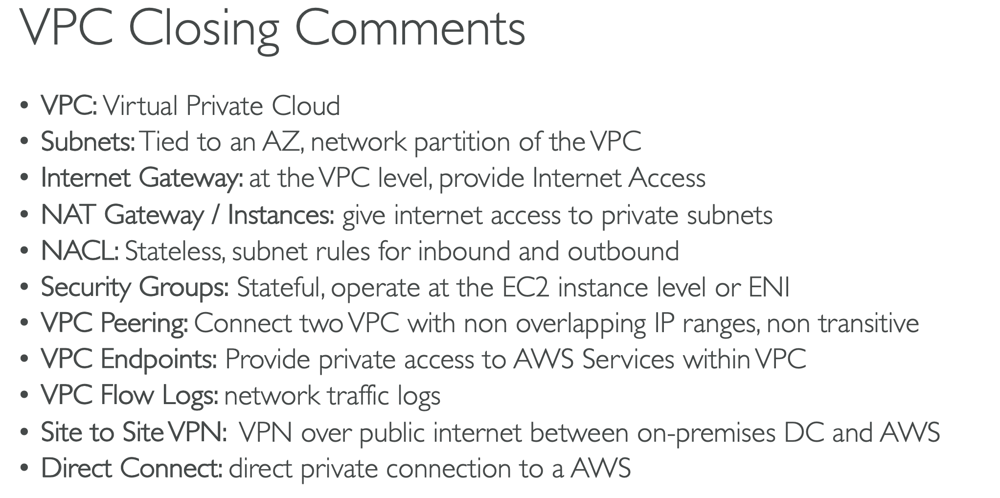
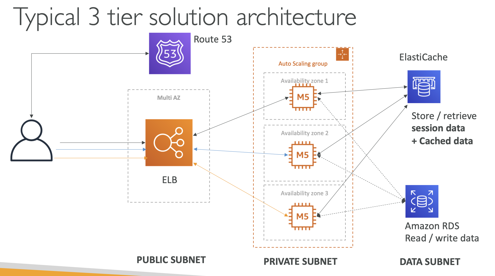

# 10: VPC Fundamentals

## VPC - Virtual Private Cloud

Amazon Virtual Private Cloud (Amazon VPC) enables you to launch AWS resources into a virtual network that you've defined. This virtual network closely resembles a traditional network that you'd operate in your own data center, with the benefits of using the scalable infrastructure of AWS. It is a regional resource.

Inside a VPC, you have subnets, which allow you to partition your network (by Availability Zone).

- **Public subnet** - accessible from internet
- **Private subnet** - not accessible from internet

**Route tables** - used to define access to the internet and between subnets

### Internet Gateway

A gateway connects your VPC to another network. For example, use an internet gateway to connect your VPC to the internet. Use a VPC endpoint to connect to AWS services privately, without the use of an internet gateway or NAT device.

Public subnets have route to Internet Gateway.

### NAT Gateways and NAT Instances

NAT Gateways and NAT Instances allow instances in private subnets to access the internet while remaining private.

- NAT Gateways - AWS managed
- NAT Instances - self-managed

You set up a NAT Gateway in a public subnet as it can access the internet gateway, the NAT is then accessed by private subnets.

### Network ACL and Security Groups 

#### NACL
- A firewall which controls traffic to and from a subnet using ALLOW and DENY rules.
- Attached at subnet level and allows traffic based on IP address

#### Security Groups
- A firewall that controls traffic to and from an ENI/EC2 instance
- Security groups only have allow rules
- Rules include IP addresses and other security groups

### VPC Flow Logs

- VPC Flow Logs capture information about traffic going into your interfaces
- Flow logs include logs for the VPC, Subnets and Elastic Network Interface
- Help to monitor and troubleshoot connectivity issues
- Also captures network information from AWS managed interfaces too
- Flow logs data can be stored in S3 or CloudWatch

### VPC Peering

- Connect two VPCs privately using AWS’ network
- Behave as if they’re in the same network 
- Can’t have overlapping CIDR (IP address range)
- Not transitive - needs to be set up for each VPC to connect to another one 

### VPC Endpoints

- Allow you to connect to AWS services using a private network instead of the public network
- Enhanced security and lower latency

- **Endpoint Gateway** - S3 and DynamoDB
- **Endpoint Interface** - all other AWS services

These services are only used within your VPC, they’re not accessible from public networks.

### Site to Site VPN 

You can connect an on premises VPN (Virtual Private Network) to AWS. The traffic goes over the public internet but is encrypted.

### Direct Connect

- Establish a physical connection between on premises servers and AWS.
- The connection is private, secure and fast
- Takes at least a month to establish as it has to be manually set up

### Summary of what you need to know

### Three Tier Architecture

