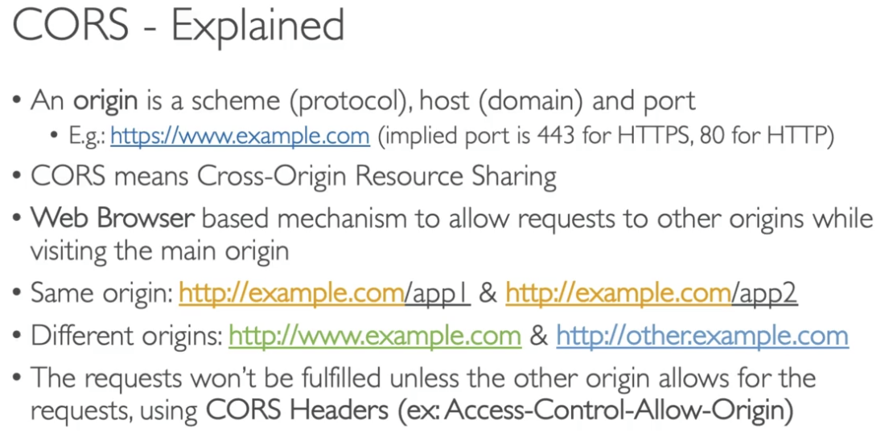
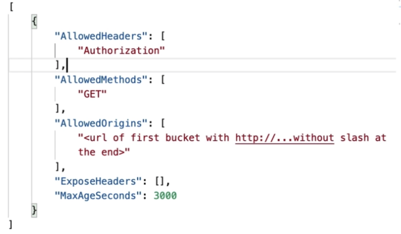

# 14: Amazon S3 Security


## S3 Encryption

There are four ways of encrypting objects in S3 buckets:

Server-side encryption (SSE):
1. With Amazon S3 managed keys
2. With KMS keys stored in AWS Key Management Service (KMS)
3. With customer provided keys (SSE-C)
4. Client-side encryption

#### SSE-S3 (S3 managed keys)

- Encryption using keys handled, managed and owned by AWS
- Set header on object ```“x-amz-server-side-encryption”: “AES256”```

#### SSE-KMS

- Using keys handled and managed by AWS KMS
- User control and audit key usage using CloudTrail
- Set header ```“x-amz-server-side-encryption”: “aws:kms”```

Limitations:
- It calls the GenerateDataKey KMS API when you upload and the Decrypt KMS API when you download
- You may be impacted by KMS limits, there are quotas for number of requests per second
- If you have high throughput, it could cause throttling

#### SSE-C (Customer provided)

- Encryption using key managed by customer outside of AWS
- S3 does not store the key
- Must use HTTPS and must be provided in headers for every request

#### Client-side encryption

- Client encrypts data themselves using service such as Amazon S3 Client-side Encryption Library
- Must decrypt themselves when retrieving from S3


### Encryption in transit / flight (SSL/TLS)

S3 exposes two endpoints:
- HTTP Endpoint - non-encrypted
- HTTPS Endpoint - encryption in flight

HTTPS is recommended and is mandatory for SSE-C. Most clients would use the HTTPS endpoint by default.

#### Hands On

- You can see the Server-side encryption settings section in an object's properties. 
- When you set a file to be encrypted, it will not encrypt the old versions if versioning is enabled
- You can set default encryption for a bucket in the bucket properties, but you can override this when you add an object


### S3 CORS



- If a client makes a cross-origin request on an S3 bucket, we need to enable the correct CORS headers
- Files in the same bucket count as same origin, so you don’t need to worry about CORS
- Files in a separate bucket are a different origin
- You can set the CORS policy in permissions, under Cross-origin resource sharing section
- You can allow for a specific origin or all (*)

Example of an object to set CORS:




### S3 Multi-factor Authentication Delete

- You can make it so MFA is required for deleting an object version or suspend versioning
- MFA won't be required for enabling versioning or to list deleted versions
- Just for extra protection for deletions
- Currently you have to do it on the CLI using the root account


### S3 Access Logs

- You may want to log all access to S3 buckets for auditing
- You can log any request to S3 from any account, authorised or denied, 
- Logs get stored in another bucket, which must be in the same AWS region
- You can analyse the data

**Don't set the logging bucket to be the monitored bucket, it will cause a loop!**

Enable logging in bucket properties, enable Server Access Logging and choose a target bucket


### S3 Pre-signed URLs

- Generate URLs using the S3 console (in Object actions section), CLI or SDK
- The URL has an expiration on it
	- S3 Console: 1-720 mins 
	- AWS CLI: use ```--expires-in parameter``` flag
- User is given pre-signed URL which inherits the permissions of the user that generated it
- Use cases:
	- Only allow logged-in users to download a premium video
	- Temporarily allow a user to upload a file to a precise location in your bucket 
- When you open an object in the S3 console, it is using a pre-signed URL


### S3 Access Points

- Creating policies to grant access to a prefix in an S3 bucket
- Can make it easier to manage groups of users instead of just having a bucket policy
- Each Access Point has its own DNS and policy

### S3 Object Lambda
- Using lambda functions to change an object before it is retrieved by the caller application
- You can use one S3 bucket, but have an Access Point and S3 Object Lambda Access Point for each modification
- **Examples:** 
	- Analytics app only needs a redacted version of an object
	- Redacting PPI
	- Converting for different data formats