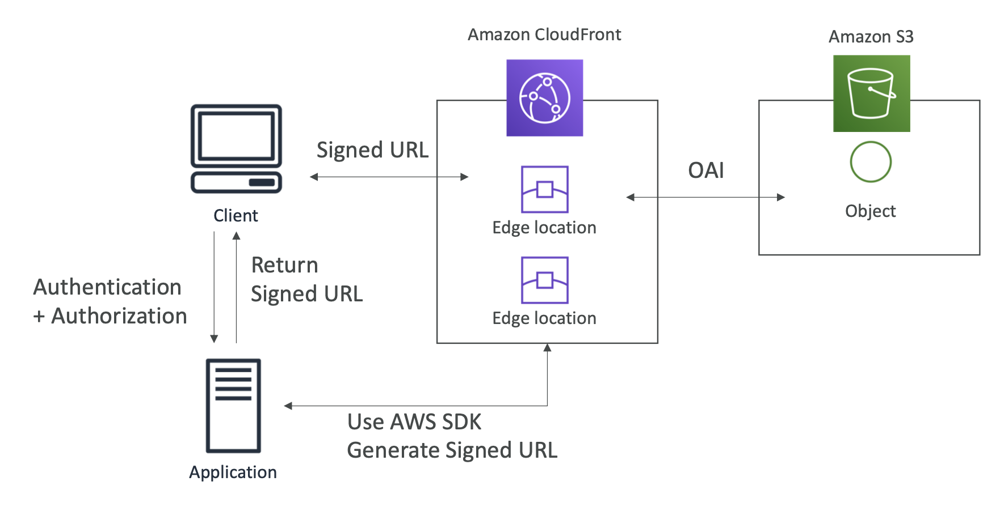

# 15: CloudFront

### A private AWS Content Delivery Network

- Improves read performance, content is cached at the edge
- 216 points of presence globally (edge locations)
- DDoS protection, integration with Shield, AWS Web Application Firewall
- Can expose external HTTPS and talk to internal HTTPS

### Origins

- S3 bucket - for distributing files and caching them at the edge
- Custom Origin (HTTP)
	- Application Load Balancer
	- EC2 instance
	- S3 website
	- Any HTTP backend

### How does it work?

1. A client makes a request which goes to the edge location 
2. The edge location forwards the request onto the origin
3. The edge location returns it to the client and stores it

**S3 security** - edge locations request files from S3 and use Origin Access Control and S3 bucket policy (or you can make your bucket public, but OAC is recommended)

**EC2 security** - EC2 instances must be public, edge location passes on request and security group must allow the public IP of edge locations

**Application Load Balancer security** - security group of ALB must allow IPs of edge locations, the EC2 instances can be private but their security group must allow security group of ALB

### Geo Restriction

- You can restrict who can access your distribution
- Whitelist: allow users if they're on list of approved countries
- Blacklist: prevent users from accessing content if they're on blacklist
- Determined using 3rd party Geo-IP database
- Useful for copywrite laws 

### CloudFront vs S3 Cross Region Replication

Cloudfront:
- Global edge network
- Files are cached for a TTL
- Good for static content that must be available everywhere

S3 Cross Region Replication:
- Must be set up for each region
- Files are updated in near real time
- Read only
- Good for dynamic content that needs to be available at low latency in few known regions

## CloudFront Caching

- For dynamic content, caching is based on headers, session cookies and query string params
- For static content, no rules for cookies etc.
- Content is cached in Edge locations
- You can control the TTL (Time To Live) from 0 secs to 1 year

### Cache invalidations

- You can invalidate part of the cache using CreateInvalidation API
- If you update a file but it is cached, you want to force an invalidation, otherwise requests in an edge location area with the file cached will return the old version

## Geo Restriction

- Restrict who can access your distribution with either a whitelist or blacklist
- Uses 3rd party Geo-IP database
- Copywright laws
- Viewer Protocol policy (between client and edge location)- redirect HTTP to HTTPS or use HTTP only
- Origin protocol policy (between origin and edge location) - HTTPS only or match viewer

### Signed URL / Cookies

- Attach a policy which includes URL expiration, IP ranges, trusted signers (which AWS accounts), how long it's valid for
- Signed URL - access to individual files (one signed URL per file)
- Signed Cookies - access to multiple files

- Two ways of managing signed URL signers:
	- Trusted key group - can create and rotate keys
	- AWS account with CloudFront key pair - managed using root account, not recommended
- Can create trusted key groups in CloudFront distribution
- Generate private keys (for signing URLs) and public keys (to verify URLs)

### CloudFront Advanced Concepts

Pricing:
- 3 price classes:
	- All - all regions
	- 200 - most regions but without most expensive
	- 100 - only least expensive

Multiple origins
- Routing to different kinds of origins (ALB, S3) based on path pattern

Origin groups
- To have high availability
- One primary and one secondary origin which requests are sent to when primary fails
- Can have region level high availability too

Field level encryption
- Adds another layer to protect sensitive information on top of HTTPS
- In POST requests, data encrypted at edge location using public key
- Isn't decrypted until inside the server with some application logic
- This means the data can be encrypted in flight throughout CloudFront