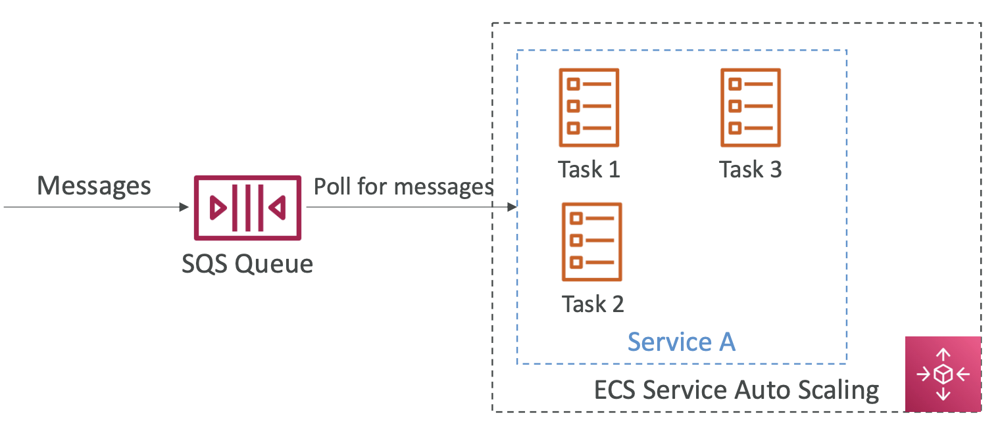

# 16: ECS, ECR and Fargate - Docker in AWS


### Docker Introduction

- Software development platform to deploy apps which are packaged in containers that can run on any OS
- Can run on any machine, no compatibility issues, predictable, easier to maintain and deploy
- Use cases: Microservices architecture, lif-and-shift apps to the cloud

### Docker Repositories
- Docker images are stored in a Docker Repository
- Docker Hub - public repository, you can find base images for many technologies / OSs
- Amazon Elastic Container Registry (ECR) - private repository or public in ECR Public Gallery

### Docker vs Virtual Machines
- Sort of a virtualisation technology
- Resources are shared with the host - many containers on one server
 


### Docker container management in AWS

- Elastic Container Service - container platform
- Elastic Kubernetes Service (EKS) - Amazon managed Kubernetes
- Fargate - serverless container platform, works with ECS and EKS
- Elastic Container Registry - stores container images


## Amazon Elastic Container Service (ECS)

#### EC2 Launch Type
- Launch ECS Tasks on ECS Clusters
- You must provide and maintain the infrastructure (EC2 instances)
- Each EC2 instance runs the ECS Agent to register in the ECS Cluster
- AWS takes care of starting/stopping the containers

#### Fargate Launch Type
- You don't provision the infrastructure - serverless!
- No EC2 instances to manage
- You create task definitions
- AWS runs tasks based on CPU/RAM you need
- Easily scalable, just increase the number of tasks


#### IAM roles for ECS

EC2 Instance Profile (for EC2 Launch Type)
- Used by the ECS Agent 
- Makes API calls to the ECS Service

ECS Task Role 
- Allows each task to have a specific role
- Task role defined in task definition

Application Load Balancer supported, Network Load Balancer supported but only recommended in high performance cases

You can use Elastic File System to persist data, works with both EC2 and Fargate launch types

Use case - persistent multi Availability Zone shared storage for your containers

You can't use S3 as a file system for ECS


### ECS Service Auto Scaling

- Automatically increase/decrease number of ECS tasks
- Uses AWS Application Auto Scaling
- Target tracking - scale based on target value for CloudWatch metric
- Step scaling - scale based on a specified CloudWatch alarm
- Scheduled scaling - scale based on date/time when there are predictable changes
- Much easier to set up with Fargate because it's serverless

#### Auto scaling EC2 Launch Type
Auto scaling group scaling:
- Scale your auto scaling group based on CPU utilisation
- Add EC2 instances over time

ECS Cluster Capacity Provider
- Automatically provisions and scales infrastructure for ECS tasks
- Capacity Provider paired with Auto Scaling group
- EC2 instances are automatically created when you're missing capacity (CPU, RAM)


### ECS Rolling Updates

When there are updates, you can control how your tasks are stopped and started repending on how essential the number of tasks running is

You can set Minimum healthy percent and maximum percent


### Example architectures

EventBridge:


SQS Queue:




### Task definitions

- Metadata in JSON to tell ECS how to run a Docker container
- Contains information such as:
	- image name
	- container and host port
	- memory and CPU
	- environment variables
	- networking info
	- IAM role
	- logging configuration
- Can define up to ten containers in a task definition

Load balancing for EC2 Launch type:
- Dynamic host port mapping if you only define the container port and not the host
- ALB finds the right port on EC2 instances using the Elastic Container Service
- EC2 instances' security group must allow any port from ALB security group, as we don't know which ports they're on

Load balancing for Fargate:
- Each task has a unique private IP
- We only have to define the container port as they're on different IPs

One IAM role per Task Definition, all services created in task definition will have same role

You can retrieve environment variables from SSM Parameter Store, Secrets Manager, or from files in Amazon S3 (called bulk loading)


### Data volumes

You can share data between multiple containers in the same task definition

For EC2 tasks, it uses EC2 instance storage (data tied to EC2 instance lifecycle)

For Fargate tasks, ephemeral storage (data tied to containers using them)


### ECS Task Placement

- When an EC2 task is launched, ECS has to decide which EC2 instance to put it on
- When a service scales, it has to decide which tasks to terminate
- You can define a task placement strategy and task placement constraints

Process:
1. Identify instances that satisfy CPU, memory and port requirements in the task definition
2. Identify instances that satisfy task placement constraints
3. Instances that satisfy task placement strategies
4. Select instances for placement

Strategies:
- Binpack: place based on the least available amount of CPU or memory (minimise number of instances)
- Random: places randomly
- Spread: places task evenly based on specified value

```
"placementStrategy": [
    {
        "field": "memory",
        "type": "binpack"
    },
    {
        "field": "instanceId",
        "type": "spread"
    },
]
```

You can mix them together (see above)

Placement constraints

```
"placementConstraints": [
    {
        "type": "distinctInstance"
    },
    {
        "expression": "attribute:ecs.instance-type =~ t2.*",
        "type": "memberOf"
    },
]
```


## Elastic Container Registry

You can store and manage your own Docker images on the Elastic Container Registry

This can be private or public using the ECR Public Gallery

Fully integrated with ECS, access is controlled through IAM

Supports image vulnerability scanning, versioning and image tags


### Using the AWS CLI for Elastic Container Registry


## Elastic Kubernetes Service

A way to launch managed Kubernetes clusters on AWS

Kubernetes is an open-source system for automatic deployment, scaling and management of containerised (mostly Docker) applications

You can use EC2 instances or Fargate

Kubernetes is cloud agnostic - can be migrated to other cloud providers


Node types:
- Managed node groups - creates and manages nodes (EC2), supports on demand and spot instances
- Self-managed - nodes you create and register to EKS cluster, can use pre-built AMI (EKS Optimized)
- AWS Fargate - no maintenance, no nodes to manage

Data volumes:

- You can attach data volumes by specifying StorageClass on your EKS cluster, leverages a Container Storage Interface compliant driver
- There is support for EBS, EFS (works with Fargate)