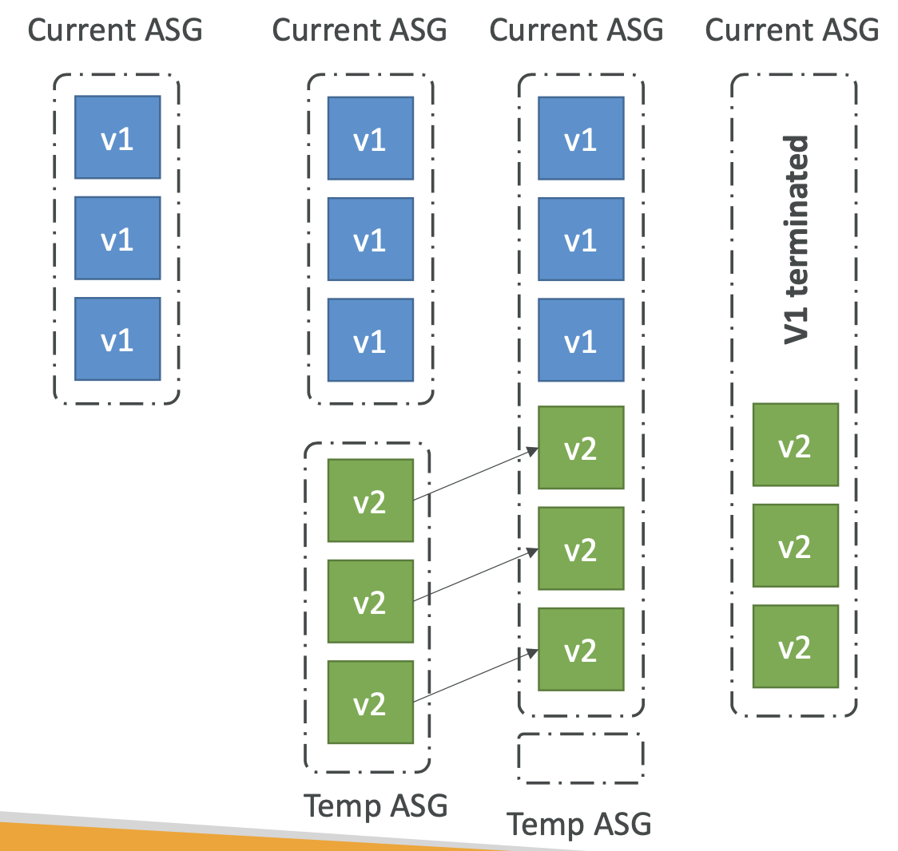

# 17: Elastic Beanstalk

### Overview

Most web applications will have the same architecture - Application Load Balancer with an Auto-scaling group of EC2 instances. As a developer, it saves a lot of effort if this architecture is set up for you and it also gives you a way of deploying web apps consistently.

Elastic Beanstalk is a managed service which still uses the technologies we've seen (EC2, ASG, Load Balancers, RDS), but it automatically handles capacity provisioning, load balancing, scaling, health monitoring, instance configuration.

The only responsibility of the developer is the application code. You still have control of the configuration.

Beanstalk is free but you pay for the underlying instances.


Supports many programming languages and if your language is not supported, you can write a custom platform.

**Web server tier** - for hosting a web site

**Worker tier** - having an SQS queue which an auto-scaling group can poll and run jobs


### Environments

You can create multiple environments for an application, e.g. test and prod, which allows you to easily set up a server with a load balancer and auto-scaling groups. When you create an environment, you can modify the configuration to change things like minimum and maximum number of instances when auto-scaling, what kind of load balancer, availability etc.

You can manage it all from the Elastic Beanstalk UI, but you can see all of the instances/security groups that have been created in the usual places.


## Deployment Modes

The first time you deploy, it is easy to set up a single instance environment for dev and a high availability mode for prod


### Options for updates

#### All at once 
- Fastest but there's downtime 
- Stops the application and deploys V2 to the instances
- Good for dev environments where downtime is not important


#### Rolling
- Update instances a few at a time and only move on once bucket is healthy
- Application is running below capacity
- Can set the bucket size for the number of buckets to update at a time
- Application is temporarily running both versions simultaneously
- No additional cost
- Can take a long time to deploy if you have a lot of instances


#### Rolling with additional batches
- Like rolling but spins up new instances to move the batch
- Means that the application can still run at capacity (good for prod)
- Small additional cost, additional batch is removed at the end
- Still quite a long deployment


#### Immutable
- Deploys new instances in a new Auto-scaling Group, then you swap instances when healthy
- No downtime
- High cost as you are at double capacity
- Longest deployment
- Quick rollback in case of failures (just terminate new ASG)
- Good for prod




#### Blue / Green Deployments

- Not a direct feature of Elastic Beanstalk
- Zero downtime
- Create a new 'stage' environment and deploy new version there
- The new environment can be validated independently and roll back if issues
- You can use Route 53 to set up weighted policies, to redirect some traffic to new version
- Using Beanstalk, swap URLs when done with the testing of new version
- It's a bit manual in Elastic Beanstalk


#### Traffic Splitting
- Canary testing - a new version is deployed to a temporary Auto-scaling group with the same capacity
- A small percentage of traffic is sent to temporary ASG for a configurable amount of time
- Deployment health is monitored - if there is a failure or CloudWatch alarm, it automatically rolls back
- No application downtime
- New instances migrated from temporary to original ASG

### Summary of deployment strategies


### Elastic Beanstalk CLI

- Makes working with Elastic Beanstalk from the command line easier than using just the AWS CLI. It is useful for automated deployment pipelines.
- Basic commands:
	
    ```eb create, status, health, events, logs, open, deploy, config, terminate```
- In your code, you need to describe the dependencies (requirements.txt for Python, package.json for Node), package the code as a zip file, then in the console or CLI, upload the zip file and deploy. In the background, the zip is actually pushed to S3 in an Elastic Beanstalk bucket for that region.


### Beanstalk Lifecycle Policy

- Elastic Beanstalk can store at most 1000 application versions
- If you don't remove old versions, you won't be able to deploy, so you can use a lifecycle policy based on either time or space.
- Versions which are in use won't be deleted
- There is an option to keep the source bundle in S3


### Elastic Beanstalk Extensions

- You can add EB extensions in the `.ebextensions/` folder to configure parameters with code.
- Can be YML or JSON format in files with .config extensions
- Resources managed by .ebextensions are deleted if the environment is removed

Example for setting environment variables:
```
option_settings:
	aws:elasticbeanstalk:application:environment:
      DB_URL: "test_url"
      DB_USER: username
```


### Beanstalk and CloudFormation

Elastic Beanstalk is actually using CloudFormation, which provisions other AWS services. You can define CloudFormation resources in your `.ebextensions`, so you can provision whatever you want (S3, ElastiCache).

When you create an environment in Elastic Beanstalk, a stack is created in CloudFormation. You can go to the stack in the console and see all of the resources that have been created for an environment.


### Beanstalk Cloning

Cloning an existing environment with the same configuration. This is useful for deploying a test version of your prod environment. All of the resources and config are preserved (e.g. Load Balancer type and config, RDS database without data, environment variables).


### Beanstalk Migrations

After creating a Beanstalk environment, you can't change the Load Balancer type, only the configuration. To migrate, you have to:
1. Create a new environment with same config (can't use cloning)
2. Deploy your application on the new environment
3. Perform a CNAME swap or Route 53 to do a DNS update

### RDS with Elastic Beanstalk

RDS can be provisioned by Beanstalk, which is useful for test/dev environments. But the database lifecycle is tied to the Beanstalk environment lifecycle, which is not good for prod.

The best thing to do is create an RDS database separately and provide our application with the connection string.

How to decouple RDS created on Beanstalk:
1. Create a snapshot of RDS DB (as a safeguard)
2. Go to RDS Console and protect the DB from deletion
3. Create a new Beanstalk environment without RDS, pointing to your existing RDS
4. Perform a CNAME swap or Route 53 update and confirm it is working
5. Terminate the old environment
6. Delete CloudFormation stack (have to delete it manually as it will have failed due to the RDS DB)


### Elastic Beanstalk with Docker

#### Single Docker

You can run your application as a single docker container. Provide either:
- Dockerfile - Elastic Beanstalk will build and run it
- Dockerrun.aws.json - describe where an already built docker image is

Beanstalk in Single Docker Container does not use Elastic Container Service

#### Multi Docker Container

Multi Docker helps you run multiple containers per EC2 instance in Beanstalk.

It creates for you an Elastic Container Service cluster, EC2 instances configured to use the cluster, a load balancer and task definitions and execution. 

Requires a Dockerrun.aws.json file at the root, which is used to generate the ECS task definition (the contents are pretty much the same as an ECS task definition). Your Docker images must already be built and stored somewhere, e.g. Elastic Container Registry.


### Advanced Concepts

### Elastic Beanstalk and HTTPS

Load the SSL certificate onto the Load Balancer, which can be done from the console or in the .ebextensions config files.

An SSL can be provisioned using AWS Certificate Manager or the CLI. You must configure a security group rule to allow incoming on port 443 (HTTPS port).

#### Redirecting to HTTPS
- You can set up a redirect by [configuring your instances](https://github.com/awsdocs/elastic-beanstalk-samples/tree/master/configuration-files/aws-provided/security-configuration/https-redirect)
- Configure the Application Load Balancer with a rule
- Make sure that health checks are not redirected

### Web server vs Worker environment
- If your app performs tasks which take a long time, you want to offload these tasks to a dedicated worker environment
- It is common to decouple your application
- Examples include processing videos, generating zip files
- You can define periodic tasks ina `cron.yaml` file
 


### Custom Platforms

They are very advanced, they allow you to define the OS, additional software and scripts that Beanstalk runs from scratch.

The use case is when you have a language which is incompatible with Beanstalk and doesn't use Docker.

To create your platform:
- Define an AMI using a `Platform.yaml` file
- Build that platform using the Packer software (open source tool to create AMIs)

Custom images in AMI tweak existing Beanstalk platforms, the Custom platform can create an entirely new one.


