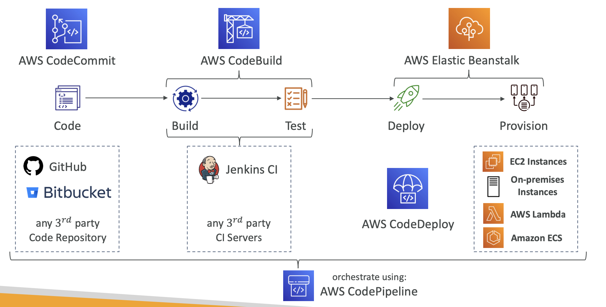
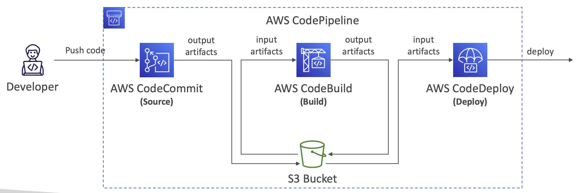
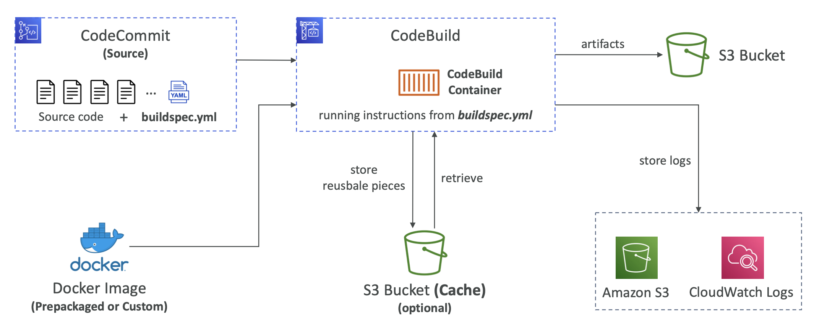
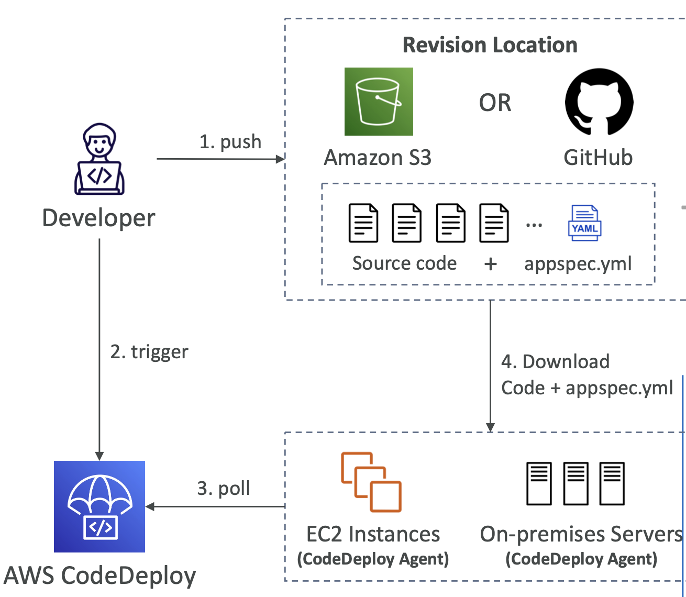
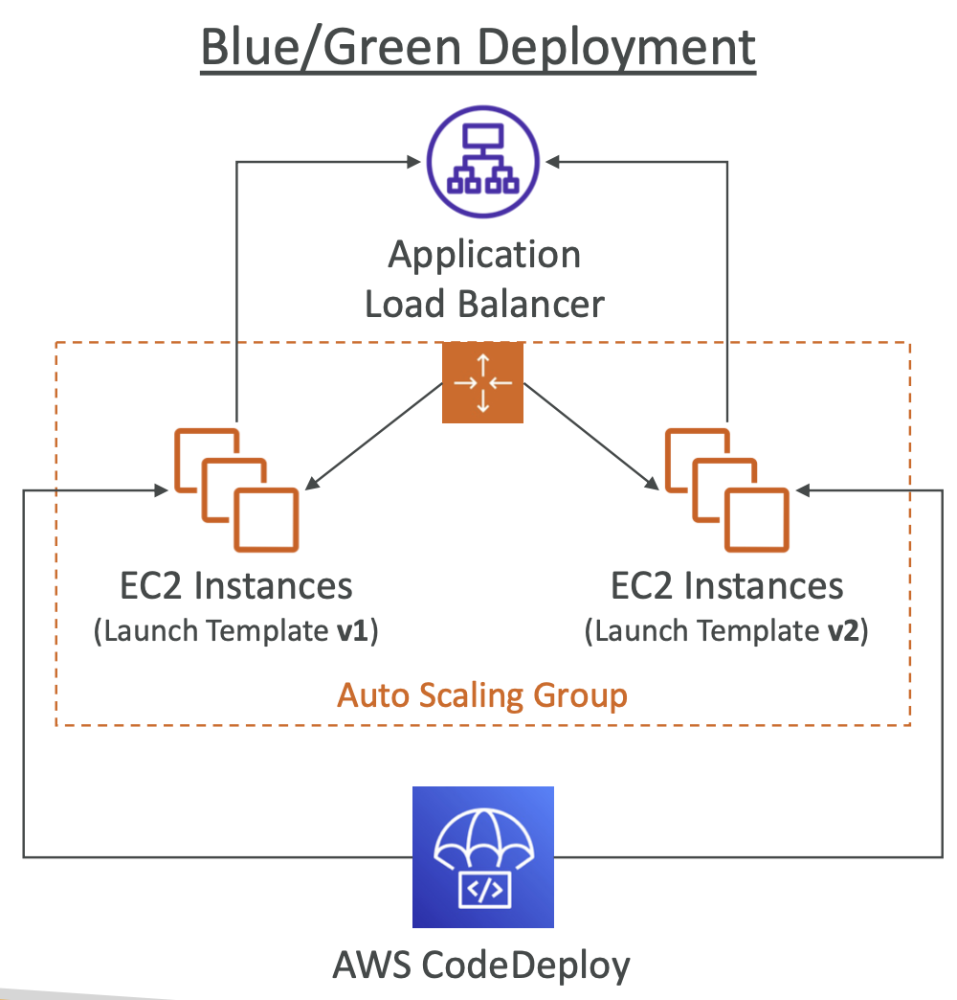
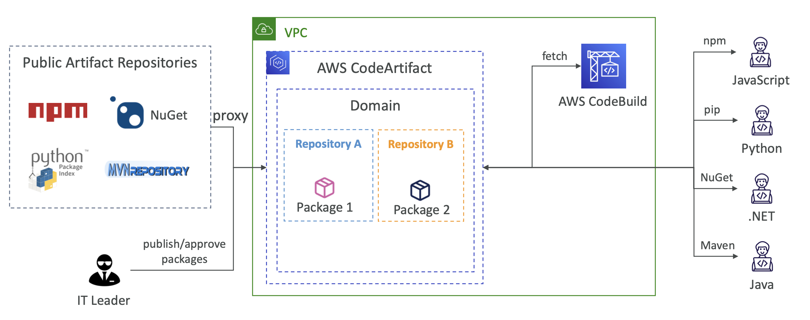

# 18: AWS CI/CD - CodeCommit, CodePipeline, CodeBuild, CodeDeploy


## Overview of CI/CD in AWS

Automation reduces the number of mistakes, is less effort, can be tested, you have different stages and you can still have manual approval steps if needed.

Different platforms:
- CodeCommit - storing our code
- CodePipeline - automating our pipeline from code to Elastic Beanstalk
- CodeBuild - building and testing our code
- CodeDeploy - deploying the code to EC2 instances (not Beanstalk)
- CodeStar - manage software development activities in one place
- CodeArtifact - store, publish and share software packages
- CodeGuru - automated code reviews using machine learning

#### Continuous Integration
- Developers pushing code to a repository regularly 
- Checks run so the developer gets feedback quickly
- Allows you to deliver quickly and deploy often

#### Continuous Delivery
- Ensures software can be released reliably and increase the regularity of releases
 



## CodeCommit

Version control alternative to Github, GitLab, BitBucket etc.

In AWS CodeCommit, you can have private Git repos with no size limit, which are fully managed and highly available. The code is only available in your account, you can have security features such as encryption and access control using IAM roles/policies. It is integrated with Jenkins, AWS CodeBuild and other tools.

### Security

- Authentication using SSH keys or HTTPS
- Authorisation using IAM
- Repos are automatically encrypted at rest using KMS and in transit
- Cross-account access using IAM roles and AWS Security Token Service

You can easily create notification rules and link them to another service (AWS or outside) like SQS or Slack. You can create triggers as well to make jobs run (like GitHub Actions).


## CodePipeline

Visual workflow tool to orchestrate your CI/CD which is split into stages:
- Source - CodeCommit, ECR, S3, GitHub (can be external source)
- Build - CodeBuild, Jenkins
- Test - CodeBuild, AWS Device Farm, 3rd Party tools
- Deploy - CodeDeploy, Beanstalk, CloudFormation, ECS, S3

Each pipeline stage can create artifacts, which are stored in an S3 bucket and passed onto the next stage.

You can create your own stages and have actions within action groups in them. Actions in an action group run in parallel, subsequent action groups are reliant on the previous group passing.



### Troubleshooting

You can use CloudWatch Events to create events for failed pipelines. When a stage fails, you can view info in the console. It's important to make sure pipelines have the correct permissions in their IAM Service Role. You can use CloudTrail to audit AWS API calls.


## CodeBuild

- The source can be from CodeCommit, S3, BitBucket, GitHub
- The build instructions need to be in a file called `buildspec.yml`
- Output logs can be stored in S3 and CloudWatch
- You can use CloudWatch metrics to monitor statistics, CloudWatch Events to detect failed builds and trigger notifications, and CloudWatch Alaarms to notify if you need thresholds for failures
- Build projects can be defined in CodePipeline or CodeBuild



### Supported environments

There are pre-built images for many languages, but you can use Docker to extend it for anything.


### buildspec.yml

- Yaml file which must be at the root of the code
- In the env you can define environment variables or pull them from parameter-store, secrets-manager
- **phases** - commands to run:
	- **install** - installing dependencies
	- **pre_build** - commands to execute before build
	- **build** - build commands
	- **post_build** - finishing touches (e.g. zip output) 
- **artifacts** - what to upload to S3
- **cache** - files to cache for S3 (usually dependencies)

Example buildspec.yml:
```
version: 0.2
phases:
  install:
    runtime-versions:
      nodejs: 16
    commands:
      - npm install -g typescript
      - npm install
  pre_build:
    commands:
      - echo "Installing source NPM dependencies..."
  build:
    commands:
      - echo "Build started on `date`"
      - tsc
      - npm prune --production
    post_build:
      commands:
        - echo "Build completed on `date`"  
artifacts:
  type: zip
  files:
    - package.json
    - package-lock.json
    - "build/**/*"
    - .ebextensions/**/*
```

### Local builds

[You can run CodeBuild locally](https://docs.aws.amazon.com/codebuild/latest/userguide/use-codebuild-agent.html) for trouble-shooting (you need Docker installed) by using the CodeBuild Agent


### Inside VPC

By default, CodeBuild containers are launched outside your VPC, so it can't access resources in your VPC. You can specify a VPC configuration (VPC ID, Subnet IDs, Security Group IDs) and then you can build resources in your VPC. The use cases for this are for integration tests, data queries, internal load balancers.


## CodeDeploy

Deploying our application automatically to many EC2 instances.

These instances are not managed by Elastic Beanstalk.

### How it works 

Each EC2 instance must be running the CodeDeploy Agent. The agent continuously polls AWS CodeDeploy. When there is work, the app and `appspec.yml` is pulled from GitHub/S3 and the EC2 instances run the deployment instructions in the `appspec.yml`.

You can install the CodeDeploy Agent by SSHing into the EC2 instance, installing Ruby, downloading the agent and executing it.

You create a deployment group and reference instances which have a certain key or key/value pair.

Then you can create a deployment.




### Primary Components

- Application
- Compute Platform
- Deployment configuration
- Deployment group
- Deployment type
- IAM Instance Profile
- Application Revision
- Service Role
- Target Revision


### appspec.yml

- files - source and destination
- hooks - set of instructions to deploy
	- ApplicationStop
	- DownloadBundle
	- BeforeInstall
	- Install
	- AfterInstall
	- ApplicationStart
	- ValidateService

### Configurations

- Deployments:
    - One at a time
    - Half at a time
    - All at once
    - Custom - e.g.minimum healthy hosts
- Failures:
    - EC2 instances stay in failed state
    - New deployments first deployed to failed instances
    - To rollback, redeploy the old deployment or enable automated rollbacks for failures
- Deployment Groups:
    - A set of tagged EC2 instances
    - Directly to an ASG
    - Mix of ASG/tags
    - Customisation in scripts with DEPLOYMENT_GROUP_NAME environment variable


### CodeDeploy for Auto Scaling Groups

In Place deployment:
- Updates existing EC2s
- Newly created EC2S by an ASG will get automated deployments

Blue Green deployment:
- A new Auto Scaling group is created
- Choose how long to keep the old EC2 instances
- Must be using a Load Balancer



### Rollbacks 

- Redeploying a previous version of your application
- Deployments can be automatically rolled back on failure or on CloudWatch Alarms being triggered, or manually.
- You can disable rollbacks
- When deployments are rolled back, the last known good version is redployed as a new deployment


## CodeStar

An integrated solution that groups together everything - GitHub, CodeCommit, CodeBuild, CodeDeploy, CloudFormation, CodePipeline, CloudWatch. You can set up integration with different IDEs. 

Makes it so you can set up a CI/CD pipeline really quickly for EC2, Lambda and Elastic Beanstalk. You get one dashboard to view all of your components and it is a free service where you just pay for the underlying services as usual.


## CodeArtifact

Software packages depend on each other. Storing and retrieving these dependencies is called **Artifact management**. CodeArtifact is an alternative to setting up your own dependency management system and it works with tools like pip, npm, yarn, twine, Maven and Gradle. It means that developers and CodeBuild can retrieve dependencies from CodeArtifact (which is useful as caching means you don't always have to install dependencies and if the packages are removed from npm, they're still available in your CodeArtifact).




## CodeGuru

A Machine Learning service for automated code reviews and application performance recommendations.

- **CodeGuru Reviewer** - automated code reviews
- **CodeGuru Profiler** - recommendations for performance