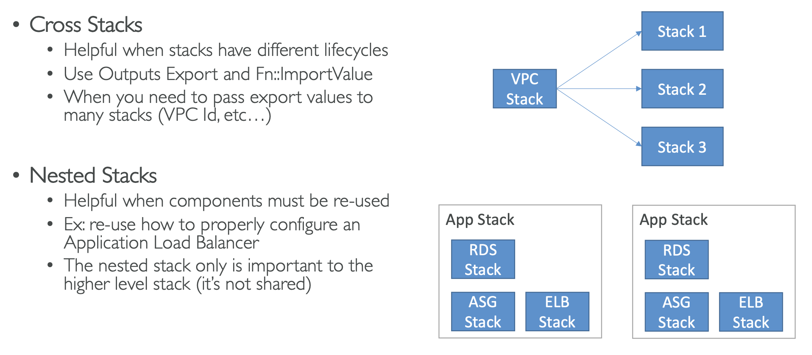
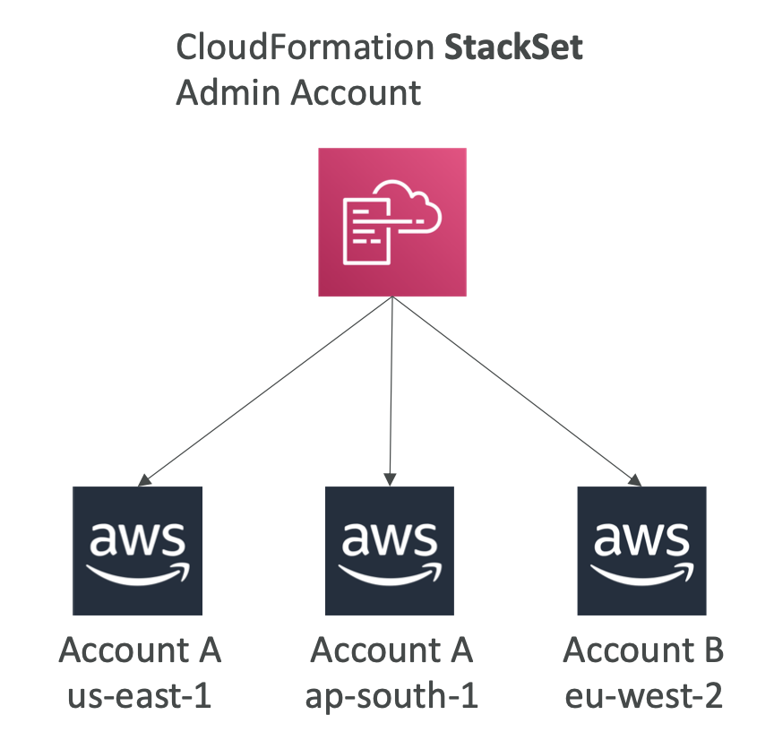

# 19: AWS CloudFormation


## Managing your infrastructure as code

A declarative way of outlining your AWS infrastructure for any resources. CloudFormation will create resources for you in the order you give it and with the configuration you specify.

### Infrastructure as Code
Having infrastructure as code means no resources are created manually, code can be version controlled and changes can be reviewed. 

### Cost
- Each resource is tagged with an identifier so you can easily see the cost of a CloudFormation stack. 
- You can also estimate the cost of your resources using the CloudFormation template. 
- You can use savings strategies such as deleting unused resources overnight and recreating in the morning.

### Productivity
- Ability to destroy and re-create infrastructure on the fly
- Automated generation of diagrams for your templates
- Declarative programming - don't need to worry about ordering

### Separation of Concerns
You can have separate templates for different stacks, e.g. application stacks, VPC stacks, network stacks.

You can leverage existing templates and use the documentation to help you create infrastructure quickly.

### How it works
- Templates are uploaded to S3 and then references in CloudFormation
- To update templates, you can't edit previous ones. You have to upload a new version.
- Stacks are identified by a name
- Deleting a stack deletes all of the artifacts created by CloudFormation


### Deploying CloudFormation Templates
- Manual way:
	- Edit templates in CloudFormation Designer
	- Using the console to input parameters
- Automated way:
	- Edit templates in yaml file
	- Use the AWS CLI to deploy the templates
	- Recommended way to completely automate workflows

### Template components
- Resources
- Parameters
- Mappings
- Outputs
- Conditionals
- Metadata

### Template helpers
- References
- Functions


### YAML

CloudFormation supports YAML or JSON, but YAML is much easier.

Key value pairs, nested objects, arrays (`-` before each element), multi-line strings (`| lines`), comments


## Template components

### CloudFormation Resources

```yaml
---
Resources:
  # An EC2 instance (comment)  
  MyInstance:
    Type: AWS::EC2::Instance
    Properties: 
      AvailabilityZone: us-east-1a
      ImageId: ami-a2314213
      InstanceType: t2.micro
      SecurityGroups:
      - !Ref SSHSecurityGroup
      - !Ref ServerSecurityGroup

  # An elastic IP for our EC2 instance
  MyEIP:
    Type: AWS::EC2::EIP
    Properties:
      InstanceId: !Ref MyInstance
```

- A CloudFormation template must have resources, it represents the different AWS components that will be created and configured. 
- Resources are declared and can reference each other, AWS will sort out creation, updating and deletion of the resources (and figure out the order of creation when they reference each other).

Format:   
`AWS::aws-product-name::data-type-name`

[Link to documentation for all the resources supported by CloudFormation](http://docs.aws.amazon.com/AWSCloudFormation/latest/UserGuide/aws-template-resource-type-ref.html)

Most AWS resources are supported, there are a few niche ones which aren't yet available. You cannot make a dynamic amount of resources, as everything in a CloudFormation template has to be declared.


### CloudFormation Parameters

```yaml
---
Parameters:
  SecurityGroupDescription:
    Description: Security Group Description
    Type: String
    
Resources:
  ServerSecurityGroup:
    Type: AWS::EC2::SecurityGroup
    Properties:
      GroupDescription: !Ref SecurityGroupDescription
      SecurityGroupIngress:
      - IpProtocol: tcp
        FromPort: 80
        ToPort: 80
        ...
```

A way to provide inputs to your template, which makes it easier to reuse templates.

The Fn::Ref function can be used to reference parameters, in YAML, the shorthand is `!Ref`. 

**Note:** the ref function can also be used to reference other resources.

Parameter settings:

```
Type (String, Number, CommaDelimitedList, List<Type>), 
Description, Constraints, ConstraintDescription, Min/MaxLength, 
Min/MaxValue, Defaults, AllowedValues, AllowedPattern, NoEcho
```

#### Pseudo parameters
Parameters which are there for you to reference rather than being explicitly passed in, e.g. `AWS::AccountId, AWS::Region, AWS:StackId, AWS::StackName`

### Mappings

Fixed variables within a template which can be useful to differentiate between different environments, regions, AMI types etc. All of the values are hard-coded in the template.

```yaml
RegionMap:
  us-east-1:
    "32": "ami-231323"
    "64": "ami-432434"
  eu-west-1:
    "32": "ami-538243"
    "64": "ami-313211"
```

Mappings are useful when you know all the values in advance and don't need the flexibility of passing them in with parameters.

#### Accessing Mapping Values

```yaml
Fn::FindInMap
!FindInMap [ MapName, TopLevelKey, SecondLevelKey ]


Properties: 
  ImageId: !FindInMap [RegionMap, !Ref "AWS::Region", 32]
```


### Outputs

Declares optional output values which can be imported into other stacks. You can also view the outputs in the Console or the CLI.

Example use case:
- Define a network CloudFormation and output variables such as the VPC ID and your Subnet IDs

It's a good way to perform cross-stack collaboration. You can't delete a stack if its outputs are being referenced in another stack.

```yaml
Outputs:
  StackSSHSecurityGroup:
    Description: The SSH Security Group for our company
    Value: !Ref MyCompanyWideSSHSecurityGroup
    Export:
      Name: SSHSecurityGroup
```

Importing the output in another template:

`Fn::ImportValue`

```yaml
Resources:
  MySecureInstance:
    Type: AWS::EC2::Instance
    Properties:
      AvailabilityZone: us-east-1a
      ImageId: ami-ac431432
      InstanceType: t2.micro
      SecurityGroups:
		- !ImportValue SSHSecurityGroup
```


### Conditions

Control creation of resources or outputs based on a condition. Common examples are environment, region and paramter value checks. 

Definition:
```yaml
Conditions:
  CreateProdResources: !Equals [ !Ref EnvType, prod ]
```

Logical functions:
```
Fn::And, Fn::Equals, Fn::If, Fn::Not, Fn::Or
```

Usage:
```yaml
Resources:
  MountPoint:
    Type: "AWS::EC2::VolumeAttachment"
    Condition: CreateProdResources
```


### Intrinsic Functions

#### Fn::Ref
- Parameters - returns value
- Resources - returns physical ID of underlying resource

```yaml
DbSubnet1:
  Type: AWS::EC2::Subnet
  Properties:
    VpcId: !Ref MyVPC
```

#### Fn::GetAtt

- Attributes are attached to any resources you create
- You can see available attributes for each resource in the documentation

```yaml
# First resource
MyEC2Instance:
  Type: ...
# Another instance
NewVolume:
  Type: AWS::EC2::Volume
  Properties:
    Size: 100
    AvailabilityZone:
      !GetAtt MyEC2Instance.AvailabilityZone
```

**Fn::FindInMap**,  **Fn::ImportValue** and Condition functions - see above

#### Fn::Join

Join values with a delimiter:
```
!Join [ delimiter, [ comma-delimited list of values ] ]

!Join [ ":", [ a, b, c ] ]
```

#### Fn::Sub

Substitute variables from text, e.g. you can combine Fn::Sub with References or pseudo-variables. String must contain `${VariableName}` and will substitute them.

```yaml
!Sub
  - String
  - { Var1Name: Var1Value, Var2Name: Var2Value }
```


### CloudFormation Rollbacks

If a stack creation fails, the default is that everything gets rolled back. However, you can disable rollback.

If a stack update fails, the stack rolls back to the previous working version. You can see what happened/error messages in the logs.


### CloudFormation ChangeSets

When you update a stack, you can see what changes there will be before confirming in the ChangeSets (It is a section in the Console).

### Nested Stacks

Having stacks that are part of other stacks, which allows you to isolate repeated patterns in separate stacks.

Examples:
- Load balancer configuration which is reused
- Security group which is reused

They are considered best practice, and to update them you need to update the parent (root) stack.

### Cross stacks vs nested stacks




### StackSets

Create, update or delete stacks across multiple accounts and regions with a single operation.

You have an administrator account to create StackSets.

When you update a stack set, all associated stack instances are updated throughout all accounts and regions.




### CloudFormation Drift

CloudFormation allows you to create infrastructure, but it doesn't protect against manual configuration changes. We can know if there have been config changes by using CloudFormation Drift. Here is a [list of supported resources](https://docs.aws.amazon.com/AWSCloudFormation/latest/UserGuide/using-cfn-stack-drift-resource-list.html).

When viewing a stack in the Console, you can click on Detect drift in stack actions section, and then you can see the drift status and how the configuration has changed (expected and actual).

