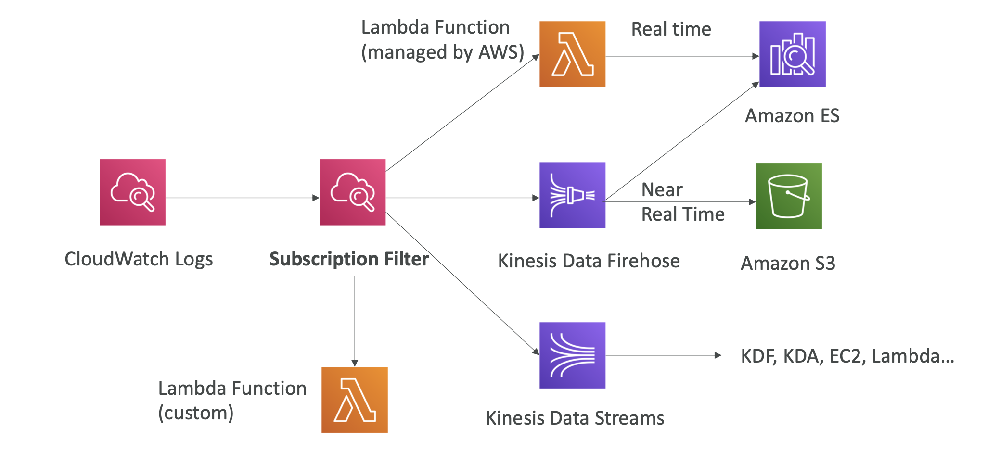
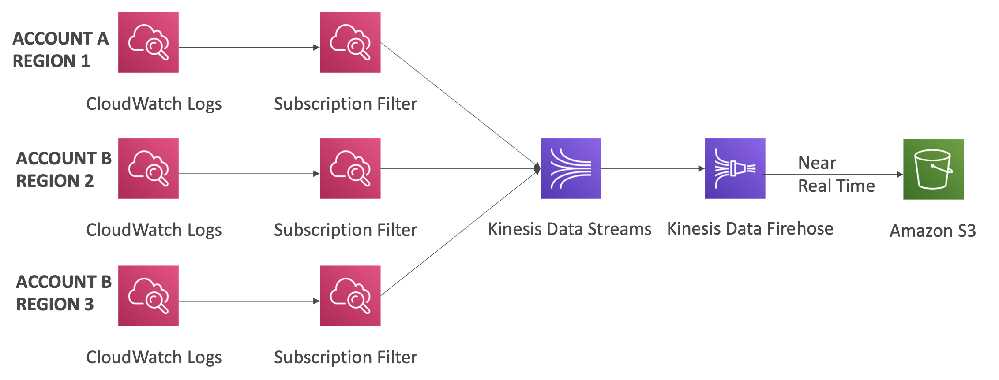
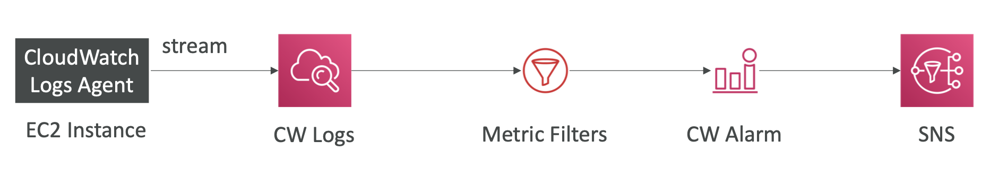
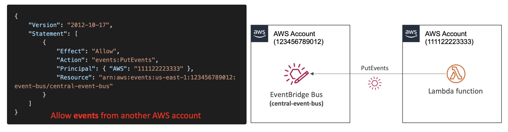
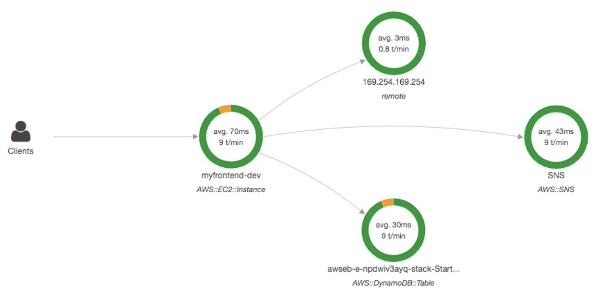
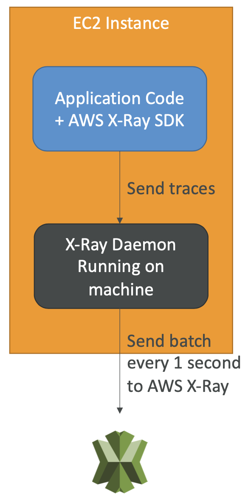
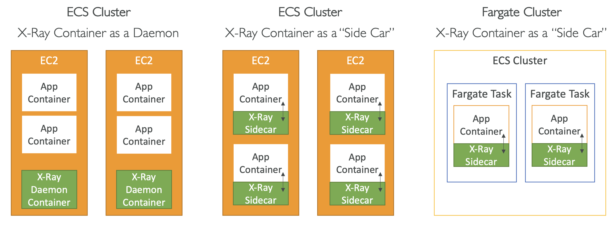
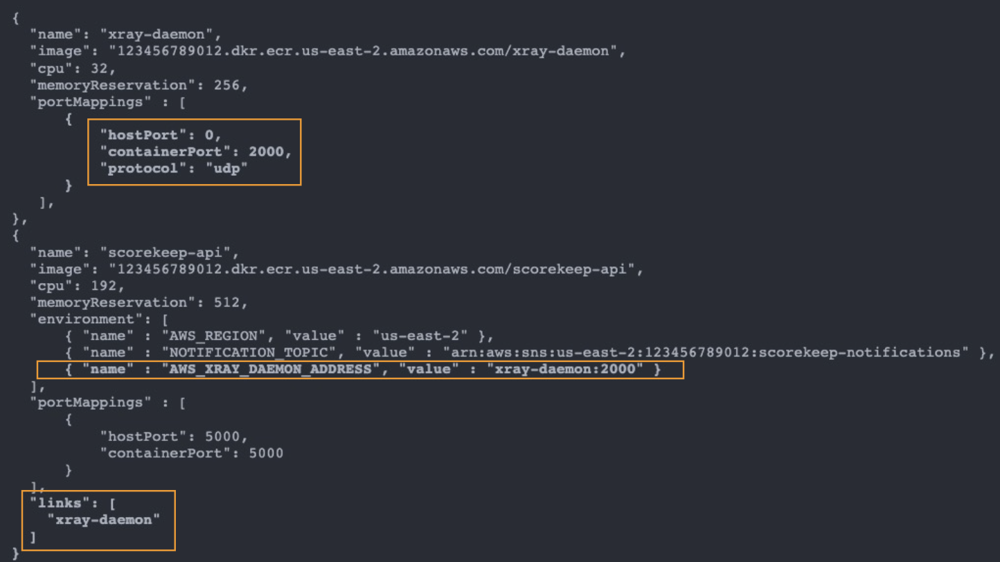
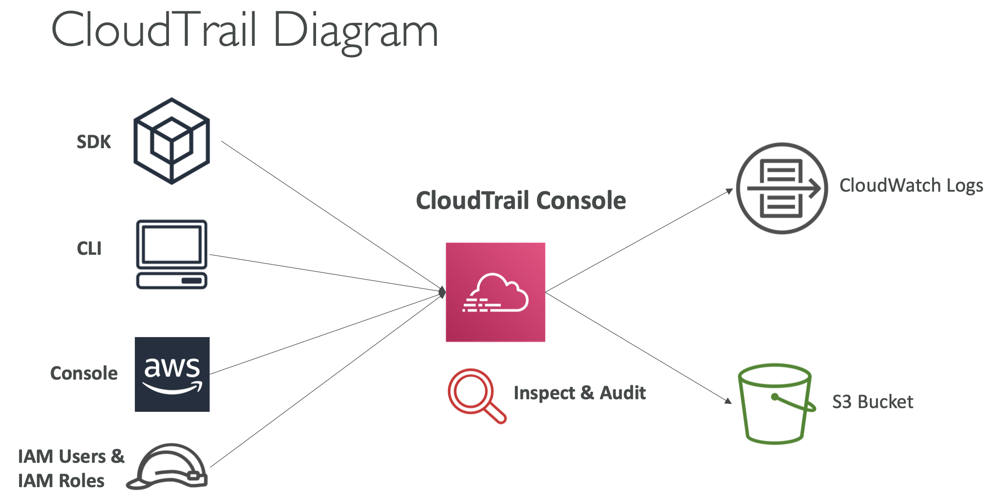
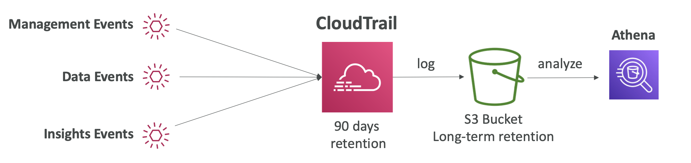

# 20: AWS Monitoring, Troubleshooting and Audit


### Why use monitoring?

Monitoring is important, as it can help us be aware of our application latency, when there are outages and enables troubleshooting and remediation. The hope with monitoring is that we can prevent issues before they happen, monitor performance and cost, spot trends and make improvements based on what we find. 

### Monitoring in AWS

**CloudWatch** - Metrics, logs, events, alarms

**X-Ray** - Troubleshooting application performance and errors, and allows for distributed tracing of microservices

**CloudTrail** - Internal monitoring of API calls and audit changes to AWS resources by your users


## CloudWatch

### CloudWatch Metrics

CloudWatch provides metrics for every service in AWS. A metric is a variable to monitor, it belongs to a namespace, and a dimension is an attribute of a metric (e.g. instance ID, environment).

You can have up to 10 dimensions per metric, and metrics have timestamps. You can create CloudWatch dashboards of metrics.

#### EC2 Detailed Monitoring

EC2 instances have metrics every 5 minutes, but you can use Detailed monitoring (for more money) to get the data every minute. This is useful if you want to scale your Auto-scaling group really quickly.

AWS Free Tier lets you have 10 detailed monitoring metrics. Some metrics aren't pushed by default, such as EC2 memory usage, which must be pushed as a custom metric.


### CloudWatch Custom Metrics

You can define your own metrics, e.g. memory usage, disk space, number of logged in users. 

- To create it, you use the API call `PutMetricData`
- You can use dimensions to segment the metrics, e.g. `Instance.id, Environment.name`
- Metric resolution - StorageResolution API parameter which can be Standard (1 minute) or High Resolution (1/5/10/30 seconds)
- When created, it accepts metric data points two weeks in the past and two hours in the future

Documentation for [publishing custom metrics](https://docs.aws.amazon.com/AmazonCloudWatch/latest/monitoring/publishingMetrics.html)


### CloudWatch Logs

- You can group logs into **Log Groups**
- Each instance in an application will have a **Log Stream**
- You can define log expiration policies
- Logs can be sent to:
	- S3
	- Kinesis Data Streams
	- Kinesis Data Firehose
	- Lambda
	- ElasticSearch

#### Insights

- CloudWatch Logs Insights can be used to query logs and add queries to CloudWatch Dashboards

#### S3 Export

You can export logs to S3 using the API call CreateExportTask, but can take up to 12 hours.

#### Logs Subscriptions



#### Logs Multi-account/Multi-region Aggregation




### CloudWatch Agent and Logs Agent

By default, there are no logs from EC2 instances going to CloudWatch. You need to run a CloudWatch Agent on the EC2 to push log files. 

To do this you need to make sure the permissions are correct. The Agent can be set up on premises as well.

**Logs Agent** - the old version which can only send to CloudWatch Logs

**CloudWatch Unified Agent** - collects additional system-level metrics (e.g. RAM) and has centralised configuration using SSM Parameter Store. It can also collect metrics (e.g. CPU, disk metrics, RAM) so it is a lot more granular.


### Metric Filter

- Logs can use filter expressions, e.g. find a specific IP in a log, count occurences of ERROR
- Metric filters can be used to trigger CloudWatch alarms
- You can do filtering in the Console to search through logs, but when creating a Metric Filter, it only publishes metric data for events after creation



[Documentation for filter patterns](https://docs.aws.amazon.com/AmazonCloudWatch/latest/logs/FilterAndPatternSyntax.html)


### CloudWatch Alarms

Alarms are used to trigger notifications for any metric. There are various options (sampling, percentage, max, min). The Alarm states are OK, INSUFFICIENT_DATA and ALARM.

Alarms have three main targets:
- EC2 instances - Stop, Terminate, Reboot, Recover
- To trigger an Auto-scaling action
- To send notifications to SNS (where you can hook it to something)

#### Composite Alarms

They monitor the state of multiple other alerts, using AND and OR conditions. This is helpful to reduce 'alarm noise' so that you are only alerted when there is something urgent.

#### EC2 Instance Recovery

Checks the status of the environment (Instance status) and the underlying hardware (System status). You can enable auto-recovery in the EC2 settings and when the CloudWatch alarm is triggered, it will recover it. You will also get an alert to SNS to say that it has been recovered.


CloudWatch Alarms can be created based on CloudWatch Logs Metric Filters.

You can test your alarms using the CLI:
```bash
aws cloudwatch set-alarm-state --alarm-name "myalarm" --state-value ALARM --state-reason "testing purposes"
```


### CloudWatch Events

Events is now deprecated and replaced by **EventBridge**.

**Event pattern** - Intercept events happening in AWS services, e.g. EC2 instance start, S3, or any API call with CloudTrail integration

**Schedule or CRON** - e.g. create an event every four hours

A JSON payload is created from the event and passed to a target:
- Compute - Lambda, Batch, ECS task
- Integration - SQS, SNS, Kinesis Data Streams/Data Firehose
- Orchestration - Step Functions, CodePipeline, CodeBuild


## Amazon EventBridge

- The next evolution of CloudWatch Events
- It uses the Default Event Bus, generated by AWS services which is also used by CloudWatch Events 
- It also has a Partner Event Bus, to receive events from SaaS services, e.g. Auth0, DataDog
- You can create Custom Event Buses for your own application
- Event buses can be accessed by other accounts, you can archive events, but also have the ability to replay archived events
- Events have rules, to say how to process them

#### Schema Registry

EventBridge can analyse events in your bus and infer the schema. This allows you to generate code for your application which will know in advance how data is structured in the event bus. These schemas can be versioned.

It is useful to see how events will look in JSON, and you can download code bindings for different languages so you can easily add event types to your application.

#### Resource-based Policy

You can manage permissions for a specific Event Bus, e.g. allow/deny events from another AWS account or region.

Use case - aggregate all events from your AWS Organization in a single account/region




### EventBridge vs CloudWatch Events 

- EventBridge builds upon CloudWatch Events - it uses the same service API and the same underlying service infrastructure.
- EventBridge allows extension to add event buses for custom applications and third party SaaS apps.
- EventBridge has the Schema Registry


## AWS X-Ray

Debugging in Production can be hard, especially when you have distributed services as it is difficult to have a view of your entire architecture.

AWS X-Ray gives you a visual analysis of your applications



#### Advantages
- Troubleshooting performance
- Helps to understand dependencies in a microservice architecture
- Pinpoint service issues
- Review request behaviour
- Find errors and exceptions
- Identify impacted users when errors occur

#### Compatibility
Lambda, Elastic Beanstalk, Elastic Container Service, Load Balancers, API Gateway, EC2 Instances

### Tracing

X-Ray leverages tracing, an end-to-end way of following a request. Each component dealing with a request adds its own trace, and you can add annotations to traces to provide extra information.

#### Security

IAM for authorisation and KMS for encryption

### Enabling X-Ray

1. Your code must import the AWS X-Ray SDK. You need to make some small code changes, the SDK will then capture calls to AWS services, HTTP(S) requests, DB calls and queue calls (SQS).
2. Install the X-Ray daemon or enable X-Ray AWS Integration (compatible AWS services already run the X-Ray daemon). Each application must have the IAM permissions to write data to X-Ray.




X-Ray collects data from all of the different services, and then the service map is computed from all the segments and traces.

### Troubleshooting

#### EC2
Ensure the EC2 IAM role has permissions and ensure it is running the X-Ray daemon.

#### Lambda
Ensure it has an IAM execution role with proper policy (AWSX-RayWriteOnlyAccess) and that X-Ray is imported in the code.


### X-Ray Instrumentation

Instrumentation is the measure of a product's performance, in order to diagnose errors and to write trace information

You can use the SDK to instrument your application, by adding in middleware, interceptors and filters to modify tracing.

### X-Ray Concepts

- **Segments** - each application / service will send them
- **Sub-segments** - if you need more details in your segment
- **Trace** - segments collected together to form an end-to-end trace
- **Sampling** - You can decrease the amount of requests sent to X-Ray, to reduce costs. The default is first request each second (reservoir) and 5% after (rate), but these can be modified.
- **Annotations** - Key value pairs to index traces
- **Metadata** - Key value pairs for extra information

The X-Ray daemon/agent has config to send traces cross account (IAM permissions must be correct for agent role), which allows for a central account to have all tracing.


### X-Ray APIs
#### X-Ray Write API

API used by the X-Ray daemon, which needs to have an IAM policy authorising the correct API calls:
- **PutTraceSegments** - upload segment documents to X-Ray
- **PutTelemetryRecords** - used to upload telemetry (SegmentsReceivedCount, RejectedCounts)
- **GetSamplingRules**

#### X-Ray Read API

- **GetServiceGraph**
- **BatchGetTraces** - retrieves list of traces by ID
- **GetTraceSummaries** - IDs and annotations
- **GetTraceGraph**


### X-Ray with Elastic Beanstalk

Elastic Beanstalk platforms include the X-Ray daemon, and can be enabled in the Console or with a config file in `.ebextensions/xray-daemon.config`.

Make sure your instance profiles have the correct IAM permissions and add instrumentation to your code with the SDK.


### X-Ray with Elastic Container Service



Example ECS task definition:




## CloudTrail

CloudTrail provides governance, compliance and auditing for your AWS account. It's enabled by default. You get a history of events/API calls made within your account from the Console, SDK, CLI and AWS services.

You can put logs from CloudTrail into CloudWatch Logs or S3, and you can apply a trail to a single regions or all regions.

**Example use case** - you want to know who deleted a resource



### CloudTrail Events

#### Management Events

Operations performed on resources in your AWS account, e.g. configuring security (IAM AttachRolePolicy), setting up logging (AWS CloudTrail CreateTrail).

By default, trails are configured to log management events. They can be separated into Read and Write events.

#### Data Events

By default, data events are not logged, due to the volume of operations. For example, S3 object level events include GetObject, PutObject etc. These can also be separated into Read and Write events in CloudTrail.

### CloudTrail Insights

You have to enable CloudTrail insights, and it will analyse normal management activities and then analyse write events to detect unusual patterns. Anomalies appear in the CloudTrail Console, an event is sent to S3 and an EventBridge Event is generated.

Examples of unusual activity could be inaccurate resource provisioning, hitting service limits or sudden bursts of IAM actions.

### CloudTrail Events Retention

By default, events are stored for 90 days. To keep events for longer, you have to log them to S3 and use Athena (the service to query S3 buckets using SQL syntax).




## CloudTrail vs CloudWatch vs X-Ray

### CloudTrail

- Audit API calls made by users/services/the AWS Console
- Useful to detect unauthorised calls or the root cause of changes

AWS CloudTrail allows you to log, continuously monitor, and retain account activity related to actions across your AWS infrastructure. It provides the event history of your AWS account activity, audit API calls made through the AWS Management Console, AWS SDKs, AWS CLI. So, the EC2 instance termination API call will appear here. You can use CloudTrail to detect unusual activity in your AWS accounts.


### CloudWatch
- Metrics for general monitoring
- Logs for storing application logs
- Alarms to send notifications when metrics hit thresholds

Amazon CloudWatch is a monitoring service that allows you to monitor your applications, respond to system-wide performance changes, optimize resource utilization, and get a unified view of operational health. It is used to monitor your applications' performance and metrics.


### X-Ray
- Automated trace analysis and central service map visualisation
- Latency, errors and fault analysis
- Request tracking across distributed systems
