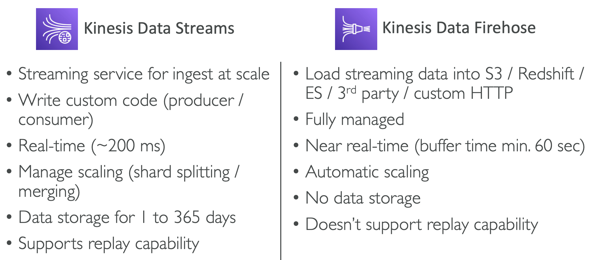

# 21: AWS Integration and Messaging: SQS, SNS & Kinesis

### Overview

When we start deploying multiple applications, they need to communicate with one another. There are two patterns for this:

1. Synchronous communications - application to application, e.g. Buying service => Shipping service
2. Asynchronous/Event-based - application to queue to application


Synchronous communication can be problematic, for example when there are sudden spikes of traffic. Decoupling your applications is a solution to this problem. AWS has different services which can scale independently from our applications:
- **SQS** - the queue model
- **SNS** - the pub/sub model
- **Kinesis** - the real-time streaming model


## SQS - Simple Queue Service

Amazon Simple Queue Service (SQS) lets you send, store, and receive messages between software components at any volume, without losing messages or requiring other services to be available.

SQS is a fully managed service used to decouple applications, and it is the oldest offering on AWS.


### Standard Queue

- Unlimited throughput, unlimited number of messages in the queue
- Default retention of messages is 4 days, maximum of 14 days
- Low latency - <10ms on publish and receive
- Limitation of 256KB per message sent
- It can have duplicate messages (delivery at least once)
- Messages can be out of order (best effort ordering)

### Producers

1. Producers send messages to SQS using the SDK (using SendMessage API)
2. The message is persisted in SQS until a consumer reads it and deletes it

Example - send an order to be processed, the message may have order ID, customer ID etc. 


### Consumers

Consumers can be running on EC2 instances, on premises servers or Lambdas. They poll SQS for messages and can receive up to 10 messages at a time.

The consumer processes the messages, e.g. inserts the message into a database, and then deletes the message in SQS.


### Auto-scaling Groups

Auto-scaling groups is a good use case for SQS, as we can horizontally scale (add more EC2 instances) when there is a lot to process 


### Decoupling application tiers

For applications with intense workloads, e.g. image processing, you can decouple to reduce the load on the front-end web app.


In this example, you can scale the front-end and back-end separately, as their workloads are decoupled.


### SQS Security

#### Encryption
- In flight encryption using HTTPS API
- At rest encryption using KMS keys
- Client-side encryption if the client wants to do their own encryption

**Access Controls** - IAM policies to regulate access to the SQS API

**SQS Access Policies** - similar to S3 bucket policies, which is useful for cross-account access and allowing other services to write to an SQS queue


### SQS Access Policies

If you want to publish to SQS on S3 events, you need to update/create an SQS access policy which allows S3 to send messages. Then you can add an event notification to S3.


### SQS Message Visibility Timeout

After a message is polled by a consumer, it becomes invisible to other consumers. By default, the message visibility timeout is 30 seconds (amount of time to be processed).

If a message is not processed within the visibility timeout, it will be processed twice. To stop this, if a consumer needs more time to process, they can call the `ChangeMessageVisibility` API to get more time. 


**Tradeoffs** - if timeout is high and consumer crashes, re-processing will take a long time, if it's too low, we may get duplicates.


### SQS Dead Letter Queues

If a consumer fails to process a message within the visibility timeout, the message goes back into the queue. You can set a threshold for how many times it can go back. 

After the `MaximumReceives` threshold is hit, the message goes into a Dead Letter Queue. This is useful for debugging. The Dead Letter Queue must match the type of queue (Standard, First In First Out).

In the Console, you can create a queue and then in your original queue, go to the Dead Letter Queue section and add your DLQ.

#### Redrive to Source

Feature to help consume messages in the Dead Letter Queue to understand what's wrong with them. When our code is fixed, we can redrive messages from the DLQ back to the source in batches.


### SQS Delivery Delay

Delaying messages so that consumers don't see them immediately. The default is 0 seconds, but you can set the default at queue level. You can override the default on send using the `DelaySeconds` parameter.


### Certified Developer Concepts

### Long Polling

When a consumer requests messages from the queue, it can wait for messages to arrive if there are none in the queue.

This decreases the number of API calls made to SQS, while increasing the efficiency and latency of your application.

Wait time can be between 1 and 20 seconds, and long polling is considered best practice. It can be enabled at queue level or by using the `WaitTimeSeconds` parameter in the API call.


### SQS Extended Client

For sending large messages (message size limit is 256KB), we can use the SQS Extended Client (a Java library). It sends the large message to S3 and a metadata message to the queue, which instructs the consumer to get the object from S3.


### API Calls

- `CreateQueue` (parameter MessageRetentionPeriod)
- `DeleteQueue`
- `PurgeQueue` - delete all messages in queue
- `SendMessage` (parameter DelaySeconds)
- `DeleteMessage`
- `ReceiveMessage` (param MaxNumberOfMessages) 
- `ReceiveMessageWaitTimeSeconds` - for long polling
- `ChangeMessageVisibility` - to change the message timeout
- You can use Batch APIs for Send, Delete and ChangeMessageVisibility to decrease costs


### First In First Out (FIFO) Queues

Due to the constraint in ordering, the queue has limited throughput (300 messages per second, 3000 with batching), but it means messages are processed in order and we have exactly-once send capability. 

**Note** - Queue name has to end with `.fifo` 

#### Deduplication

If you send the same message within the de-duplication interval (default 5 minutes), then the second message will be refused.

There are two de-duplication methods:
1. Content-based - creates a SHA-256 hash of the message body
2. Provide a de-duplication ID when messages created


#### Message Grouping

If you specify the `MessageGroupID` in an SQS FIFO queue, you can only have one consumer and all messages are in order.

You can specify different values for `MessageGroupID` to have ordering at the level of subsets of messages. Each group ID can have a different consumer, but ordering across groups is not guaranteed.


## SNS - Simple Notification Service

A way of sending messages to many receivers, using the **Pub / Sub - Publish / Subscribe model**

The event producer sends a message to one SNS topic. We can have as many subscribers as we want to listen to the notifications. 


SNS can publish to lots of subscribers, including SQS, Lambda, Kinesis Data Firehose, HTTP endpoints, mobile notifications and emails.

SNS can receive data from many AWS services:


### How to publish

**Topic Publish (using the SDK)** - Creating a topic or subscription or publishing to a topic

**Direct Publish (SDK for mobile apps)** - Creating a platform application or endpoint and publishing to the endpoint, it works with Google GCM, Apple APNS, Amazon ADM.


### Security

It has the same security as SQS - in flight encryption using HTTPS API, at rest encryption with KMS keys, client-side encryption if desired.

It has access controls (IAM policies to regulate access to the SNS API) and SNS Access Policies (like S3 bucket policies).

### SNS and SQS Fan Out Pattern

- A pattern where you push once to SNS, which then publishes to several subscriber SQS queues
- This makes it fully decoupled with no data loss, and makes it easy to add more SQS subscribers over time 
- You need to make sure your SQS queue access policy allows for SNS to write to it
- Can work with cross-region delivery


#### Example: S3 Events to multiple queues

For the same combination of event type (e.g. object create) and prefix (e.g. images/) you can only have one S3 Event rule. You can use the Fan Out pattern to send the same S3 event to many SQS queues.


#### Example: SNS to Amazon S3 through Kinesis Data Firehose


### First In First Out

SNS can also have FIFO topics, they work in the same way as SQS:
- Ordering by message group ID
- De-duplication by the de-duplication ID or content
- You can only have SQS FIFO queues as subscribers, and it has limited throughput like SQS FIFOs


### Message filtering

You can add JSON policies to filter messages sent to SNS topic’s subscriptions.

If a subscription doesn’t have a filter policy, it receives every message.


## Kinesis

Kinesis makes it easy to collect, process and analyse streaming data in real-time, such as application logs, metrics and website clickstreams.

### The Kinesis services:
- **Kinesis Data Streams** - capture, process and store data streams
- **Kinesis Data Firehose** - load data streams into AWS data stores
- **Kinesis Data Analytics** - analyse data streams with SQL or Apache Flink
- **Kinesis Video Streams** - capture, process and store video streams


## Kinesis Data Streams


- Retention between 1 day to 365 days
- Ability to reprocess (replay) data
- Once data is inserted in Kinesis, it can’t be deleted (immutability)
- Data that shares the same partition goes to the same shard (ordering)
- **Producers:** AWS SDK, Kinesis Producer Library (KPL), Kinesis Agent
- **Consumers:**
	- Write your own: Kinesis Client Library (KCL), AWS SDK
	- Managed: AWS Lambda, Kinesis Data Firehose, Kinesis Data Analytics,

### Capacity Modes

### Provisioned Mode
You choose the number of shards provisioned and scale manually/using the API. Each shard gets 1MB/sec in, 2MBs/sec out. 

You pay per shard provisioned per hour.

### On-demand Mode
You don't need to provision or manage the capacity. The default capacity is 4MB/sec, and it scales automatically based on throughput. 

You pay per stream per hour and the data in/out per GB.


### Security

Control access/authorisation using IAM policies. Encryption is the same as SQS and SNS (in-flight HTTPS, at rest KMS, client-side).

VPC Endpoints are available for Kinesis to access within the VPC.


### Kinesis Producers

Producers put data records into data streams. A data stream consists of:
- **Sequence number** - unique per partition key
- **Partition key** - data put into shards based on this
- **Data blob** - up to 1MB

Types of producer:
- **AWS SDK**
- **Kinesis Producer Library** - advanced library to do things like batches, compression, retries
- **Kinesis Agent**

**Write throughput:** 1 MB/sec or 1000 records/sec per shard

All producers use the `PutRecord` API


Partition keys need to be evenly distributed for best performance, i.e. if browser type is used as the partition key, the data streams may not be spread evenly as more people use Chrome than other browsers.

Solutions for a `ProvisionedThroughputExceeded` error:


### Kinesis Consumers

The consumers get data records from the data streams and process them. They can be:
- Lambda
- Kinesis Data Analytics
- Kinesis Data Firehose
- Custom Consumer using AWS SDK (shared fan-out or enhanced)
- Kinesis Client Library


#### Shared (classic) fan-out consumer - pull

- Low number of consuming applications
- Read throughput 2MB/sec per shard across all consumers
- Consumers poll data from Kinesis using a GetRecords API call
- Maximum of 5 GetRecords API calls/sec

#### Enhanced fan-out consumer - push
- Multiple consuming applications
- Read throughput 2MB/sec per consumer per shard
- Latency is lower
- More expensive
- Kinesis pushes data to consumers over HTTP/2 using the SubscribeToShard API

#### Lambda

Lambda supports classic and enhanced fan-out customers. It can read records in batches, and if an error occurs, Lambda retries until success or the data expires.

Lambda can process up to 10 batches per shard simultaneously.


### Kinesis Client Library

A Java library to help read records from Kinesis Data Streams with distributed applications sharing the read workload.

Each shard is read by one KCL instance. It uses DynamoDB to share the work and track other workers. It can run on EC2, Elastic Beanstalk and on premises.


### Kinesis Operations

### Shard splitting
You can divide a shard with high traffic (a hot shard) into two. The old shard is closed and deleted once the data expires. This is to increase capacity (1MB/s of data for each shard).

You can't split into more than two shards in a single operation, and there is no automatic scaling.


### Merging shards
You can merge shards with low traffic (cold shards) to save on capacity and costs. Old shards are closed and deleted once data expires, and you can't merge more than two in a single operation.


### Adding records to a Data Stream using the CLI

```bash
aws kinesis put-record --stream-name DemoStream --partition-key user1 --data "user signup" --cli-binary-format raw-in-base64-out
```

## Kinesis Data Firehose

A fully managed service, no administration, automatic scaling and it is serverless.

It can output data into:
- **AWS** - S3, RedShift (data warehouse service), ElasticSearch
- **3rd Party** - Splunk, MongoDB, DataDog
- **Custom** - to any HTTP endpoint

You pay for the data going through Firehose, it processes data in near real time (slower than Sata Streams), supports many data formats, data can be transformed using Lambda, and you can send failed data to a backup S3 bucket.


### Kinesis Data Streams vs Firehose

Firehose is for loading streaming data into another service, it is serverless, so it scales automatically, and it doesn't store data.

Kinesis Data Streams is for ingesting streaming data, you have to manage scaling, but data is stored for 1 to 365 days.




In the hands on, we set up a Firehose which was linked to the Data Stream, and set up pushing the data into an S3 bucket.

## Kinesis Data Analytics

### Data Analytics for SQL Applications

You can pass data from Data Streams or Firehose into Data Analytics, do some analysis and then pass the results back to those services to create streams/send the query results to destinations.


It is a fully managed service with automatic scaling. You pay for actual consumption rate.

#### Use cases:
- Time-series analytics
- Real-time dashboards
- Real-time metrics

### Data Analytics for Apache Flink

Use Flink (on a managed cluster) to process and analyse streaming data. Flink is a lot more powerful than just querying with SQL.

You can only read from Kinesis Data Streams and Amazon MSK (Managed Streaming for Apache Kafka), not from Firehose.


### Data ordering for Kinesis vs SQS FIFO

You can use partition keys to keep data in order, e.g. for truck GPS positions getting consumed in order, partitioning the data based on truck ID, the data will always be in order for each individual truck.


#### Ordering data in SQS

There's no ordering in SQS Standard. For FIFO, messages are consumed in the order they're sent, to just one consumer. You can use Group ID to do something similar to partition keys, which will create a consumer for each group.

#### 100 trucks example
Kinesis Data Streams:
- 20 trucks per shard
- Trucks have data ordered within each shard
- Maximum amount of consumers is 5 (1 for each shard)
- Can receive up to 5MB/s of data

SQS FIFO:
- Only one SQS FIFO Queue
- 100 Group IDs
- Up to 100 consumers
- Up to 300 messages per second (3000 with batch)

## SQS vs SNS vs Kinesis


