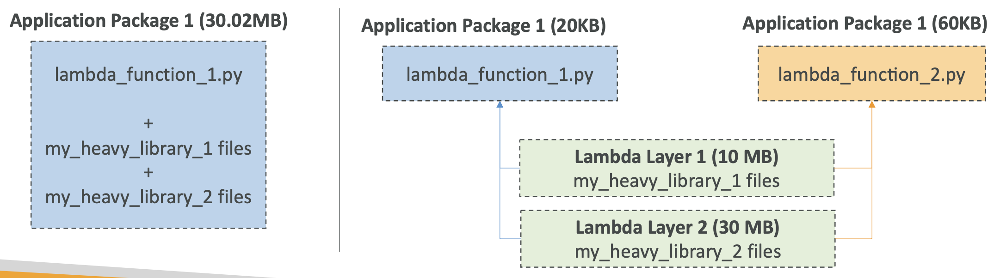

# 22: Lambda

### Serverless services in AWS
- AWS Lambda
- DynamoDB
- AWS Cognito
- AWS API Gateway
- Amazon S3
- AWS SNS & SQS
- AWS Kinesis Data Firehose
- Aurora Serverless
- Step Functions
- Fargate


### Language support

Node, Python, Java, C#, Golang, Powershell, Ruby, Custom Runtime API (community supported which allows you to use Lambda with any language)

#### Lambda container image
The container must implement the Lambda Runtime API
ECS/Fargate is preferred for running Docker images


### Synchronous Invocations

- You can make synchronous calls from the CLI, SDK, API Gateway and Application Load Balancer
- Results are returned right away, error handling must happen client side

CLI command to list functions:
```bash
aws lambda list-functions
```
You can run your lambda from the CLI using a command like this: 
```bash
aws lambda invoke --function-name demo-lambda --cli-binary-format raw-in-base64-out --payload '{"key1": "value1", "key2": "value2", "key3": "value3" }' --region eu-west-1 response.json
```


### Lambda Integration with Application Load Balancer

- Exposing a lambda as an HTTP(S) endpoint
- The function must be registered in a target group
- Multi header values are supported and will be in the JSON as an array


### Lambda@Edge

- Deploying lambda functions alongside your CloudFront CDN, Lambda is deployed globally
- Lambda can be used to change CloudFront requests and responses:
    - Viewer request
    - Origin request
    - Origin response
    - Viewer response
- Good for security, SEO, authentication, analytics, user tracking


### Asynchronous invocations

- S3, SNS, CloudWatch events
- Events go into an Event Queue
- Lambda retries on error - 3 times
- Lambda functions can send failed invocations into a Dead Letter Queue

When you make an asynchronous call, you get a 202 status response whether it’s successful or not, you don’t see the result of the invocation

```bash
aws lambda invoke --function-name demo-lambda --cli-binary-format raw-in-base64-out --payload '{"key1": "value1", "key2": "value2", "key3": "value3" }' --invocation-type Event --region eu-west-1 response.json
```

The only difference with synchronous calls is the `--invocation-type Event` flag.

### EventBridge

Set up schedule like a CRON job which calls a lambda without having to have a server running all the time to schedule

You can use CRON expressions, e.g. `0 0 12 * * ?`, and you can link those jobs to Lambdas.


### S3 Event Notifications 

There is an Event notifications section in S3 properties - you can choose event types (put, post, copy), can choose Lambda, SNS or SQS, which will be invoked when selected events occur.


### Event source mapping 

- Lambda polls records from the source
- It can poll Kinesis, SQS or DynamoDB

#### Streams 
- Creates an iterator for a shard, processes items in order
- Can process large batches in parallel by sending it off to separate lambdas
- Error handling - batch reprocessed until it passes or expires


#### Queues 
- Triggering Lambdas when items are added to an SQS queue
- You can enable a Dead Letter Queue
- Add a trigger to your Lambda and choose SQS
- You can choose batch size 
- You’ll need to give the lambda permission to read from SQS


### Lambda Destinations

- Sending the result/failure of an asynchronous/event mapper call to a destination (e.g. SQS queue) 
- Recommended to use instead of the Dead Letter Queue, as you can put successes and failures in separate destinations
- When you create a destination linked to your lambda, you select On success or On failure condition


### Permissions for Lambdas

When a source invokes the lambda, it needs a permission assigned to it in its resource based policy to be able to invoke it.

When it’s event source mapping, the lambda polls the resource so the lambda IAM needs a role to access it


### Environment Variables

You can add key-value pairs to a Lambda. This can be useful so you can have versions of a Lambda for different environments.


### Logging and monitoring Lambdas

- Execution logs are stored in CloudWatch Logs
- You can see metrics like invocations, success rates, error counts in CloudWatch Metrics
- You can link Lambda to X-Ray, for tracing and debugging

To enable X-Ray, you need to add code to your lambda like in the JS example later, and also enable tracing in the console, which will add permissions for X-Ray to the Lambda IAM role. 


### Lambda in a VPC

You can have a lambda which accesses resources in your Virtual Private Cloud by using an Elastic Network Interface, by assigning it permissions to access it.


Lambdas used within your VPC won’t have internet access automatically, so you’ll have to use a NAT gateway to access something external


### Configuration

RAM from 128MB to 10GB - if you use over 1800MB, this is the equivalent of one virtual CPU, if you want to use more RAM, you need to use threading in your code to make the most of the CPUs

Timeout defaults to 3 seconds, max 900 

#### Execution context 
- A temporary runtime environment that initialises external dependencies
- Maintained for a while so next invocation can re-use context 
- You can store files temporarily in the /tmp folder, for permanent, you need to use something like S3


### Concurrency

- Limit of up to 1000 concurrent executions - you set the limit
- Invocations over the limit ‘throttle’
- Synchronous - returns Throttle 429 error
- Asynchronous - retries and goes to Dead Letter Queue if it continues to fail

#### Cold starts and provisioned concurrency 
If the init is large for a new lambda, the first request might be quite slow. Provisioned concurrency is a way to prevent this.

Provisioned concurrency is allocated before the function is invoked so all invocations stay low latency (the function is run on load instead of the first time a client invokes it).


### Lambda External Dependencies

If your Lambda function depends on external libraries, you need to install the packages alongside your code and zip it together.

- For node, use npm and a node_modules folder
- For Python, use `pip --target`
- For Java, use .jar files

You can upload the zip straight to Lambda if it's less than 50MB, otherwise upload it to S3 first. The AWS SDK comes pre-loaded onto all Lambdas.

Example JS Lambda:
```js
// Require the X-Ray SDK (need to install it first)
const AWSXRay = require('aws-xray-sdk-core')

// Require the AWS SDK (comes with every Lambda function)
const AWS = AWSXRay.captureAWS(require('aws-sdk'))

// We'll use the S3 service, so we need a proper IAM role
const s3 = new AWS.S3()

exports.handler = async function(event) {
  return s3.listBuckets().promise()
}
```

CLI commands to deploy it:
```bash
# You need to have nodejs / npm installed beforehand
npm install aws-xray-sdk

# Set proper permissions for project files
chmod a+r * 

# You need to have the zip command available
zip -r function.zip .

# create the Lambda function using the CLI
aws lambda create-function --zip-file fileb://function.zip --function-name lambda-xray-with-dependencies --runtime nodejs14.x --handler index.handler --role arn:aws:iam::001736599714:role/DemoLambdaWithDependencies
```

### Lambda and CloudFormation

To deploy Lambdas in CloudFormation, you can either create them inline in your template, or pull them from S3.

#### Inline

You can define your function in the template as the Code.ZipFile property of your Lambda declaration.

This is only for really simple Lambdas and you can't have dependencies.

#### S3

You store the zip of your Lambda in S3, and you refer to the zip location in your CloudFormation template using:
- S3Bucket
- S3Key
- S3ObjectVersion

Specifying version is recommended, as when you update the code in S3 but the version doesn't change, CloudFormation won't automatically update your function.

#### Creating Lambdas with CloudFormation on Multiple Accounts

You are able to create lambdas from multiple accounts, by having a bucket policy which allows access to other accounts on the bucket which contains the Lambda.

If the Lambda needs to access AWS services from the account, it must have an execution role with permissions for those services.


Example CloudFormation template with an execution role:

```yaml
Parameters:
  S3BucketParam:
    Type: String
  S3KeyParam:
    Type: String
  S3ObjectVersionParam:
    Type: String

Resources:
  LambdaExecutionRole:
    Type: AWS::IAM::Role
    Properties:
      AssumeRolePolicyDocument:
        Version: '2012-10-17'
        Statement:
        - Effect: Allow
          Principal:
            Service:
            - lambda.amazonaws.com
          Action:
          - sts:AssumeRole
      Path: "/"
      Policies:
      - PolicyName: root
        PolicyDocument:
          Version: '2012-10-17'
          Statement:
          - Effect: Allow
            Action:
            - logs:*
            Resource: arn:aws:logs:*:*:*
          - Effect: Allow
            Action:
            - xray:PutTraceSegments
            - xray:PutTelemetryRecords
            - xray:GetSamplingRules
            - xray:GetSamplingTargets
            - xray:GetSamplingStatisticSummaries
            Resource: "*"
          - Effect: Allow
            Action: 
            - s3:Get*
            - s3:List*
            Resource: "*"

  LambdaWithXRay: 
    Type: "AWS::Lambda::Function"
    Properties: 
      Handler: "index.handler"
      Role: 
        Fn::GetAtt: 
          - "LambdaExecutionRole"
          - "Arn"
      Code: 
        S3Bucket: 
          Ref: S3BucketParam
        S3Key: 
          Ref: S3KeyParam
        S3ObjectVersion:
          Ref: S3ObjectVersionParam
      Runtime: "nodejs14.x"
      Timeout: 10
      # Enable XRay
      TracingConfig:
        Mode: "Active"
```


### Lambda Layers

Community supported custom runtimes which let us run languages in Lambdas which aren't natively supported, e.g. C++ and Rust.

We can also externalise dependencies so we can reuse them instead of having to zip them up with every Lambda we create.



In the hands-on, we added an AWS Layer to a Lambda which had the Python SciPy package already loaded, and we could use the package without having to package it ourselves.


### Lambda Container Images

Deploy a Lambda function as a container image from Elastic Container Registry.

Base images are available for Python, Node, .NET, Go and Ruby, but you can create your own image which implements the Lambda Runtime API.

You can test the containers locally using the Lambda Runtime Interface Emulator.

Example container image:


This can be a good alternative to creating your own Lambda Layers, as it is another easy way to easily package up your dependencies.


### Lambda Versions and Aliases

#### Versions

You can work on the $LATEST of a Lambda function, but when you publish a Lambda, you create a version, which is immutable, you can't change it.

Versions have their own ARN, and each version is accessible.

#### Aliases

Aliases are pointers to versions of Lambdas. We can define dev, test and prod aliases and have them point at different versions.

Aliases are mutable and they enable Blue/Green Deployment by assigning weights to the function versions.

Aliases have their own ARNs, but they cannot reference other aliases.


### Lambda & CodeDeploy

CodeDeploy can help you automate traffic shift for Lambda aliases. The feature is integrated with the SAM (Serverless Application Model) framework.

Traffic shifting options:
- Linear - frow traffic every minute N minutes until 100%, example API call - `Linear10PercentEvery3Minutes`
- Canary - try X% then 100%, example API call - `Canary10Percent5Minutes`
- AllAtOnce - immediate

You can create pre and post-traffic hooks to check the health of the Lambda function.


### Lambda Limits

Limits for Lambda are per region:
- Execution
	- Memory allocation - 128MB to 10GB
	- Maximum execution time - 900 seconds
	- Environment variables - 4KB
	- Disk capacity in the function container - 512MB to 10GB
- Deployment
	- Lambda function deployment size when compressed - 50MB
	- Size of uncompressed deployment - 250MB
	- Can use the /tmp directory to load other files at startup   


## Lambda Best Practice

- Perform the heavy duty work outside of your function handler, e.g. connecting to databases, initialising the SDK, pulling in dependencies
- Use environment variables for database connection strings, S3 buckets, passwords and sensitive values
- Minimise your deployment package size to just what it needs
- Avoid recursive code - you don't want a lambda to call itself as it could get very expensive

