# 23: DynamoDB

### Traditional Architecture

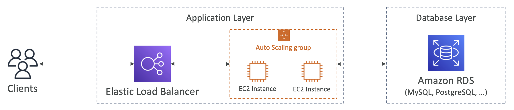

In a traditional architecture, you use a SQL database and there are a lot of requirements about how the data is modelled. In terms of scaling, you can scale vertically by increasing CPU/RAM for the database. For horizontal scaling, the only option is adding RDS Read Replicas.


### NoSQL Databases

- Non-relational databases which are distributed (e.g. MongoDB, DynamoDB)
- NoSQL does not support join queries, all the data is present in one row
- You can't do aggregations like SUM or AVG
- NoSQL databases can easily scale horizontally

## DynamoDB

- A NoSQL database which is fully managed, highly available and has replication across Availability Zones.
- It can handle millions of requests per second, trillions of rows, 100s of TBs of storage.
- It integrates with IAM for security, authorisation and administration.
- Enables event driven programming with DynamoDB Streams
- It is low cost and has auto-scaling capabilities
- There is a Standard and Infrequent Access class

DynamoDB is made of Tables, where each table has a Primary Key. Each table can have an infinite number of items (rows).

Each item has attributes, which can be added over time and can be null. You can't set a not null constraint. The maximum size of an item is 400KB.

Supported data types:
- Scalar - String, Number, Binary, Boolean, Null
- DocumentTypes - List, Map
- SetTypes - String Set, Number Set, Binary Set

### Primary Keys

1. **Partition Key (HASH)** - must be unique for each item, must be diverse so data is distributed, e.g. User_ID for a users table

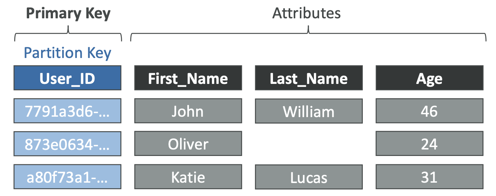

2. **Partition Key + Sort Key (HASH + RANGE)** - combination must be unique for each item, data is grouped by partition key

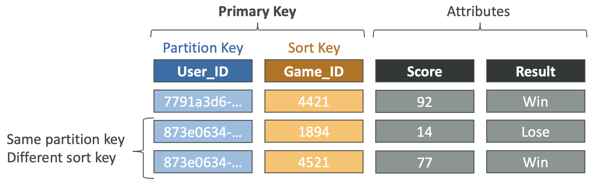


### Read / Write Capacity Modes

How you manage your table's capacity (read/write throughput):
- **Provisioned Mode (default)** - You plan capacity before by specifying the number of read/writes per second, you pay for provisioned read and write capacity units
- **On Demand Mode** - Read/Writes automatically scale, no capacity planning, you pay for what you use but it is more expensive

You can switch between the two modes once every 24 hours.

### Provisioned Capacity Mode
- The table must have provisioned Read Capacity Units(RCU - throughput for reads) and Write Capacity Units(WCU - throughput for writes)
- There is an option to set up auto-scaling of throughput to meet demand
- Throughput can be exceeded temporarily using Burst Capacity - but if exceeded you get a `ProvisionedThroughputExceededException`
- In this case, exponential backoff retries are recommended

### Write Capacity Unit

One write per second for an item up to 1KB, when items are larger, more WCUs are consumed. 

### Read Capacity Unit

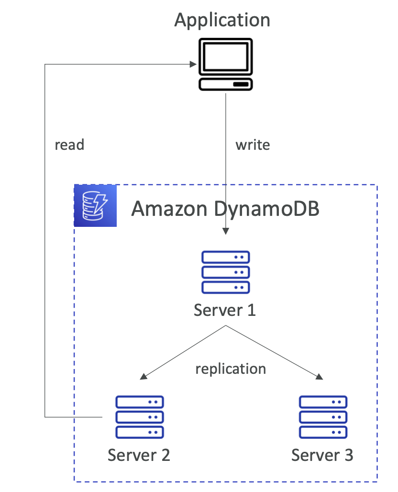

**Eventually Consistent Read** - If we read just after a write, you can get stale data because of replication.

**Strongly Consistent Read** - If we read just after a write, we still get correct data, set `ConsistentRead` parameter to true in API calls (`GetItem`, `Query`). It consumes twice the RCU.

One RCU is one Strongly Consistent Read per second or two Eventually Consistent Reads, for items up to 4KB. 


### Partitions

Data is stored in partitions, partition keys go through a hashing formula to know which partition they go to. WCUs and RCUs are spread evenly across partitions.

### Throttling

When you exceed the provisioned RCUs/WCUs, you get a `ProvisionedThroughputExceededException`. The reasons for this could be:
- **Hot keys** - one partition key being read too many times
- **Hot partitions**
- **Very large items** - RCU and WCU depend on size of items
Solutions:
- Exponential backup (already included in SDK)
- Distribute partition keys
- If it's an RCU issue, you can use **DynamoDB Accelerator (DAX)**

### Read Write Capacity Modes - On Demand
- Reads and Writes automatically scale with your workload
- No capacity planning needed
- Unlimited RCUs and WCUs
- You're charged for reads and writes that you use
- 2.5 times more expensive than provisioned capacity


## DynamoDB API Calls

### Writing Data

- **PutItem** - Create new item or fully replace old item with same primary key, consumes WCUs
- **UpdateItem** - Edit an existing item's attributes or add a new item if it doesn't exist
- **Conditional Writes** - Accept a Write/Update/Delete if a condition is met, otherwise return an error (helps with concurrent updates)

### Reading Data

#### GetItem
- Read based on primary key (hash or hash + range)
- By default it is an Eventually Consistent Read, but can choose Strongly Consistent
- A `ProjectionExpression` can be used to only return certain attributes.

#### Query
- Returns items based on: 
	- `KeyConditionExpression` - PartitionKey value (=), sort key value (=, <=, >=, >)
	- `FilterExpression` - additional filtering after query operation - only for non-key attributes
- Returns the number of items specified in the Limit or up to 1MB of data
- You can do pagination on the results
- You can query a table, or a Local or Global Secondary Index

#### Scan
- Scan the entire table and then filter out data
- Filtering is inefficient so the main use is to get a whole table, it returns 1MB and you can paginate
- You can use a Parallel Scan for improved performance, which has multiple workers scanning data segments at the same time
- You can use a `ProjectionExpression` or `FilterExpression`

### Deleting Data
- `DeleteItem` - delete an individual item, can be conditional
- `DeleteTable` - much quicker than deleting all items

### Batch Operations
- Save in latency by reducing the number of API calls
- Operations are done in parallel and you can do retries for failed items
- `BatchWriteItem` - Up to 25 `Put` or `DeleteItem`s in one call, up to 16MB, you can't do a batch `UpdateItem`
- `BatchGetItem` - Return items from one or more tables, up to 100 items and 16MB of data


## Indexes

### Local Secondary Index (LSI)

- An alternative sort key for your table
- The sort key is one scalar attribute (String, Number, Binary)
- You can have up to five Local Secondary Indexes per table
- Must be defined on table creation
- Attribute Projections - can contain some or all of the attributes of the base table

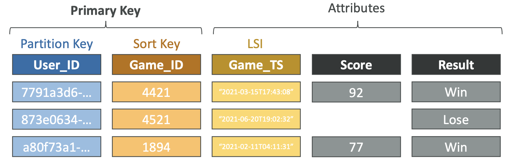

### Global Secondary Index (GSI)
- Alternative primary key (Hash or Has + range) from the base table
- Good for speeding up queries on non-key attributes
- Can be added/modified after table creation
- You must provision RCUs and WCUs for the index

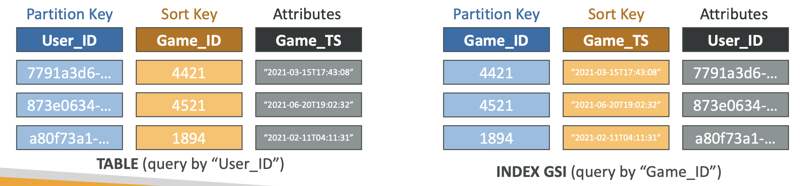

### Throttling on Indexes
- **Global Secondary Indexes** - If writes are throttled on a GSI, the main table will be throttled too. You need to choose your partition key and capacity carefully.
- **Local Secondary Indexes** - Uses the RCUs and WCUs of the main table, so there are no extra considerations for throttling

### PartiQL
- Use a SQL-like language to query and manipulate DynamoDB tables
- Supports `INSERT`, `UPDATE`, `SELECT` and `DELETE` statements
- It supports batch operations
- There is a PartiQL editor in the Console


### Optimistic Locking
DynamoDB has a feature called Conditional Writes, which is a strategy to ensure that an item hasn't changed before you update it. Each item has a version number attribute, so it will check whether the item has been updated to prevent overwrites.

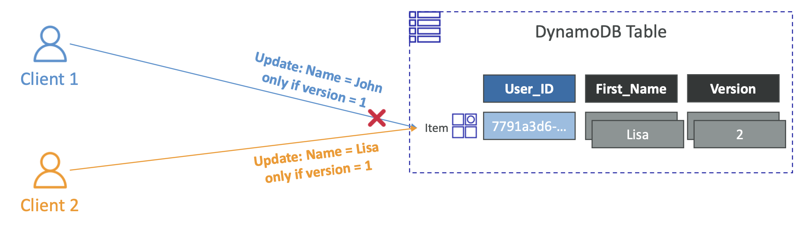


### DynamoDB Accelerator - DAX

- An in-memory cache for DynamoDB, which is fully managed and highly available
- It doesn't require application code modification
- Solves the 'hot key' problem of too many reads
- Has a default Time To Live of 5 minutes
- You can have up to 11 nodes in a cluster, multi-availability zones
- Security - encryption at rest with KMS, IAM, CloudTrail
- When you create a DAX cluster, you can choose which databases it has access to. Once created, you need to update your apps to point at the cluster endpoint instead of the DB endpoints.

#### DynamoDB Accelerator vs ElastiCache

DAX stores individual objects and queries, ElastiCache can store data which has been modified by your application (e.g. aggregation results). They can be used in conjunction.

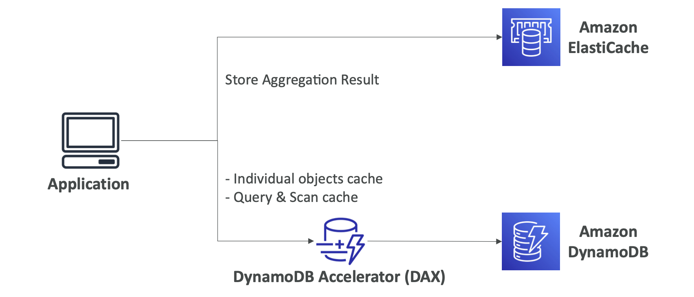


### DynamoDB Streams

An ordered stream of item-level modifications in a table, which can be sent to:
- Kinesis Data Streams
- AWS Lambda
- Kinesis Client Library applications

There is data retention for 24 hours, so you need to process it/move it within that time.

Use cases:
- React to changes in real-time, e.g. welcome emails to new users
- Analytics
- Inserting data into derivative tables
- Inserting data into ElastiCache
- Implementing cross region replication

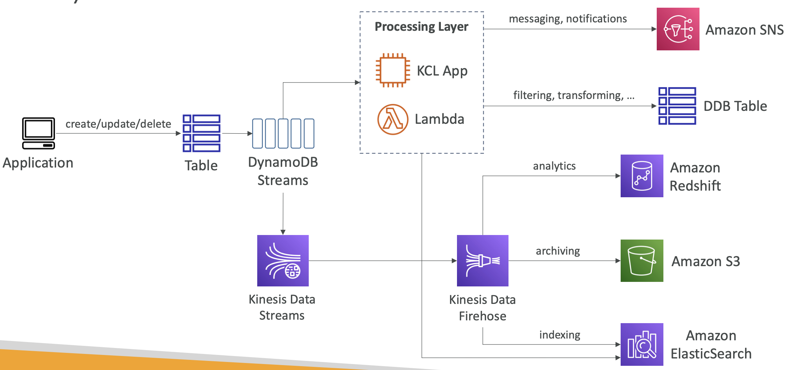


You can choose the information which is written to Streams, e.g. KEYS_ONLY (only key attributes), NEW_IMAGE (item after modification), OLD_IMAGE (item before modification), NEW_AND_OLD_IMAGES.

DynamoDB Streams are made of shards, like Kinesis Data Streams, but you don't provision shards like with Data Streams.

Records are not retroactively populated in a stream after enabling it.

#### DynamoDB Streams with Lambda

You need to define an Event Source Mapping in the Lambda to read from a DynamoDB Stream and give the Lambda required permissions. The Lambda will then poll the Stream and get invoked with batches.


### Time To Live

- Automatically delete items after an expiry timestamp
- It doesn't consume any WCUs
- The TTL attribute must be of type Number and use a UNIX epoch timestamp value
- The expired items are deleted within 48 hours of expiry, but will still appear until deletion
- They are also deleted from Local and Global Secondary Indexes
- A Delete operation appears in DynamoDB Streams (for auditing/recovery)

You can enable TTL in Additional Settings in the Console, you choose an attribute to link it to.


### DynamoDB CLI

DynamoDB Options:
- `--projection-expression` - one or more attributes to retrieve
- `--filter-expression` - filter items before they're returned

General AWS Pagination Options:
- `page-size` - CLI retrieves full list of items but with multiple API calls
- `--max-items` - Max number of items to show in the CLI, returns a `NextToken`
- `--starting-token` - specify the last `NextToken` to retrieve the next set of items


Examples:
```bash
aws dynamodb scan --table-name UserPosts --projection-expression "user_id, content"

aws dynamodb scan --table-name UserPosts --filter-expression "user_id = :u" --expression-attribute-values '{":u": {"S": "john123"}}'
# string that has the value john123

aws dynamodb scan --table-name UserPosts --page-size 20
# Still returns all items but in separate API calls for each page size

aws dynamodb scan --table-name UserPosts --max-items 20
# only returns number of items, but returns count and next token

# you can then run the same command with an additional 
--starting-token NextTokenHashReturnedFromLastCommand # to get the next set
```


### DynamoDB Transactions

You can use transactions in DynamoDB, so the database can rollback when transactions fail and to ensure the ACID rules - **Atomicity, Consistency, Isolation, Durability**.

Transactional reads and writes consume two RCUs/WCUs, as there are prepare and commit actions.

There are two operations:
- `TransactGetItems` - one or more `GetItem` operation
- `TransactWriteItems` - one or more `Put`, `Update` and `DeleteItem` operations

#### Use cases:
- Financial transactions
- Managing orders
- Multiplayer games

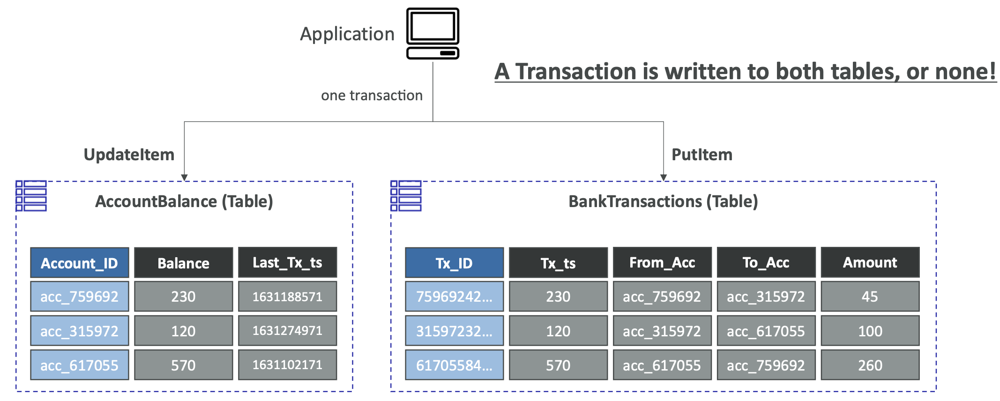

#### Capacity Computations

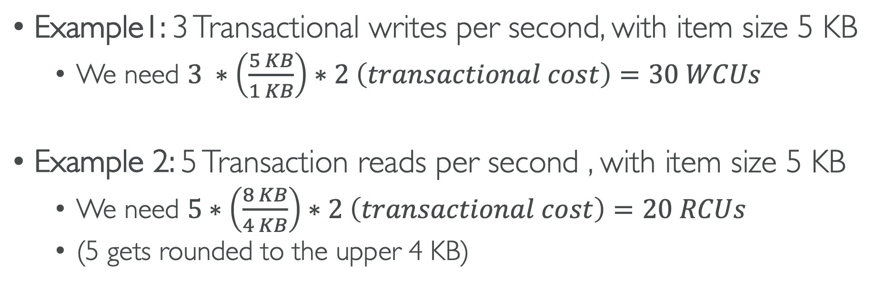


### DynamoDB as a Session State Cache

Session state cache is a common use case for DynamoDB and ElastiCache. They're both key/value stores, but the difference between them is that DynamoDB is serverless and ElastiCache is in-memory.

You could use other services for caching but they're not really recommended. You could use EFS attached to EC2 instances as a network drive. EBS and Instance Store is only for local caching.


### Partitioning Strategies

Write sharding is a strategy which enables better distribution of items across partitions.

You can add a suffix to the partition key by using either a random suffix or a calculated one, which spreads items across shards equally.

An example would be a voting application where there are two candidates, A and B. With two options, there could only be two shards and there will be a hot key, but adding suffixes to spread the items will prevent this.


### DynamoDB Write Types

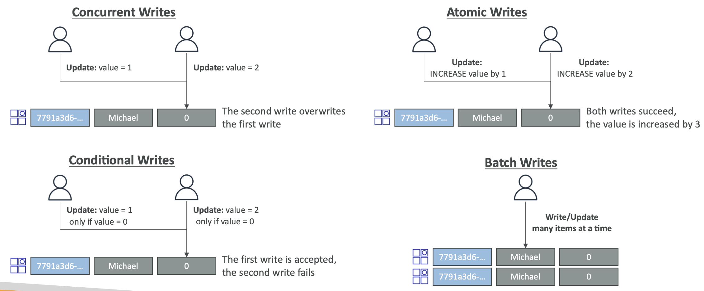


### Large Objects Pattern

DynamoDB is designed to store small objects. To store large objects, you can upload objects to S3 and then store the metadata in DynamoDB. This makes it easier to query for objects than just having things stored in S3.

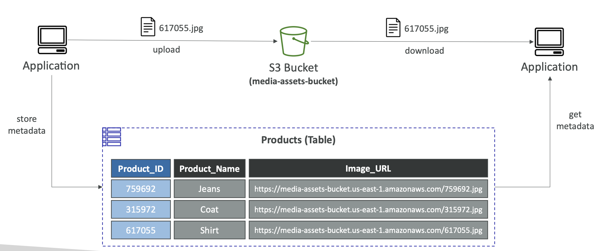

This example shows the appplication pushing the metadata directly. An alternative would be uploads to S3 triggering a Lambda which pushes metadata to DynamoDB.


### DynamoDB Operations

Table Cleanup:
1. Scan and delete - slow and expensive as it consumes RCU and WCU
2. Drop table and recreate - fast, efficient and cheap

Copying a DynamoDB table:
1. Use AWS DataPipeline
2. Backup and restore into new table (easiest option)
3. Scan and PutItem/BatchWriteItems


### DynamoDB Security and Other Features

#### Security:
- VPC Endpoints available to access DynamoDB without using the Internet
- Access controlled by IAM
- Encryption at rest using KMS and in-transit using SSL/TLS

#### Back-up and Restoring
- Point In Time Recovery like RDS
- No performance impact

#### Global Tables
Tables can be multi-region, multi-AZ, fully replicated and high performance

#### DynamoDB Local
You can develop and test apps locally without accessing the DynamoDB web service

#### AWS Database Migration Service
You can use the Database Migration Service to migrate to DynamoDB from other services like MongoDB, Oracle, MySQL.


### Users interacting with DynamoDB

We don't want to provide IAM roles for users as it is difficult to manage and dangerous. We can use identity providers to give users temporary AWS credentials, with specific permissions.

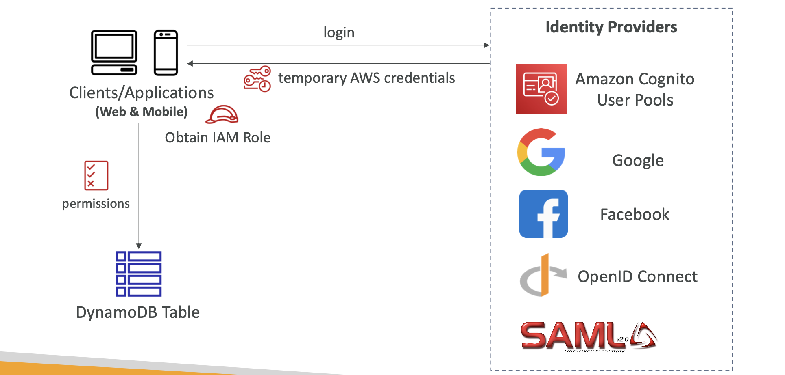

You can have fine-grained Access Control by using a federated login, specifying a condition on leading keys to limit row-level access for users, and attributes to limit users at the column-level.

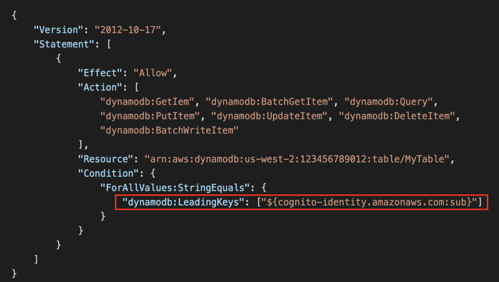


### Summary of Reads and Writes in DynamoDB
Writes - 1 write of 1KB
Eventually consistent read - 2 reads of 4KB
Strongly consistent read - 1 read of 4KB
