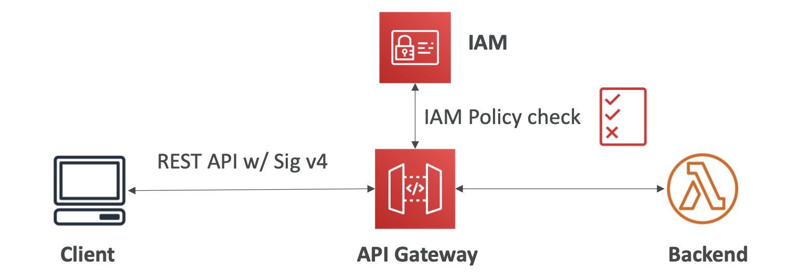
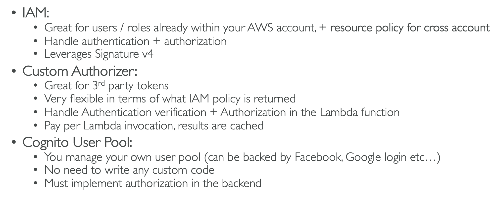

# 24: API Gateway


### Overview

Create publicly accessible APIs by proxying requests to lambdas.

- AWS Lambda and API Gateway - A fully serverless application where there is no infrastructure to manage
- It has support for the ebSocket protocol
- It can handle API versioning
- Handle different environments (dev, prod)
- Handle security with authorisation and authentication
- Create API keys, handle throttling
- Transform and validate requests and responses
- Generate SDK and API specifications
- Cache API responses


### API Gateway Integrations

**Lambda function** - Invoke a lambda function, to easily expose a REST API

**HTTP** - Expose HTTP endpoints, e.g. an internal API, Application Load Balancer. It allows you to easily add rate limiting, caching, user authentication, API keys

**AWS service** - You can expose any AWS API through API Gateway, e.g. post a message to SQS, start a Step Function workflow. This allows you to deploy publicly, add authentication, rate control

#### Kinesis Data Streams integration example

Allow people to send data into a Kinesis Data Stream securely without giving them access to AWS credentials.

#### Lambda example


### Endpoint Types

- **Edge-Optimized (default)** - Requests are routed through CloudFront Edge locations, API Gateway is still only in one region
- **Regional** - Used when all users are in the same region, you can combine with CloudFront with more control over caching strategies etc.
- **Private** - Accesses within a VPC using a VPC endpoint, giving access by using a resource policy

### Security

User authentication using IAM roles for internal applications, Cognito for external users or a custom authoriser.

You can have custom domain name HTTPS security through integration with AWS Certificate Manager. You must set up a CNAME or Alias record in Route 53 to point to your endpoint.

In the console, you can create endpoints in your API and assign lambdas/different services to them. You can then call them from the Console, or deploy them with a stage and access the API from the generated URL.


### Deployment Stages and Deployment

Changes in an API will not appear until you deploy the API to a stage. You can name the stages what you want, but test, dev and prod are common.

Each stage has its own configuration parameters and stages can be rolled back as deployment history is kept.

A common use case for stages is having version names for stages, so clients can continue using older versions and old stages get deleted once all clients have migrated.

### Stage Variables

Like environment variables for API Gateway. You can use them to configure which HTTP endpoints your stages talk to. You can pass parameters through to Lambda, available in Lambda in the context object.

#### Lambda Aliases


1. Create aliases for a Lambda function pointing at different versions
2. When you create an endpoint, add stage variable to the name of the lambda:
  `lambda-api-gateway-proxy-get:${stageVariables.lambdaAlias}`
3. The lambda needs a resource-based policy which gives API Gateway permission to invoke aliases of the function
4. You can then pass in stage variables when you make calls to the API from API Gateway in the Console.
5. After deploying to a stage, you can add variables in the Stage Variables section of the stage.


### Canary Deployments

Canary deployments allow you to choose a percentage of traffic to go to the newly deployed version.

You can enable canary deployments for any environment, but it is mainly for prod. Metrics and logs stay separate, you can override stage variables for the canary.

To do this, you create a canary for a stage, and choose traffic percentages. You then deploy to the stage canary. When you are happy that the canary is running as expected, you can promote it, and all traffic will be directed to the canary.


### API Gateway Integration Types 

- **MOCK** - Used for setting up API Gateway, returns a response without sending the request to the backend
- **HTTP / AWS (Lambda and AWS services)** -You configure the integration request and response and set up data mapping using mapping templates
- **AWS_PROXY (Lambda Proxy)** - Request is passed straight to Lambda without any changes to headers, query string etc.
- **HTTP_PROXY** - No mapping template, the request is passed straight to the backend (e.g. Application Load Balancer), and the response is just forwarded by API Gateway 


### Mapping Templates

Mapping templates are used to modify requests and responses, but only when using non-proxy integration types.

You can:
- Rename/modify query string parameters
- Modify body content
- Add headers
- Filter out parts of response

It uses a scripting language called **Velocity Template Language**.

#### Mapping example: JSON to XML for SOAP

SOAP APIs are XML-based, whereas REST APIs are JSON. Using mappings to convert JSON into XML is an example of when you'd use mapping templates.


#### Mapping example: Query string params


#### Hands On

- Set up a lambda and in API Gateway, create a method which is not a proxy integration
- Go into the Integration Response to add a mapping template to modify the response (you can generate an example template):
  ```
  #set($inputRoot = $input.path('$')) {
    "renamedExample": $inputRoot.example,
    "anotherKey": "anotherValue"
  }
  ```

### API Gateway Swagger / OpenAPI Spec

Swagger and OpenAPI are common ways of defining RESTful APIs, using code to define your API.

You can import Swagger and OpenAPI specs (methods, integration responses) to API Gateway.

Swagger can be written in YAML or JSON. It is an easy way to generate an SDK for an application.

You can go to the Export tab and get your API in the format of OpenAPI or Swagger to easily reuse it.


### API Gateway Caching

- The default Time To Live is 360 secs(5 mins), minimum 0 secs, max 1 hour
- Caches are defined per stage
- You can override cache settings per method
- You can encrypt the cache
- Capacity is between 0.5GB to 237GB
- The cache is expensive so it may be something you only want in Prod

#### Cache Invalidation

- You can flush the cache
- Clients can invalidate the cache with the header `Cache- Control: max-age=0`, but they need IAM permission
- If you don't impose an InvalidateCache policy (or choose the Require authorization check box in the console), any client can invalidate the API cache


### Usage Plans and API Keys

If you want to make your API available as a paid offering for customers, you can create a **Usage Plan**:
- Who can access one or more API stages and methods
- How much they can access them
- Uses API keys to identify clients
- Configure throttling and quota limits to enforce on individual clients

**API Keys**:
- Alphanumeric string values distributed to customers
- Can be used with Usage Plans to control access
- Throttling and quota (max number of requests) limits are applied to API keys


### How to configure a Usage Plan

1. Create an API, configure methods to require an API key and deploy stages
2. Generate or import API keys to distribute
3. Create the usage plan with the throttling and quota limits
4. Associate API stages and keys with the usage plan

Callers of the API must supply an assigned API key in the `x-api-key` header in requests to the API.


## Monitoring, Logging and Tracing

#### CloudWatch Logs
- You can enable logging at stage level
- You can override settings on a per API basis
- Contains information about request/response bodies

#### X-Ray
- Enable tracing to get extra information about requests in API Gateway

#### CloudWatch Metrics
Metrics are by stage and you can enable detailed metrics
- `CacheHitCount` and `CountMissCount` - efficiency of cache
- `Count` - total number of API requests
- `IntegrationLatency` - Time between request relay to backend and response from backend
- `Latency` - Time between API Gateway receiving a request and returning the response to the client
- `4XXError` - Client-side
- `5XXError` - Server-side

#### Throttling

By default, API Gateway throttles at 10000 requests per second, but this can be changed. When throttling, you receive the 429 error Too Many Requests.

You can set stage and method throttling limits or define Usage Plans to set throttling per client. 

One API throttling can cause other APIs to throttle too.


#### Errors
**4XX Errors - Client-side**
- 400 - Bad Request
- 403 - Access Denied, WAF Filtered
- 429 - Quota Exceeded (Throttling)

**5XX Errors - Server-side**
- 502 - Bad Gateway Exception - incompatible output
- 503 - Service Unavailable
- 504 - Integration Failure

API Gateway requests time out after a maximum of 29 seconds.


### CORS - Cross Origin Resource Sharing

CORS must be enabled when you receive API calls from another domain. You can enable CORS through the Console.

The OPTIONS pre-flight request must contain:
- `Access-Control-Allow-Methods`
- `Access-Control-Allow-Headers`
- `Access-Control-Allow-Origin`


When you enable CORS on a method, an OPTIONS method gets created, which is for pre-flight requests.

**Note:** This only works if you are not using a proxy. With proxies, the requests are passed directly to Lambda/the AWS service, so in that case you would need to add headers to your Lambda response to enable CORS.


## Authentication and Authorisation

### IAM Permissions

#### User/Role policies

Create an IAM policy and attach it to the user/role. This is a good way of providing access within AWS.

For API clients, Sig v4 is leveraged where IAM credentials are in request headers.



#### Resource Policies

API Gateway Resource Policies are similar to Lambda Resource Policies, they enable cross-account access and for specific IP addresses. 


### Cognito User Pools

A database of users which manages user lifecycles and token expiry.

Using Cognito, API Gateway can automatically verify user identity, and there is no custom implementation required.


### Lambda Authorizer

A token-based authoriser (like JWT or OAuth) is used, and authorisation details are passed in to the request parameters. A Lambda Authorizer checks with the 3rd party service and if valid, returns an IAM policy for the user which is cached.


### Summary




## API Types

### HTTP vs REST API

#### HTTP APIs - Simple proxies which are low cost
The HTTP APIs are all proxy APIs where there is no data mapping (transforming requests and responses). There are no usage plans or API keys.

Lambda Proxy, HTTP Proxy API and Private integration


#### REST APIs - Fully featured APIs
REST APIs have all of the features we have covered


### WebSocket API

Two-way interactive communication between a user's browser and a server. This means the server can push information to the client without the client making a request. This enables stateful applications.

WebSocket APIs are often used in real-time applications like chat apps, multiplayer games and trading platforms.

It works with AWS services (Lambda, DynamoDB) and HTTP endpoints.


#### Connecting to the API:


#### Client to server messaging

On the open connection, the client can send messages (frames) to the server using the same connection ID.


#### Server to client messaging

The server (e.g. Lambda function) can send responses to the client, using IAM Sig v4 for authorisation.

### Connection URL Operations

- **POST** - Send a message from the server to the connected WebSocket client
- **GET** - Get the latest connection status of the WebSocket client
- **DELETE** - Disconnect the client from the WebSocket connection

### Routing
Incoming JSON messages are routed to different backends, if there are no routes, it is sent to the default.

A request includes a route selection expression (`$request.body.action`), which is evaluated against the route keys available in your API Gateway, and then it is sent to the correct endpoint. 

```json
INCOMING MESSAGE
{
   "service" : "chat",
   "action" : "join",
   "data" : {
       "room" : "room1234"
   }
}
```

#### ROUTE KEY TABLE – API GATEWAY

| Actions linked to endpoints |      |
| ----------- | 
| $connect    |
| $disconnect |
| $default    |
| join        |
| quit        |
| delete      |


### API Gateway Architecture

You can create a single interface for all the microservices in your company, by using API endpoints for different resources.

You can apply a simple domain name and SSL certificates, and hide all of the complexity externally.


