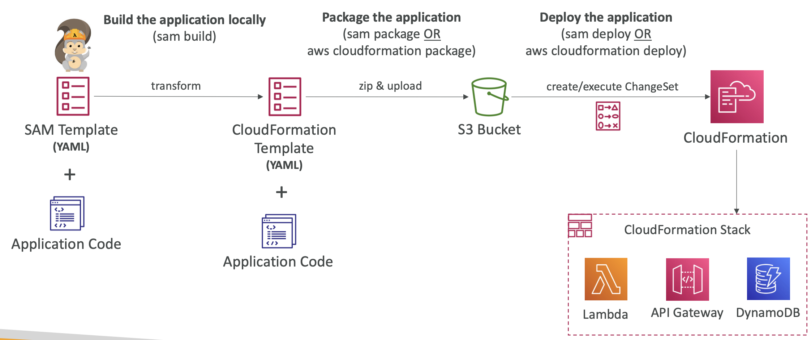
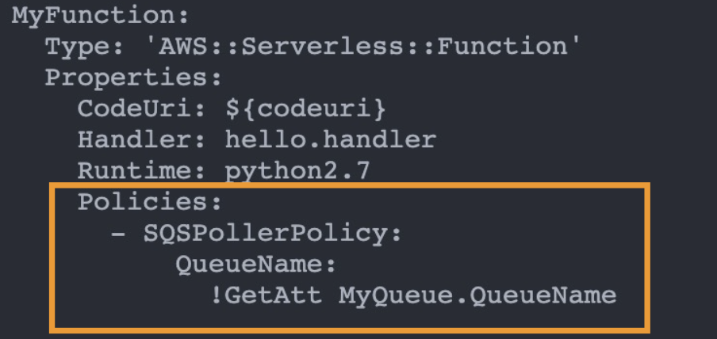
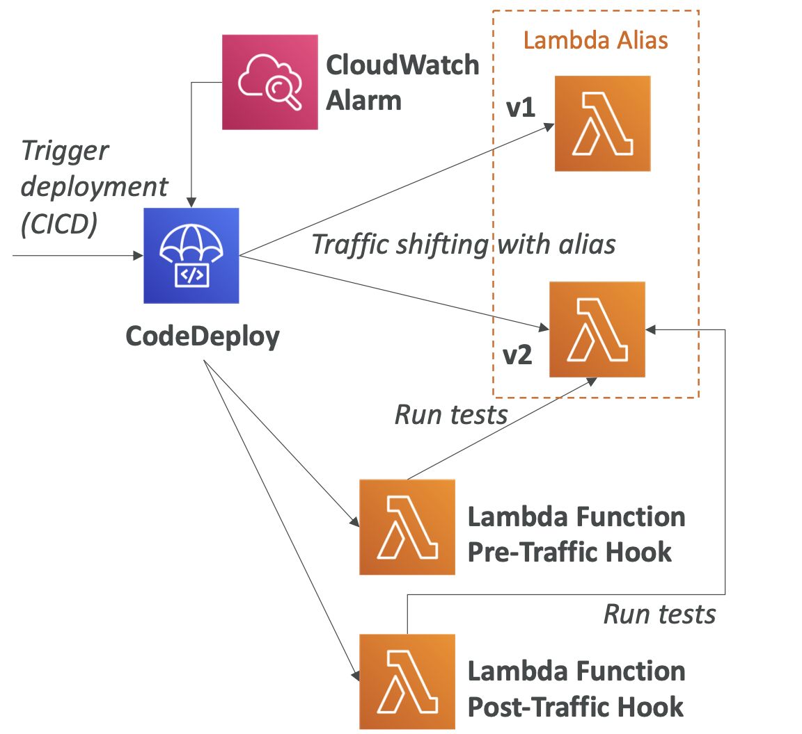
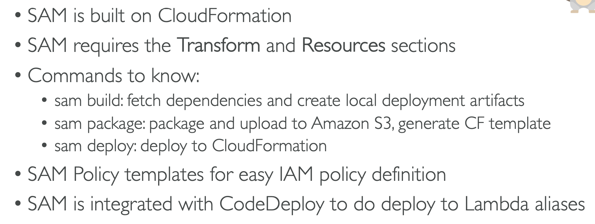

# 25: Serverless Application Model (SAM)

### Overview

A framework for developing and deploying serverless applications - it groups all of the serverless development services into one tool.

All of the configuration is in YAML, but complex CloudFormation templates can be created from simple SAM YAML files. It supports all of the features of CloudFormation (e.g. outputs, mappings, parameters, resources).

SAM can use CodeDeploy to deploy Lambda functions, and you can use it to run Lambda, API Gateway and DynamoDB locally.


### Recipes

The `Transform` header indicates that it's a SAM template - `Transform: 'AWS::Serverless-2016-10-31'`

Writing code:
- `AWS::Serverless::Function`
- `AWS::Serverless::Api`
- `AWS::Serverless::SimpleTable`

Two commands to package and deploy:
- `aws cloudformation package / sam package`
- `aws cloudformation deploy / sam deploy`


### SAM Deployments



### Using SAM for CLI Debugging

Locally build, test, and debug your serverless applications that are defined using AWS SAM templates.

It provides a lambda-like execution environment locally.

You can use the SAM CLI and AWS Toolkits to step through and debug your code in most IDEs.

AWS Toolkits is an IDE plugin which allows you to build, test, debug, deploy, and invoke Lambda functions built using AWS SAM.


### Installing the SAM CLI

You need homebrew and Docker installed, then you can install the `aws-sam-cli` by following the docs.

### Creating a SAM project

You can run the command `sam init`, which creates a lot of files and sets up the structure of a project. You can pass flags for language etc. (run `sam init --help`).


### template.yaml
```yaml
# SAM FILE
AWSTemplateFormatVersion: '2010-09-09'
Transform: 'AWS::Serverless-2016-10-31' # tells AWS it's a SAM file
Description: A starter AWS Lambda function.
Resources:
  helloworldpython3:
    Type: 'AWS::Serverless::Function'
    Properties:
      Handler: app.lambda_handler # file name and function
      Runtime: python3.9
      CodeUri: src/ # where the code is locally
      Description: A starter AWS Lambda function.
      MemorySize: 128
      Timeout: 3
      # Set environment variables to use in lambda
      Environment:
        Variables:
          TABLE_NAME: !Ref Table
          REGION_NAME: !Ref AWS::Region
	  # Creates an API using API Gateway
      Events:
        HelloWorldSAMAPI:
          Type: Api
          Properties:
            Path: /hello
            Method: GET
      Policies:
        # Creates a policy applied to the lambda giving CRUD access to DynamoDB
        - DynamoDBCrudPolicy:
            TableName: !Ref Table  

  Table:
    Type: AWS::Serverless::SimpleTable
    Properties:
      PrimaryKey:
        Name: greeting
        Type: String
      ProvisionedThroughput:
        ReadCapacityUnits: 2
        WriteCapacityUnits: 2
```

### Python Lambda function in src/app.py

```python
import boto3
import json
import os

print('Loading function')

# create the client outside of the handler
region_name = os.environ['REGION_NAME']
dynamo = boto3.client('dynamodb', region_name=region_name)
table_name = os.environ['TABLE_NAME']

def respond(err, res=None):
    return {
        'statusCode': '400' if err else '200',
        'body': err.message if err else json.dumps(res),
        'headers': {
            'Content-Type': 'application/json',
        },
    }


def lambda_handler(event, context):
    print("Received event: " + json.dumps(event, indent=2))
    scan_result = dynamo.scan(TableName=table_name)
    return respond(None, res=scan_result)

```

### Deploying the SAM project

```bash
# create an s3 bucket
aws s3 mb s3://stephane-code-sam

# package cloudformation
aws cloudformation package  --s3-bucket stephane-code-sam --template-file template.yaml --output-template-file gen/template-generated.yaml
# This pushes the code to S3 and generates the CloudFormation yaml file referencing the code in S3, it also returns the command to deploy 

# deploy 
aws cloudformation deploy --template-file gen/template-generated.yaml --stack-name hello-world-sam --capabilities CAPABILITY_IAM
```

You can replace `aws cloudformation` in the commands above with `sam`.


### CloudFormation Designer

You can get a visualisation of the stack generated by SAM using the CloudFormation Designer, which you can view in Other actions of the stack.


### SAM Policy Templates

A list of templates that you can apply to Lambda functions. 

Examples:
- `S3ReadPolicy` - gives read only permissions to objects in S3
- `SQSPollerPolicy` - permits polling an SQS queue
- `DynamoDBCrudPolicy`

It makes it easier to give permissions, as you don't have to create roles for all of your resources from scratch.




### SAM and CodeDeploy

The Serverless Application Model framework uses CodeDeploy to update lambda functions.

It uses the traffic shifting feature, where there are pre and post-traffic hooks to validate the deployments. There are automated rollbacks with CloudWatch Alarms.



You can add deployment options to your SAM template:

```yaml
  AutoPublishAlias: live
  DeploymentPreference: 
    Type: Canary10Percent10Minutes
```

With the config above, the canary will have 10% of traffic for 10 minutes and then all traffic will be directed to the new deployment.


### AWS Serverless Application Repository

When you create a new lambda, one of the options other than creating from scratch or using a blueprint is the AWS Serverless Application Repository.

This is a repository of SAM templates that people have created which is a good source of examples. 

You can build and publish applications so they can be re-used either publicly or with specific AWS accounts. It allows for some more customisation with environment variables.

#### Publishing to the SAM

To publish, you need to create a bucket policy for the S3 bucket which gives permission to SAR to access it:

```bash
aws s3api put-bucket-policy --bucket bucket-name --policy file://policy.json
```

Then you build and package your repo like above, but instead of the deploy step, you use `sam publish`:

```bash
sam publish --template-file template.yaml --region us-east-1
```

## Serverless Application Model Summary




