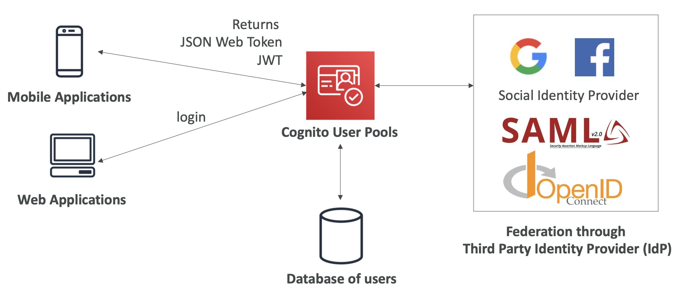
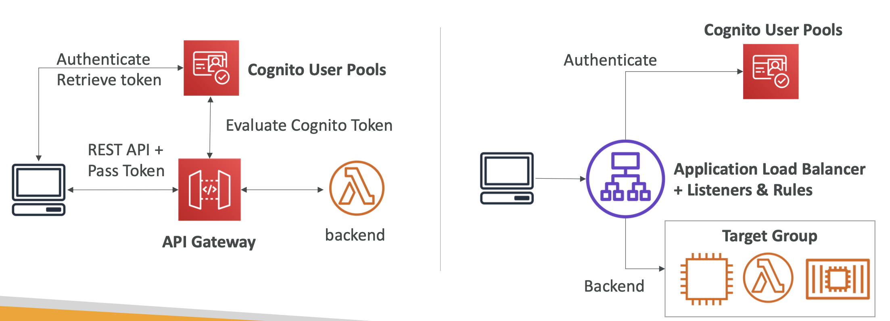
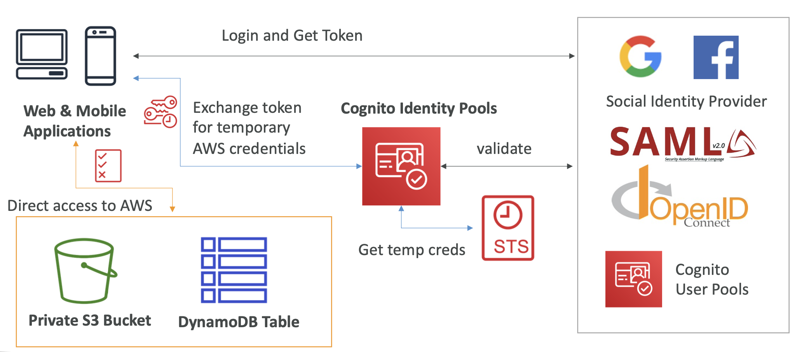
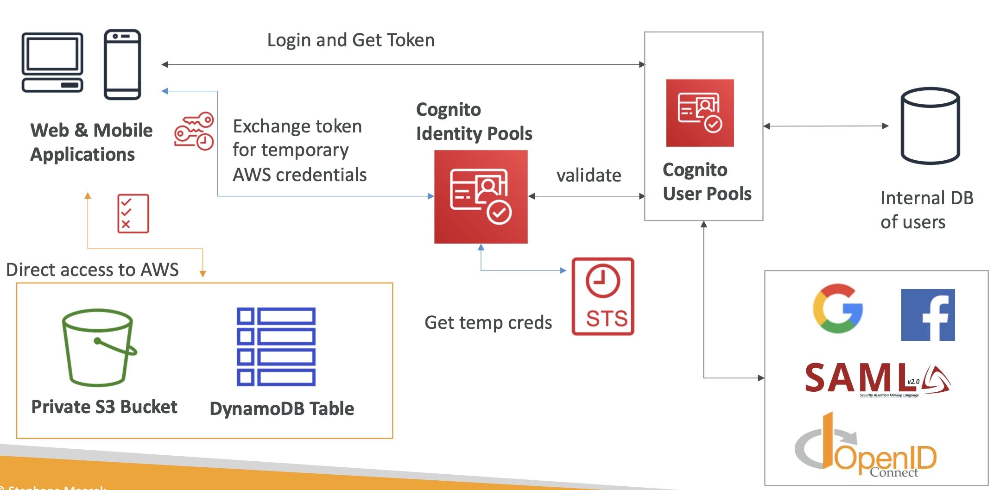
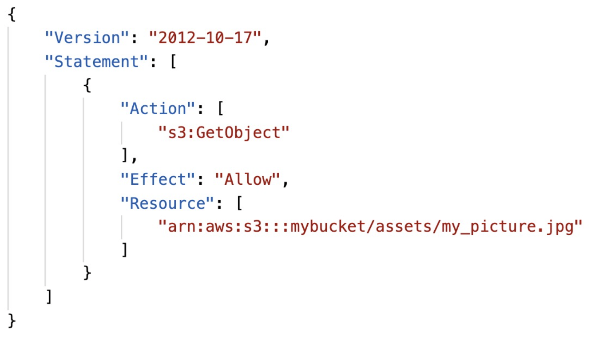
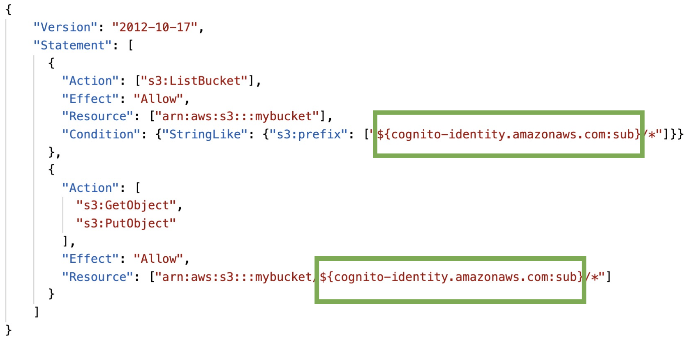
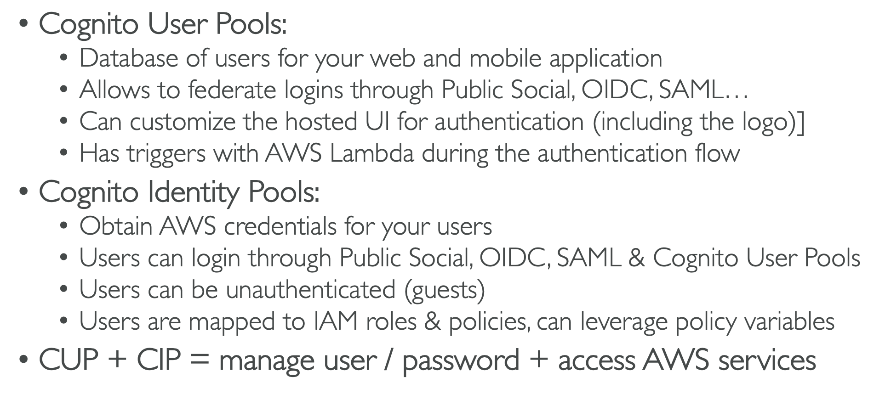

# 27: Amazon Cognito

### Overview

Give users (outside of the cloud) an identity so that they can interact with our application.

**Cognito User Pools** - Sign in functionality for app users which integrates with API Gateway and Application Load Balancers

**Cognito (Federated) Identity Pools** - Providing AWS credentials so that they can access resources directly, which integrates with User Pools

**Cognito Sync (replaced by AppSync)** - Synchronise data from devices to Cognito

### IAM vs Cognito

Cognito is for cases where there are users outside of AWS, key things to look out for are 'hundreds of users', 'mobile users' and 'authenticate with SAML'.

## Cognito User Pools

A serverless database of users for your web and mobile applications.

**The features include:** 
- simple login (username & password) 
- password reset
- email and phone number verification
- MFA
- federated identities (from sources like Facebook, Google, SAML)
- blocking users if their credentials are compromised elsewhere

A login sends back a JWT token.

### Cognito User Pools Integrations

CUP integrates with API Gateway and Application Load Balancers.

For API Gateway, clients do a pre-flight request to User Pools, with an ALB, it handles the authentication before getting data from the target group.

### Lambda Triggers

You can set up triggers for lambda functions, like pre-sign up (e.g. extra checks), post authentication (e.g. add users to an analytics database) etc.

### Hosted Authentication UI

Cognito has a hosted authentication UI which you can add to your app to handle sign-in/up workflows.

You can link this with the federated identities (third party logins) and you can customise the page with a custom logo and CSS.

## Cognito Identity Pools (Federated Identities)

Give identities to users so that they have temporary AWS credentials.

Your identity pool (source of identity) can be:
- Public providers - Amazon, Facebook, Google
- Users in a Cognito User Pool
- OpenID/SAML identity providers
- Developer authenticated identities (custom login server)
- Unauthenticated guest access

Users can then access AWS services directly or through API Gateway.

The IAM policies are defined in Cognito, and they can be customised based on user IDs to have fine grained control.

### Integration with Cognito User Pools

The focus of Identity Pools is to take a valid token and exchange it for temporary AWS credentials. 

The original token could be retrieved from User Pools or from a different identity provider. Cognito User Pools can also access third party identity providers so there are two ways of doing the same thing.

### IAM Roles

Default IAM Roles for authenticated and guest users. You can define rules to choose the role for each user based on ID.

You can use policy variables to partition users' access.

IAM credentials are obtained by Cognito Identity Pools through STS (Security Token Service).

The roles must have a 'trust' policy for Cognito Identity Pools.

#### Example of guest policy to give guest users access to an image in S3:

#### Example of using policy variables to only give access to the user's section of S3:

## Cognito Sync (now AppSync)

You can store preferences, configuration and the state of an application.

It enables cross device synchronisation and offline capability (synchronisation when back online).

Features of Sync:
- **Push Sync** - silently notify all devices when there are identity data changes
- **Cognito Stream** - stream data from Cognito to Kinesis
- **Cognito Events** - execute lambda functions in response to events 

## Cognito User Pools vs Identity Pools

