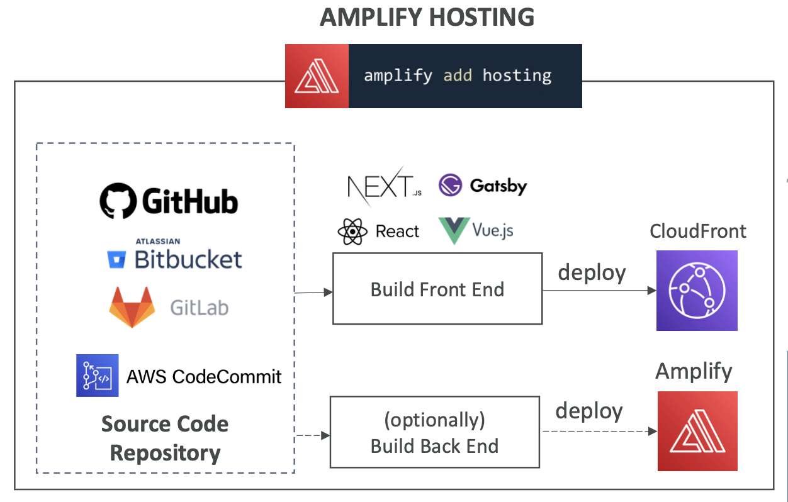

# 28: Other Serverless Services (Step Functions, AppSync & AWS Amplify)

## Step Functions

Step functions are a way to model your workflows as state machines. They can be used for any workflows, for example data processing or order fulfillment.

It is written in JSON, but it gives you visualisations of the workflow and the workflow's executions.

You can start workflows with an SDK call, API Gateway or with EventBridge.


### Task States

One of the boxes in the visualisation above.

It is a piece of work in your state machine. It can either:
- **Invoke one AWS service**, e.g. invoke a lambda, run an AWS Batch job, run an ECS task, insert items into DynamoDB.
- **Run one activity**, tasks which are already running and poll the step function for work, e.g. EC2, Elastic Container Service.

#### Example - invoking a lambda function:


### States

- **Choice state** - test for a condition to send to a branch
- **Fail or Succeed state** - stop execution with failure or success
- **Pass state** - pass its input to output or inject fixed data
- **Wait state** - provide a delay for a certain amount of time
- **Map state** - dynamically iterate steps
- **Parallel state** - begin parallel branches of execution


### Visual Workflow


### State machine example

In this example, it passes the input into a lambda function, then goes to the Is Teacher branch if the input string has Stephane in it, otherwise it goes to the Not Teacher branch.

```json
{
  "Comment": "A Hello World example of the Amazon States Language using Pass states",
  "StartAt": "Invoke Lambda function",
  "States": {
    "Invoke Lambda function": {
      "Type": "Task",
      "Resource": "<LAMBDA FUNCTION ARN>",
      "InputPath": "$",
      "Next": "Choice State"
    },
    "Choice State": {
      "Type": "Choice",
      "Choices": [
        {
          "Variable": "$",
          "StringMatches": "*Stephane*",
          "Next": "Is Teacher"
        }
      ],
      "Default": "Not Teacher"
    },
    "Is Teacher": {
      "Type": "Pass",
      "Result": "Woohoo!",
      "End": true
    },
    "Not Teacher": {
      "Type": "Fail",
      "Error": "ErrorCode",
      "Cause": "Stephane the teacher wasn't found in the output of the Lambda Function"
    }
  }
}
```

### Error Handling in Step Functions

You can use retry and catch in the state machine to handle errors instead of inside the application code.

Handling errors in your Step Functions gives you more flexibility, simplifies application code and means you don't need to change application code when you want to modify error handling.

Any state can have runtime errors for various reasons:
- State machine definition issues, e.g. no matching rule in a choice state
- Task failures, e.g. an exception in a lambda function
- Transient issues, e.g. network partition events

There are pre-defined error codes:
- `States.ALL`: matches any error name
- `States.Timeout`: Task ran longer thanTimeoutSeconds or no heartbeat received
- `States.TaskFailed`: execution failure
- `States.Permissions`: insufficient privileges to execute code

#### Retries in states

The retry section is evaluated from top to bottom. It's an array of objects where you specify the kind of error and whether/how to attempt retries.


- `ErrorEquals` - match a specific error
- `IntervalSeconds` - delay before retrying
- `MaxAttempts` - defaults to 3
- `BackoffRate` - how much to multiply the delay after each failure (enables exponential backoff)

When the max attempts is reached, it goes to the catch block.


#### Catch
- `ErrorEquals` - match a specific error
- `Next` - which state to go to next


#### ResultPath

A way of passing errors into the input of the next task.


### Standard vs Express

Express is fast and very high throughput, it was created to have a more straightforward, cheaper offering. Standard can have a really long duration and has features like history, but is more expensive.


## AppSync

A managed service which uses GraphQL, a query language which makes it easy to get data in a nice format from different sources.

These sources can be NoSQL or relational databases, it integrates with DynamoDB, Aurora, ElasticSearch and custom sources with Lambda.

It can also retrieve data in real-time with WebSocket (like the chat example in Cognito section).

It can do data synchronisation for mobile apps.


### Security

There are four ways you can authorise applications to interact with your AWS AppSync GraphQL API:
- API_KEY
- AWS_IAM - users/ roles / cross-account access
- OPENID_CONNECT: OpenID Connect provider / JSON Web Token
- AMAZON_COGNITO_USER_POOLS


### Hands On

You need to define a schema in GraphQL language, where you define data types which go along with them.

The API needs to be linked to data sources, and there are queries defined to retrieve data.

```
type Query {
  me: User
}

type User {
  id: ID
  name: String
}
```

At its simplest, GraphQL is about asking for specific fields on objects.

Queries:
```
{
  hero {
    name
  }
}

{
  human(id: "1000") {
    name
    height(unit: FOOT)
  }
}
```

Returned data:
```
{
  "data": {
    "hero": {
      "name": "R2-D2"
    }
  }
}

{
  "data": {
    "human": {
      "name": "Luke Skywalker",
      "height": 5.6430448
    }
  }
}
```

Mutations are to modify server-side data.

```
mutation CreateReviewForEpisode($ep: Episode!, $review: ReviewInput!) {
  createReview(episode: $ep, review: $review) {
    stars
    commentary
  }
}
```

The key things to remember for AppSync are that you can build a GraphQL API and it can retrieve real-time data with WebSocket and do data synchronisation.


## AWS Amplify

The 'Elastic Beanstalk' for creating mobile and web applications, a way to quickly get started with it.

It has features such as data storage, authentication, machine learning powered by AWS services and it integrates with front-end libraries.

It uses AWS best practices for reliability, security and scalability.

You can build and deploy your apps with the **Amplify CLI** or with **Amplify Studio**.


### Important Features

#### Authentication
`amplify add auth`

- Uses Cognito
- It can handle user registration, authentication, account recovery etc.
- Supports MFA, Social sign in
- There are pre-built sign in/up components
- Allows for fine-grained authorisation

#### Data store
`amplify add api`

- Uses AppSync and DynamoDB
- Work with local data and have automatic synchronisation to the cloud without complex code
- Powered by GraphQL

### Amplify Hosting

`amplify add hosting`

- Build and host modern web apps
- Has CI/CD pipeline and pull requests
- You can set up monitoring, redirects, password protection



