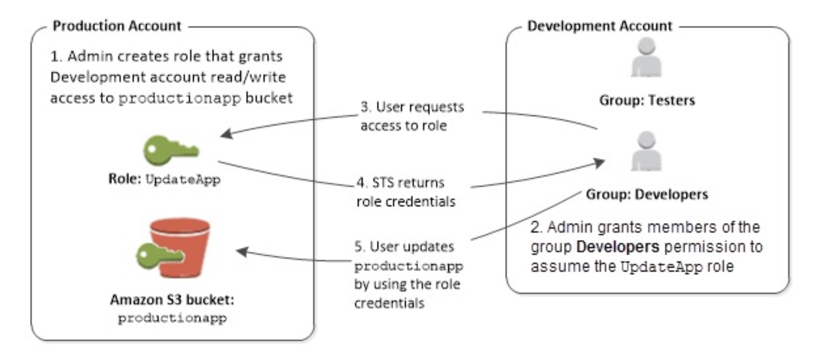
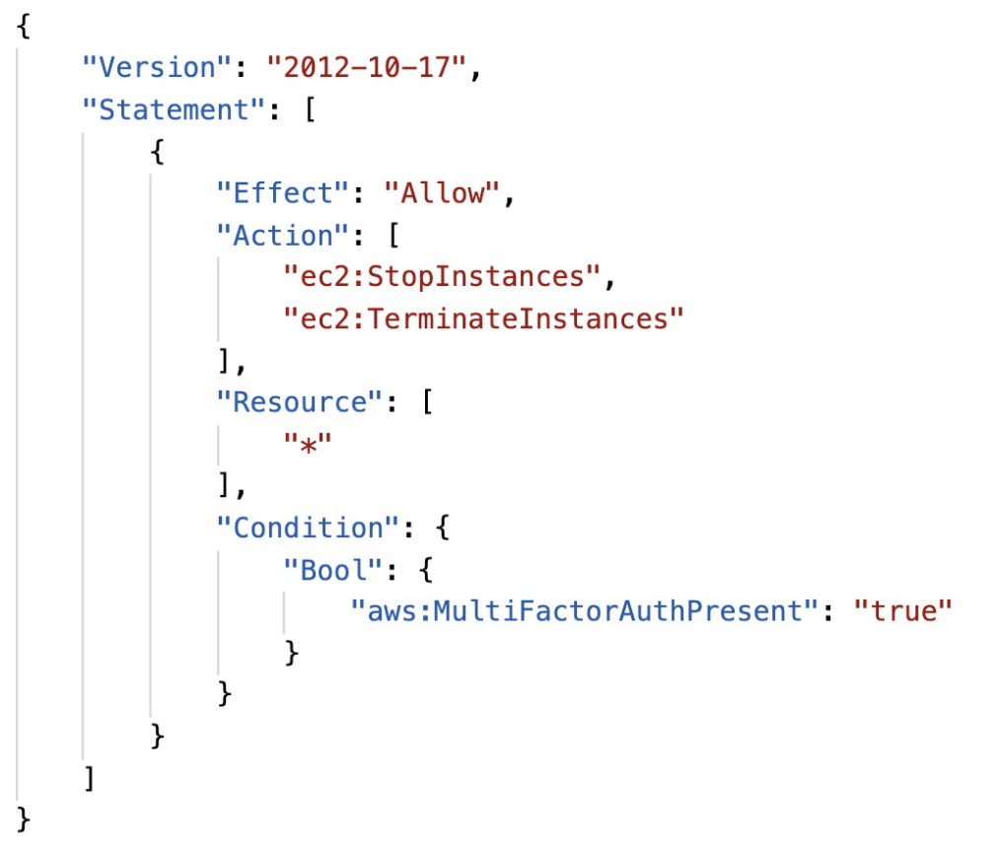
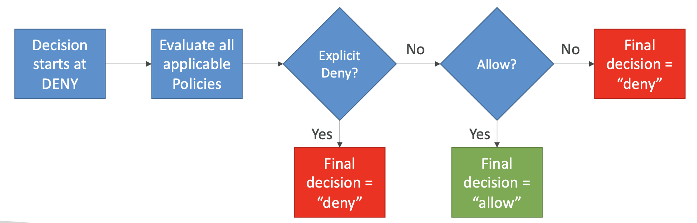
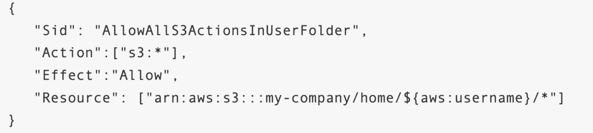
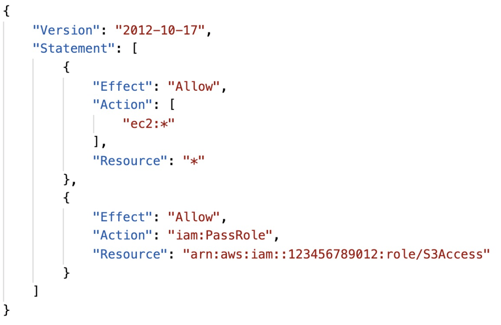
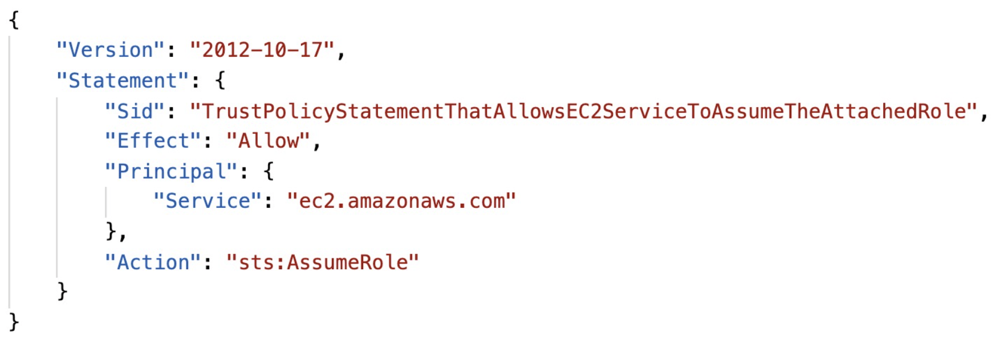

# 29: Advanced Identity

## STS - Security Token Service

Grant limited and temporary access to AWS resources (for up to 1 hour).

### STS API calls:

- `AssumeRole` - Assume roles within your account or cross account
- `AssumeRoleWithSAML` - return credentials for users logged in with SAML
- `AssumeRoleWithWebIdentity` - credentials for users logged in with an identity provider, e.g. Facebook (AWS recommends against this and using Identity Pools instead)
- `GetSessionToken` - MFA for a user
- `GetFederationToken` - get temporary credentials for a federated user
- `GetCallerIdentity` - details about user or role
- `DecodeAuthorizationMessage` - decode error message when an AWS API is denied

### Using STS to assume a role

Define a role within your account or cross-account, and define which principals can access this role. Then use the Security Token Service to retrieve credentials to assume the role.

Credentials can be valid for 15 minutes up to an hour.

### STS with MFA

Use the `GetSessionToken` API call and you need an IAM policy which has `aws:MultiFactorAuthPresent:true`.

`GetSessionToken` returns an access ID, secret key, session token and expiration data.

## Advanced IAM

### Authorisation model

For IAM, AWS will first look for an explicit deny and always deny if there is, then if there is an allow, it allows, otherwise it defaults to deny.

### IAM Policies and S3 Bucket Policies

IAM policies are attached to users, groups and roles. S3 policies are attached to buckets.

When evaluating if an IAM principal can perform an operation, it evaluates the union of IAM policies and Bucket policies.

#### IAM Scenarios:

1. IAM Role attached to an EC2 instance which authorizes Read and Write to “my_bucket”, there's no bucket policy => ALLOWED
2. IAM Role attached to an EC2 instance which authorizes Read and Write to “my_bucket”, the S3 Bucket Policy explicitly denies the IAM Role => DENIED
3. IAM Role with no S3 permissions, the S3 Bucket Policy allows Read/Write to the IAM Role => ALLOWED

### Dynamic Policies

You can use policy variables to make your policies dynamic. This gives you the ability to assign users access to their own areas of an S3 bucket.

This means you don't need individual policies for each user, which makes things easier to manage.

### Inline vs Managed Policies

#### Managed policies
Maintained by AWS, good for power users and administrators and they are updated when there are new services.

#### Customer managed policies
Reusable, can be applied to many principals, they can be version controlled. They are considered best practice as you want to restrict your users/resources to only have access to what they need.

#### Inline policies
Strict one-to-one relationship between policy and principal, the policy is deleted if you delete the principal.

## Granting a user permissions to pass roles to AWS services

When you configure AWS services, you pass a role to the service during setup, which gives the service the required permissions.

To do this though, the user needs the permission `iam:PassRole`.

### PassRole Example

Roles can only be passed to services that their **trust policy** allows.

When you view roles, you can see the trusted entities which tells you which services the role can be assigned to.

## AWS Directory Services

### Microsoft Active Directory

It's a database of objects (called trees, groups of trees are forests) like user accounts, computers, printers, security groups, which is part of any Windows Server. 

It offers centralised security management, account creation and permission assignments.

### AWS Directory Services

AWS has services which enable you to use Microsoft Active Directory.

#### AWS Managed Microsoft AD:
- Create your own Active Directory in AWS where you can manage users
- You can establish trust connections with your on-premises AD

#### AD Connector
- A proxy (Directory Gateway) to redirect to an on-premises Active Directory
- Users are managed on the on-premises AD

#### Simple AD
- A managed directory in AWS which is Active Directory compatible 
- It can't be linked to an on-premises AD

