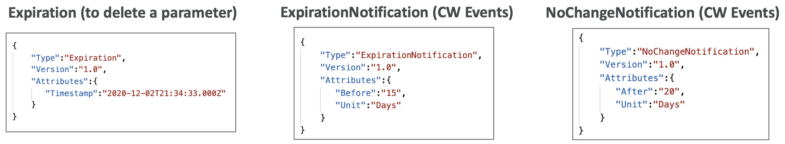

# 30: AWS Security & Encryption: KMS, Encryption SDK, SSM Parameter Store, IAM & STS

## Encryption 101

### Encryption in flight (SSL)

Data is encrypted before sending and decrypted after receiving.

SSL certificates enable encryption (HTTPS), and they prevent 'man in the middle' attacks from happening. An analogy for SSL certificates is sealing the envelope before sending a letter.

### Server-side encryption at rest

Data is encrypted after it's received by the server. It is stored in encrypted form thanks to encryption/decryption keys, they must be managed somewhere and the server must have access to them.


### Client-side encryption

The data is encrypted by the client and is never decrypted by the server. The data will be decrypted by a receiving client.


## AWS Key Management Service (KMS)

Most encryption in AWS is handled by KMS. It is a service where AWS manages the encryption keys for us, it is fully integrated with IAM and it is an easy way to control access to your data.

You can audit KMS key usage in CloudTrail.

KMS key encryption is also available through API calls, so it can be used with the CLI and SDKs. Encrypted keys can be stored as environment variables in your code.


### KMS Key Types

#### Symmetric keys (AES-256 keys)

- A single key that is used for encryption and decryption
- AWS services that are integrated with KMS use symmetric keys
- You never get access to the unencrypted key, you call the KMS API to use it

#### Assymetric keys (RSA & ECC key pairs)

- Public (encryption) and private (decryption) key pair
- Used for encrypt/decrypt and sign/verify operations
- The public key is downloadable but not the private key
- **Use case** - encryption outside of AWS by users that can't use KMS


### Three types of KMS keys
- **AWS managed keys** - free, naming convention is `aws/service-name`
- **Customer managed keys created in KMS** - created in KMS but you manage it ($1 per month)
- **Imported customer managed keys** - must be symmetric keys ($1 per month)

You also pay for API calls to KMS ($0.03 / 10,000 calls)

### Automatic key rotation
- **AWS managed keys** - automatically rotated once a year
- **Customer managed keys created in KMS** -can be enabled to rotate once a year 
- **Imported customer managed keys** - only manual rotation is possible

### Copying snapshots across regions
You can't use the same KMS encryption keys across regions, so when you have encrypted snapshots, they will be assigned a different key when moved across to another region.


### KMS Key Policies

Key policies control access to KMS keys, like S3 Bucket policies, but without a key policy, you can't control access to KMS keys.

There are two kinds:

#### Default KMS Key Policy
- Created if you don't provide a policy
- Gives complete access to the root user 

#### Custom Key Policy
- Define users and roles that can access the KMS key
- Define who can administer the key
- Useful for cross-account access to the key

### Copying snapshots across accounts


### Encryption using customer managed keys in KMS

```bash
# 1) encryption
aws kms encrypt --key-id alias/tutorial --plaintext fileb://ExampleSecretFile.txt --output text --query CiphertextBlob  --region eu-west-2 > ExampleSecretFileEncrypted.base64

# base64 decode for Linux or Mac OS 
cat ExampleSecretFileEncrypted.base64 | base64 --decode > ExampleSecretFileEncrypted

# base64 decode for Windows
certutil -decode .\ExampleSecretFileEncrypted.base64 .\ExampleSecretFileEncrypted

# 2) decryption

aws kms decrypt --ciphertext-blob fileb://ExampleSecretFileEncrypted   --output text --query Plaintext > ExampleFileDecrypted.base64  --region eu-west-2

# base64 decode for Linux or Mac OS 
cat ExampleFileDecrypted.base64 | base64 --decode > ExampleFileDecrypted.txt

# base64 decode for Windows
certutil -decode .\ExampleFileDecrypted.base64 .\ExampleFileDecrypted.txt
```


### How does KMS work?

#### The Encrpyt and Decrypt APIs

When you encrypt or decrypt, you send an API call to KMS, which checks IAM permissions, then encrypts/decrypts and returns the data in the new format.


However, it is limited to secrets that are smaller than 4KB.

#### Envelope Encryption

You need to use the envelope encryption technique to encrypt secrets larger than 4KB. You can do this with the `GenerateDataKey` API.

This involves encrypting and decrypting on the client-side, but using keys generated from KMS. 

Encrypting with envelope encryption:


Decrypting an envelope:


#### AWS Encryption SDK

Envelope encryption is quite complicated, so the AWS Encryption SDK implements it for us. It can also be used as a CLI tool that we can install. There are implementations for JS, Python, Java and C.

#### Data key caching
It also has a data key caching feature, which means re-using data keys instead of creating new ones for each encryption. This reduces the number of calls to KMS but there is a slight security trade-off. To do this you use a `LocalCryptoMaterialsCache` where you can set the maximum age, number of messages etc.


### KMS API Summary


[Documentation for encrypting using the CLI](https://docs.aws.amazon.com/encryption-sdk/latest/developer-guide/crypto-cli-examples.html)


### KMS Request Quotas

When you exceed a request quota, you get a `ThrottlingException`. However, cryptographic operations share a quota, including requests made by AWS on your behalf.

There are three ways of resolving this:
1. You can use exponential backoff
2. Use envelope encryption with the GenerateKeyData API and use  DEK caching from the encryption SDK
3. Request Quotas increase through the API or AWS Support.


## S3 Advanced Security

There are four ways of encrypting objects in S3:
1. **SSE-S3** - encrypts S3 objects using keys handled & managed by AWS
2. **SSE-KMS** - leverage AWS Key Management Service to manage encryption keys
3. **SSE-C** - when you want to manage your own encryption keys
4. Client Side Encryption
 

### SSE-KMS (Server-side Encryption)

- Encryption using keys handled and managed by KMS
- Gives more user control and audit trails
- Objects encrypted server-side
- Must set header: `“x-amz-server-side-encryption": ”aws:kms"` 


SSE-KMS uses the `GenerateDataKey` and `Decrypt` KMS API calls, as it is encrypting large files.

To use SSE-KMS, you need:
- A KMS Key Policy that authorises the user/role
- An IAM Policy that gives access to KMS

S3 calls to KMS count towards our KMS quotas. If you get throttling issues with S3, it will be KMS causing the issue.


### Forcing SSL in S3 Bucket Policies

You can force SSL with a DENY on the condition that `aws:SecureTransport = false`.

[Documentation for restricting S3 API calls to use SSL certificates](https://aws.amazon.com/premiumsupport/knowledge-center/s3-bucket-policy-for-config-rule/)


### Forcing SSE-KMS Encryption in S3 Bucket Policies

- Deny incorrect encryption header: make sure it includes `aws:kms` (SSE-KMS)
- Deny no encryption header to ensure objects are not uploaded un-encrypted


You could add default encryption to a bucket instead of the second statement.


### S3 Bucket Key for SSE-KMS

This is a new setting to decrease the number of API calls from S3 to KMS, and to reduce costs of KMS encryption.

An S3 bucket key is generated and that key is used to encrypt objects with new data keys, instead of it making calls to KMS to do it. A side effect of this is you will have fewer CloudTrail KMS events.


This setting can be enabled when you enable KMS encryption on a bucket.


## SSM Parameter Store - Systems Manager Parameter Store

Parameter Store is secure storage for configuration and secrets, which can use KMS encryption. It's serverless and it is very easy to use with SDKs.

It has version tracking for secrets, integration with CloudFormation and notifications in EventBridge.


You can organise your parameter store to have a hierarchy which matches your organisations, apps, and stages within those apps.

There are Standard and Advanced tiers for parameters, in Advanced you get a higher number of parameters and parameter values can be bigger.

#### Parameter policies (for advanced parameters)

You can assign a TTL to parameters and set up expiration notifications in EventBridge using parameter policies.



#### CLI commands

```bash
aws ssm get-parameters --names /my-app/dev/db-url /my-app/dev/db-password

aws ssm get-parameters --names /my-app/dev/db-password --with-decryption

aws ssm get-parameters-by-path /my-app/dev

aws ssm get-parameters-by-path /my-app --recursive
```


## Secrets Manager

- A newer service than the Parameter Store
- Secrets Manager is more oriented to secrets and it can force secret rotation
- You can automate generation of secrets on rotation using Lambda
- It integrates with RDS, you can set a username and password and select a database, and it will set the credentials for the database
- Secrets are encrypted using KMS

For database secrets, the Console prompts you for the DB username and password, but you can store any key/value pair.


### SSM Parameter Store vs Secrets Manager


## CloudWatch Logs Encryption

You can encrypt CloudWatch Logs with KMS keys, and you enable encryption at the log group level.

You have to use the CloudWatch Logs API to enable encryption (not currently in the Console), by either associating a key to an existing log group, or by creating a log group with a key:

```bash
# associate with existing log group
aws logs associate-kms-key --log-group-name /aws/lambda/hello-world --kms-key-id arn:aws:kms:eu-west-2:387124123361:key/0509dc31 --region eu-west-2

# create new log group
aws logs create-log-group --log-group-name /example-encrypted --kms-key-id arn:aws:kms:eu-west-2:387124123361:key/0509dc31 --region eu-west-2
```

To make these API calls, the KMS key needs to have a key policy which allows CloudWatch to access it.

Example key policy:
```json
{
  "Version" : "2012-10-17",
  "Id" : "key-default-1",
  "Statement" : [ {
      "Sid" : "Enable IAM User Permissions",
      "Effect" : "Allow",
      "Principal" : {
        "AWS" : "arn:aws:iam::Your_account_ID:root"
      },
      "Action" : "kms:*",
      "Resource" : "*"
    },
    {
      "Effect": "Allow",
      "Principal": { "Service": "logs.region.amazonaws.com" },
      "Action": [ 
        "kms:Encrypt*",
        "kms:Decrypt*",
        "kms:ReEncrypt*",
        "kms:GenerateDataKey*",
        "kms:Describe*"
      ],
      "Resource": "*"
    }  
  ]
}
```


## CodeBuild Security

#### VPC
If you want to access resources in a VPC, you need to specify a VPC configuration for your CodeBuild

#### Secrets in CodeBuild
There are environment variables in CodeBuild, which can be plaintext, or they can reference Parameter Store parameters or secrets in Secrets Manager.

You just reference the names/paths of the secrets and you need to ensure CodeBuild has the IAM permissions to access Secrets Manager/Parameter Store.
