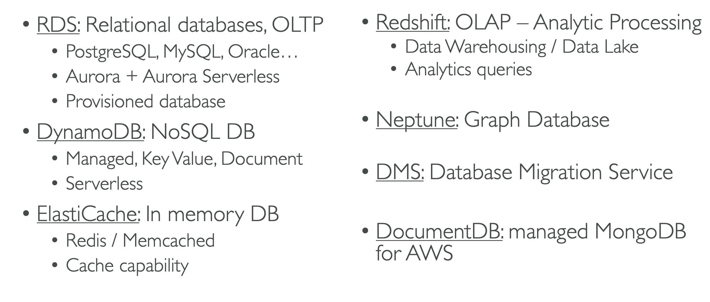
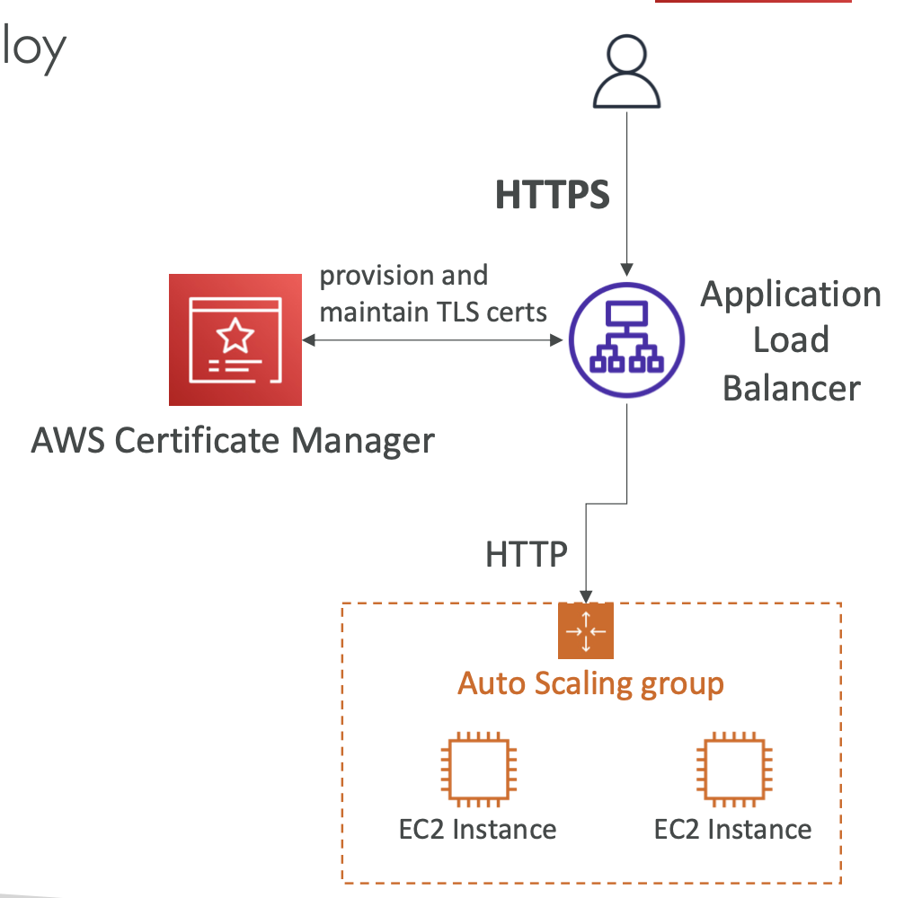
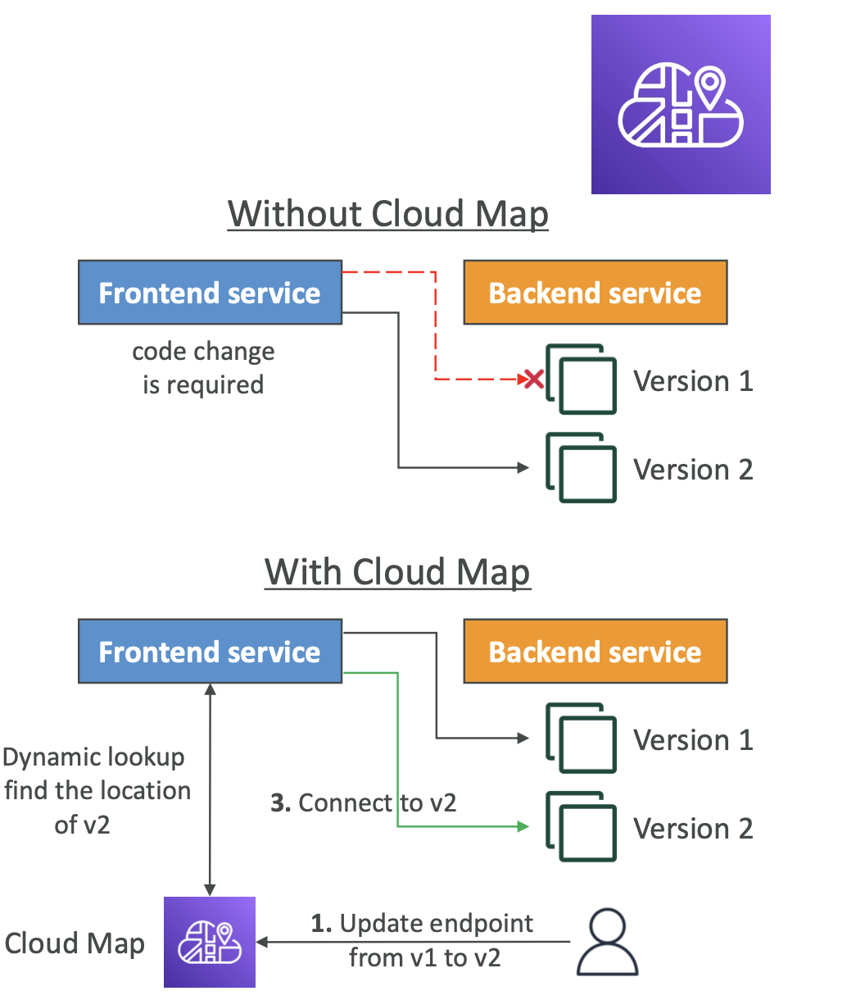
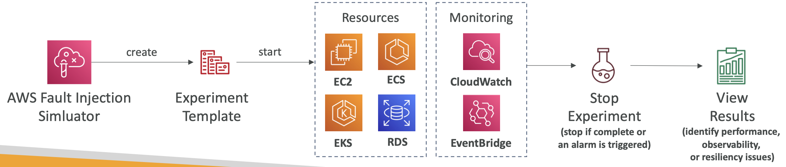

# 31: Other Services

## AWS Simple Email Service (SES)

You can send emails to people using:
- **SMTP** - The Simple Mail Transfer Protocol is an Internet standard communication protocol for electronic mail transmission. Mail servers and other message transfer agents use SMTP to send and receive mail messages
- **AWS SDK**

You also can receive emails and the service integrates with S3, SNS and Lambda.

You require IAM permissions to send emails using this service.

## Summary of Databases

## AWS Certificate Manager (ACM)

Certificate Manager lets you provision, manage and deploy SSL/TLS certificates, which are used to provide in-flight encryption for HTTPS websites.

It supports private and public TLS certificates. Public certificates are free of charge and there is automatic certificate renewal.

It integrates with Load Balancers, CloudFront distributions and API Gateway.

You select a domain you want to create the certificate for, then confirm that you are the owner of the domain.

Certificate Manager will then create a CNAME record for you in Route53.

When you create an environment in Elastic Beanstalk for example, you go to the listeners and add a 443 port for HTTPS and select your SSL certificate.

## AWS Cloud Map

A managed resource discovery service, which creates a map of backend services/resources that your applications depend on.

You register your application components, their locations, attributes and health status with Cloud Map.

This makes it easier to point to new versions of backends without making code changes, and also with health checks Cloud Map can stop routing traffic to unhealthy endpoints.

Your applications can query Cloud Map using the SDK, the API or DNS.

## AWS Fault Injection Simulator (FIS)

A fully managed service for running fault injection experiments on AWS workloads, which could be EC2s, ECS, EKS and RDS.

It is based on chaos engineering - stressing an application by creating disruptive events (e.g. sudden increase in CPU/memory), seeing how the system responds and making improvements to it.

There are pre-built templates you can use to generate disruptions.

## AWS DataSync

A service to move data to and from:
- on premises / other cloud services (with agent)
- one AWS service to another (no agent needed)

You can synchronise data to S3 (any storage class), EFS and Amazon FSx.

- Replication tasks can be scheduled hourly, daily or weekly
- File permissions and metadata are preserved 
- One agent can use 10Gb per second

