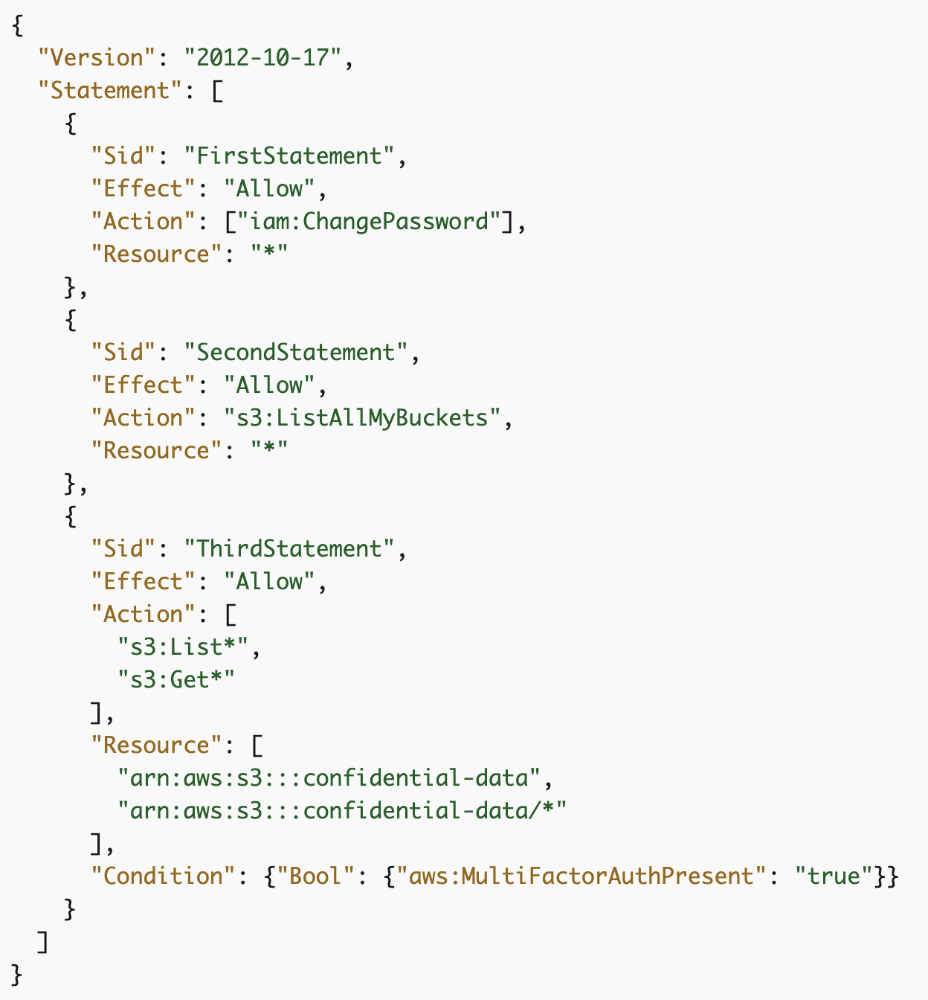

## 4: IAM & AWS CLI

### Policies

JSON files with list of permissions


A policy will be an object with keys version and statement, which will be an object or array of objects with the following keys: 
- Effect - Allow or Deny
- Sid - optional statement ID
- Principal - for resource-based policies, which users/roles you’re allowing/denying access to
- Action - list of actions the policy allows/denies
- Condition - optional, circumstances under which permission is granted



### Roles

Assigning policies to resources, e.g. EC2 instances, lambdas

### Groups

Users can belong to more than one group, groups can only contain users. Makes it easier to assign/take away policies to types of user.

### How to set your access key ID and secret access key in the CLI

Run the command - `aws configure`, enter key and secret key, then enter default region

```bash
aws --version
aws iam list-users
aws list-users —region regionName
```


### AWS CloudShell
- A terminal you can use in the cloud (from the AWS console)
- Default region will be whichever region you’re set to in the AWS console


- Files you create in CloudShell will be saved
- You can download files using actions, create tabs, upload 


### IAM security tools

#### IAM Credentials Report (account-level)
Lists account’s users and the status of their credentials

#### IAM Access Advisor (user-level)
- In user summary
- Shows service permissions granted to user and when they were last accessed
- Useful to revise policies - shows if you’re not using services


