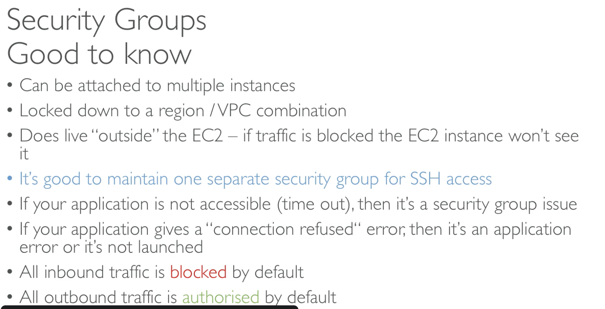
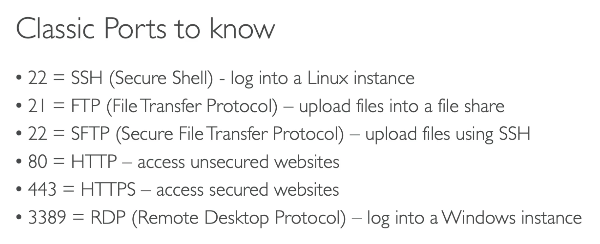
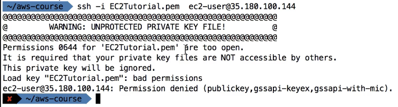
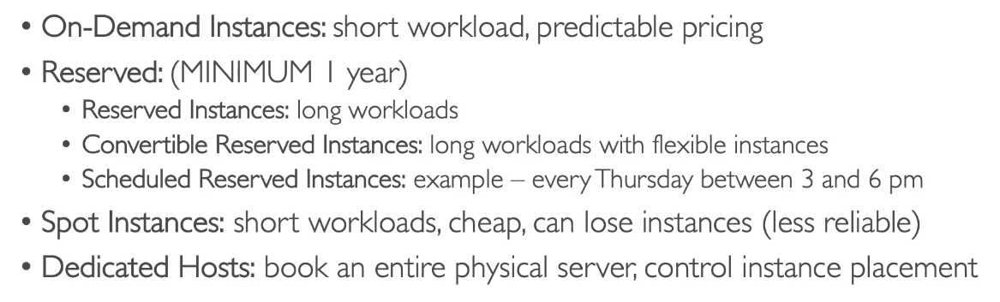

## 5: EC2 - Elastic Compute Cloud

### Overview 
A virtual server on the cloud, you can setup an instance and choose the type, micro.t2 is free.

### Types of EC2 instances

- **General purpose** - balance between compute, memory, networking
- **Compute-optimised** - good for compute intensive tasks like machine learning, high performance web servers, gaming servers
- **Memory-optimised** - high performance databases, cache stores
- **Storage optimised** - high read-write access to large data sets - databases, in memory databases (Redis)

### Security groups

### Firewall
- Control how traffic is allowed in (Inbound rules) and out (Outbound rules) of your EC2 instances
- Only contains allow rules
- Can reference by IP address or by security group
- You can attach more than one security group to an instance - common practice to have a separate group for SSH

### User Data

EC2 User Data is used to bootstrap your EC2 instances using a bash script. This script can contain commands such as installing software/packages, download files from the Internet, or anything you want.

### SSH into an EC2 instance

- Use public IP
- Port 22 must be open in the security group
- It is always `ec2-user` as the username
- You download a key file and provide it when you SSH using -i

The permissions need to be set correctly to use the private key, it should not be accessible by others, you need to use chmod to change the permissions:
`chmod 0400 EC2Tutorial.pem` (Allows the owner to read)

### EC2 Instance Connect

- Connecting to the instance from the console
- Doesn’t work with all types of EC2 instance
- Creates a temporary SSH key
- Still requires the permission to do it, port 22 needs to be open (set in inbound rules)

### EC2 instance roles

When you connect into an EC2 instance, you can provide your credentials (Access Key ID and Secret Access Key) - BAD IDEA, if someone got into your account, they could find your keys and then they could use them for everything you have permission for
Never enter your access keys into an EC2 instance

Instead, you can use IAM roles - go to security and add a role, then you can give permissions to an EC2 instance without having to provide keys

### EC2 instance purchasing options

#### On-demand instances 

- High cost but no upfront payment
- Linux and Windows - billing per second after first minute
- Other operating systems - per hour

#### Reserved instances

- 1 or 3 years
- Can do no upfront, partial upfront or all upfront - more upfront gives bigger discounts
- Good for steady state usage, e.g. databases
- Convertible - can change instance type but less discount
- Scheduled reserved - launch within time window once a week etc.

#### Spot instances

- Up to 90% discount - cheapest, but you can lose them if a higher bid comes in
- It needs to be workloads which are resilient to failure, e.g. batch jobs, image processing, distributed workloads
- Not good for critical jobs or databases

#### Dedicated Hosts

- For compliance requirements and server-bound software licenses (e.g. Bring Your Own License)
- 3 year period

#### Dedicated Instances

- Instances running on hardware which is dedicated to you, but less control
- You may share the hardware with other instances in same account
- No control over instance placement
