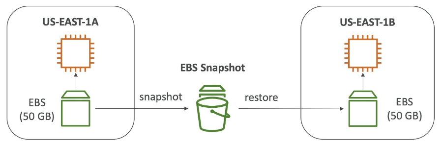
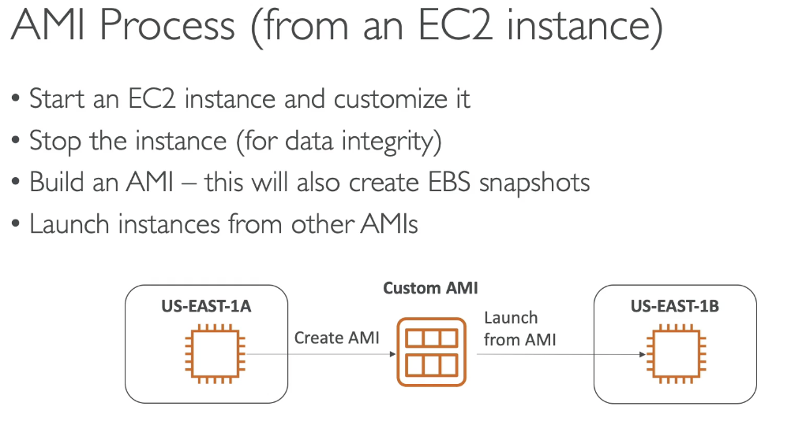
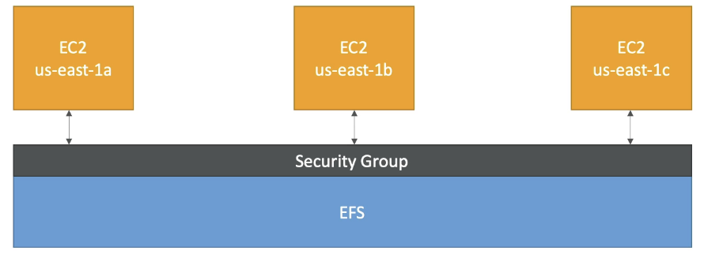
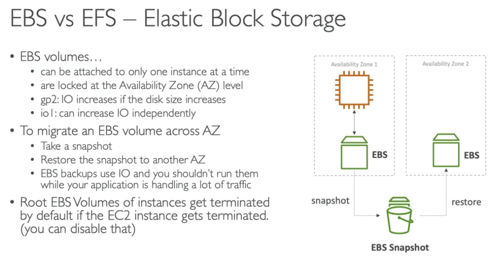
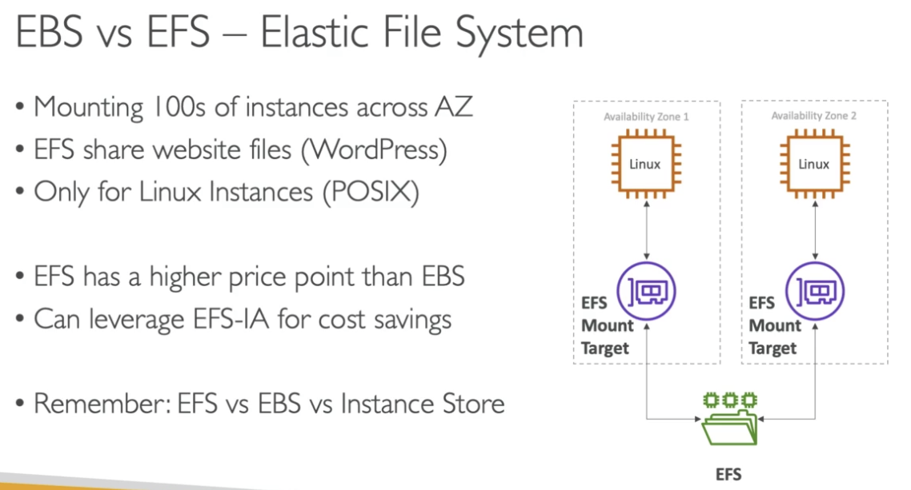

## Elastic Block Store (EBS)

### Overview

Elastic Block Store is a network drive you can attach to your EC2 instances. It allows instances to persist data, even after termination.

- It is bound to availability zone
- Free tier - 30GB 
- You can take snapshots to move across AZs
- Provisioned capacity - size in GBs and IOPS
- Delete on termination - option to delete the EBS volume automatically when an EC2 instance is deleted

You cannot have an EBS shared across EC2 instances, but you can have more than one EBS attached to one EC2 instance.

You can create/manage EBS Volumes in the storage section of EC2 instances.

### Snapshots

- Backups of your EBS volumes so you can restore it even if it’s terminated
- Not necessary to detach volumes to create a snapshot but it is recommended
- You can copy snapshots across regions

From the snapshot page, you can go into actions and copy it to create a new snapshot and choose a different region. Then you can create a volume from it.

When you create a new volume from a snapshot, you can select from the AZs within the region, to create it in a different region, you need to copy the snapshot to the other region.

## AMI - Amazon Machine Image

- A customisation of an EC2 instance
- Add your own software, config, OS etc
- Gives you a faster boot because the packages will already be installed when you create the EC2 instance 
- It is reusable, so saves you time having to copy over code when you create EC2 instances
- It reduces boot time because the packages are already installed on the AMI
- Built for a specific region, can be copied across regions

You can use public AMIs (AWS provided), AWS Marketplace AMIs (third party AMIs created and sold on the marketplace) or create your own.

Right click on your instance and select Create image
You can then launch an EC2 instance from the AMI, by going into the My AMIs section.

## EC2 Instance Store

EBS is for network drives with limited performance, EC2 Instance Store is a high performance hardware disk.

It has better I/O, but EC2 Instance Store loses the data if it’s stopped.

- It is useful for buffers/cache/temporary content (things where data loss isn't too important).
- Risk of data loss if hardware fails
- Backups and copies your responsibility

## EBS Volume Types

**6 types**

**Gp**
- **Gp 2/3 (SSD)** - general purpose, cost effective, low latency
- **Gp3** - newer, better IOPS, baseline of 3000IOPS, but you can independently set the IOPS and throughput

**Io 1/2 (SSD)** 
- High performance for mission critical workloads and business applications with sustained IOPS
- Good for database workloads
- Supports EBS multi-attach

**St/Sc**
- **St 1 (HDD)** - low cost designed for frequent access
**Sc 1 (HDD)** - lowest cost designed for less frequently accessed workloads
- Can’t be boot volumes, good for big data, data warehouses

Only gp2/3 and io1/2 can be used as boot volumes

### Multi-attach - Io volumes

In the Io 1/2 family, you can attach the same EBS volume to multiple EC2 instances in the same Availability Zone.

Done to achieve higher application availability, must manage concurrent write operations

## EFS - Elastic File System

- Managed network file system which can be mounted on many EC2s across Availability Zones
- Highly available, scalable, more expensive but pay per use

#### Use cases
Content management, web serving, data sharing, Wordpress

- Uses NFSv4.1 protocol
- Uses security groups to control access
- Only compatible with Linux based AMIs
- Scales automatically - 1000s of concurrent NFS clients

#### Performance modes (set at creation time)

- **General purpose** - latency sensitive e.g. web servers, CMS
- **Max I/O** - higher latency, e.g. big data, media processing

#### Throughput modes
- **Bursting** - scales with file system size
- **Provisioned** - set throughput regardless of storage size

#### Storage tiers (lifecycle management feature - move files after number of days)

- **Standard** - frequently accessed
- **Infrequent access** - cost to retrieve files, lower price to store

Files which aren’t accessed within the period you set get moved into Infrequent Access

### Setting up EFS

1. SSH into your EC2 instance
2. Click on attach on the EFS in the console, gives you instructions for attaching to EC2s
3. Install the EFS package, create an EFS folder and run the command to mount the EFS
4. The EC2 instance needs to be allowed in the security group of the EFS (edit inbound rules, add NFS rule and select instance you want to give permission) 

Anything added in one EC2 instance will be available in other instances which are linked to the EFS

## EBS vs EFS

