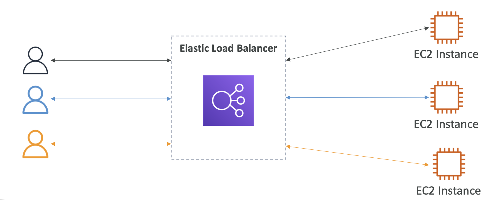
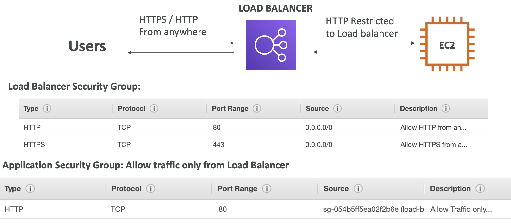
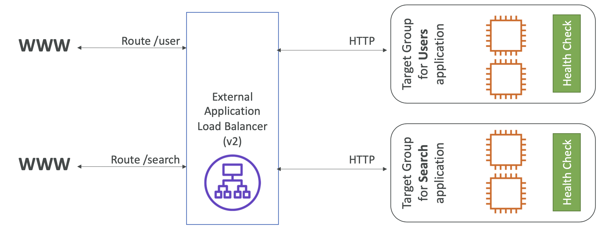
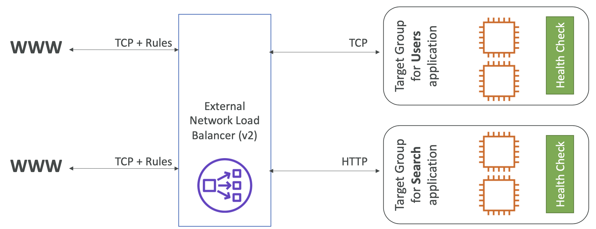
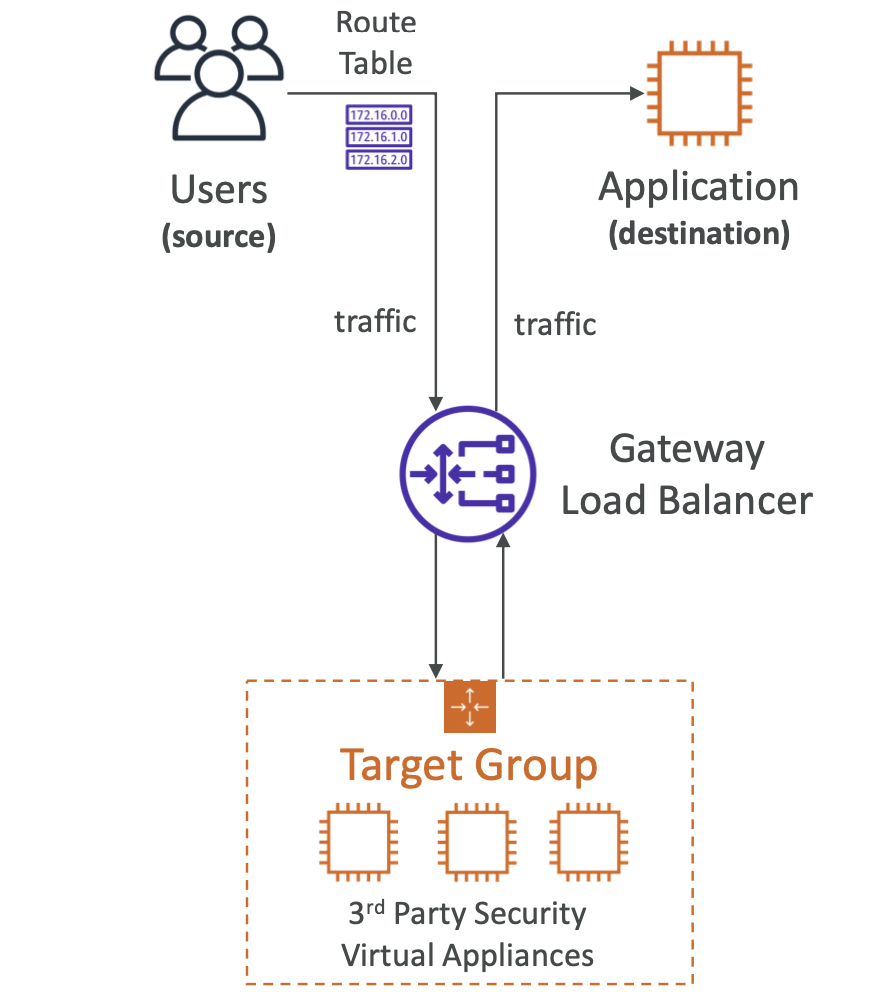
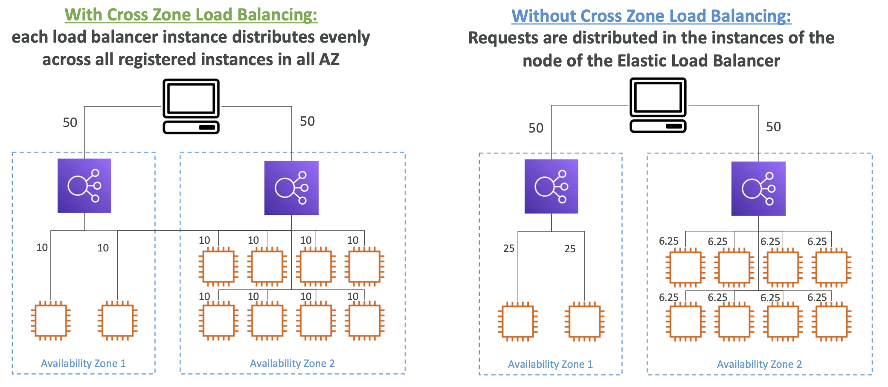
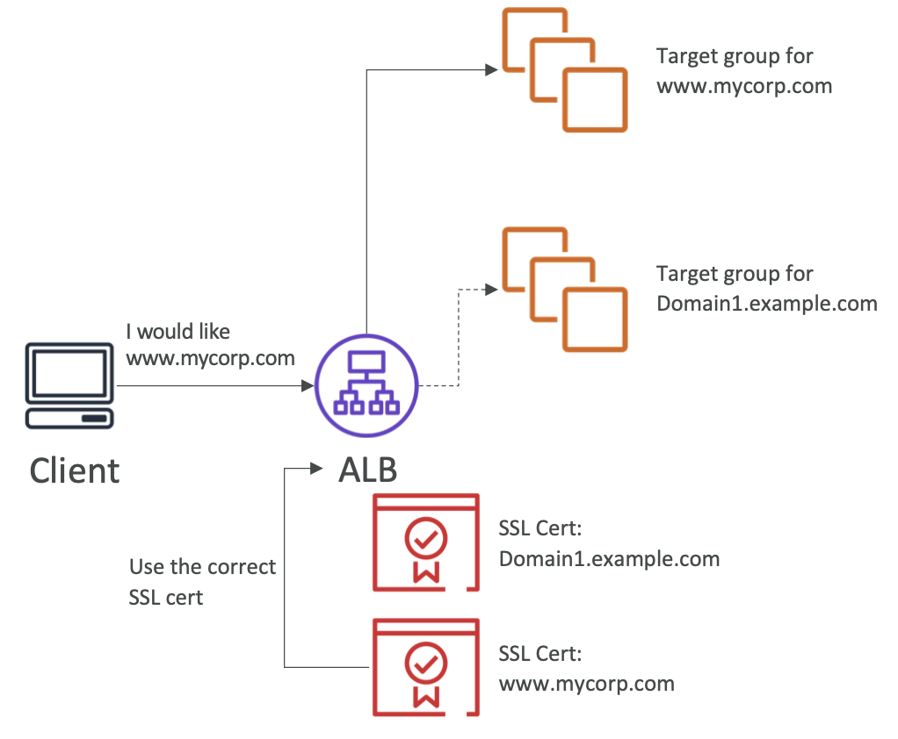
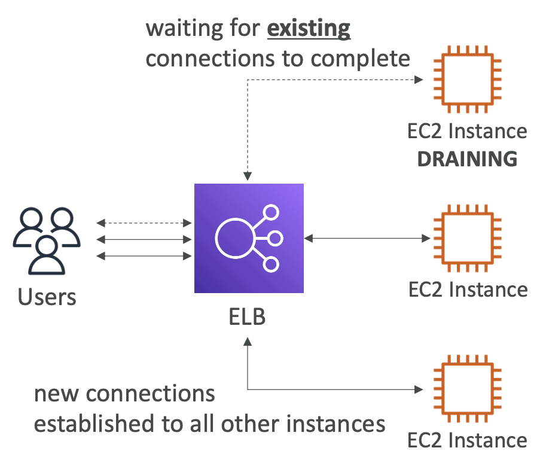
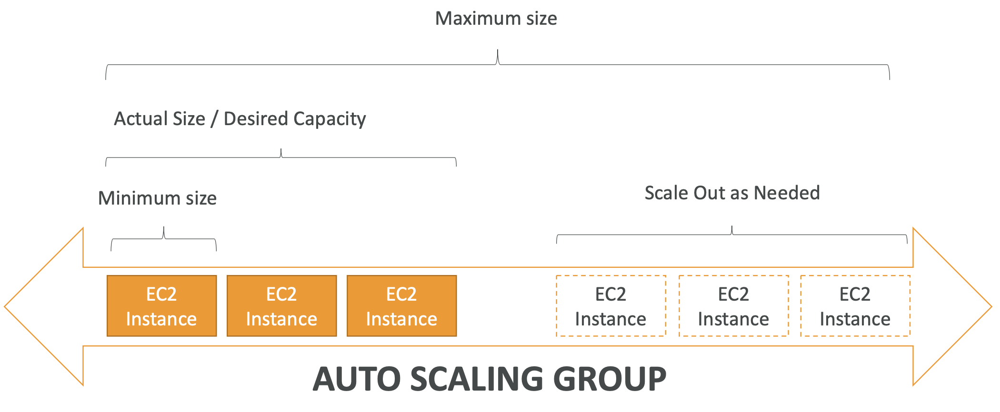

# 7: Load Balancers and Auto Scaling Groups

## Scalability and High Availability

Scalability means that an application / system can handle greater loads by adapting. There are two kinds of scalability:
- Vertical Scalability
- Horizontal Scalability (elasticity)

### Vertical Scaling
Vertical scalability means increasing the size of an instance. For example, if your application runs on a t2.micro, scaling that application vertically means running it on a t2.large.

Vertical scalability is very common for non-distributed systems, such as databases. RDS and ElastiCache are services that can scale vertically.

### Horizontal Scaling
Horizontal Scalability means increasing the number of instances / systems for your application. It implies that there are distributed systems, and this is very common for modern web applications.

### High Availability
High Availability usually goes hand in hand with horizontal scaling. It means running your application / system in at least 2 data centres (Availability Zones). The goal of high availability is to survive a data center loss.

## What is Load Balancing?

Load Balancers are servers that forward traffic to multiple servers (e.g. EC2 instances) downstream.

Load balancing means you can spread load across multiple instances while still only exposing a single point of access. This makes it easier to handle failures, do health checks and make your services highly available.

Elastic Load Balancers are managed by AWS and remove a lot of complexity from server management. The Load Balancers AWS offers also integrate with many AWS services.

### Types of AWS Load Balancers
- **Classic Load Balancer** - deprecated
- **Application Load Balancer** (v2 - new generation) - HTTP, HTTPS,WebSocket
- **Network Load Balancer** (v2 - new generation) – TCP,TLS(secureTCP),UDP
- **Gateway Load Balancer** – Operates at layer 3 (Network layer) – IP Protocol

### Security Groups

You can make your load balancers publicly accessible and only allow traffic to your EC2 instances from the load balancer.

## Application Load Balancer

The Application Load Balancer is a layer 7 load balancer which can:
- Load balance to multiple HTTP applications across machines (target groups)
- Load balance to multiple applications on the same machine (containers)

It has support for HTTP/2, WebSocket and it supports redirects (e.g. from HTTP to HTTPS).

### Routing Tables

You can set up routing to different target groups from your routing table:
- Based on path in URL (*example.com/users* & *example.com/posts*)
- Based on hostname in URL (*one.example.com* & *other.example.com*)
- Based on Query String, Headers (*example.com/users?id=123&order=false*)

Target groups can be EC2 instances (either individual or managed by an auto-scaling group), ECS tasks, lambda functions or IP addresses.

The application servers don’t see the IP of the client directly, the true IP of the client is inserted in the header `X-Forwarded-For`, as well as the port `X-Forwarded-Port` and proto `X-Forwarded-Proto`.

When you create an ALB, you create a security group which gives HTTP access from anywhere to make it public, then select a target group. You can make instances in the target group only accessible from the ALB by only allowing inbound traffic from the ALB security group.

## Network Load Balancer

Network Load Balancers are a lower level (Layer 4), and they allow TCP and UDP traffic to your instances.

Transmission control protocol (TCP) and user datagram protocol (UDP) are foundational pillars of the internet, enabling different types of data transmission from a network source to the destination. 

The Network Load Balancer is really high performance; it can handle millions of requests per second. It's not in the free tier.

A Network Load Balancer only has one static IP per Availability Zone, and it supports assigning elastic IPs. It can use HTTP on the backend even though it must receive TCP/UDP traffic.

Target groups for a Network Load Balancer can be EC2 instances, private IP addresses or an Application Load Balancer (in the case where you want to add rules around HTTP traffic but still want the high performance of NLB).

Health checks support the TCP, HTTP and HTTPS protocols.

You don't create a security group for a Network Load Balancer like with an ALB. You need to add inbound traffic from your NLB in the target group security group.

## Gateway Load Balancer

Gateway Load Balancer allows you to manage a fleet of 3rd party network virtual appliances in AWS. Examples of this are:
- Firewalls
- Intrusion detection and prevention systems
- Payload manipulation

It operates at layer 3, so it is quite low level, and it uses the GENEVE protocol on port 6081.

The target groups can be EC2 instances or private IP addresses. The main use case is a layer of protection before passing requests to your application.

## Application Load Balancer

### Sticky Sessions (Session Affinity)

You can enable sticky sessions so that clients are redirected to the same instance behind a load balancer. The use case is to ensure that a user keeps their session data.

The potential drawback is that you can imbalance the load sent to your instances.

There are two main kinds of cookies that you can enable:
- **Application-based cookies**
	- Custom cookies - generated by the target which can include custom attributes required by the application
	- Application cookies - generated by the load balancer (name - AWSALBAPP)
- **Duration-based cookies** - cookies generated by the load balancer (name - AWSALB)

You can enable them on target groups and choose the expiration time for them.

### Cross Zone Load Balancing

With cross zone load balancing, traffic is distributed evenly across the number of instances across all Availability Zones. Without it, requests are distributed evenly across the zones themselves.

**Application Load Balancer** - Enabled by default and no extra charge
**Network and Gateway Load Balancers** - Disabled by default and you pay if enabled

You can enable/disable it in the Attributes section of the load balancer in the console. You can also go into target groups and select whether to inherit the load balancer's cross zone settings or not.

### SSL Certificates

An SSL (Secure Sockets Layer) Certificate allows traffic between your clients and your load balancer to be encrypted in transit (in-flight encryption).

TLS (Transport Layer Security) is a newer version which is mainly used, but people still often refer to it as SSL.

Public SSL certificates are issued by Certificate Authorities (CA), they have an expiration date (you set) and must be renewed.

For using SSL with load balancers, you can use Certificate Manager (ACM) or upload your own certificate.

#### Server Name Indication (SNI)

Server Name Indication enables loading more than one SSL certificate onto one web server.

The protocol requires the client to indicate the host name of the target server in the initial SSL handshake. The server finds the correct certificate or returns the default.

SNI works for Application, Network Load Balancers and CloudFront.

You can add an HTTPS listener to your Load Balancer, select TLS as the protocol and choose an SSL certificate, by choosing one from Certificate Manager or uploading one.

### Deregistration Delay

Formerly known as Connection Draining, it's setting a time to complete in-flight requests when an instance is unhealthy. 

The load balancer stops sending new requests to the instance, but you can set a time between 1 and 3600 seconds to give time to complete requests. It is best to set it to a low value if your requests are typically short. 

## Auto Scaling Groups

The purpose of an Auto Scaling Group is to scale in and out (adding and removing EC2 instances) as load increases and descreases.

- We can set a minimum, maximum and desired number of instances we want running 
- We can automatically register new instances to a load balancer
- We can create new instances when previous unhealthy instances are terminated

Auto Scaling Groups are free, you only pay for the underlying instances.

### Launch Template

A Launch Template has information on how to launch instances within your ASG - AMI, instance type, EC2 user data, EBS volumes, security groups, SSH key pairs, min, max and initial capacity etc.

You can scale ASGs based on CloudWatch alarms, to either scale in or out.

### Scaling Policies

### Dynamic Scaling Policies

- **Target tracking** - most simple setting, e.g. average CPU usage to stay at around 40%
- **Simple/Step scaling** - When a 70% CPU usage CloudWatch Alarm is triggered, add 2 instances, 30% alarm triggered, remove 1 instance
- **Scheduled actions** - anticipating scaling based on known usage patterns
- **Predictive scaling** - continually forecast load and schedule scaling ahead of time (uses ML)

#### Good metrics to scale on
- CPU utilisation
- RequestCountPerTarget
- Average network in or out
- Custom metrics

#### Scaling Cooldowns
After a scaling activity, there is a cooldown period where you see what effect the scaling event has. The ASG will not launch/terminate more instances.

The default cooldown period is 300 seconds. A good way to minimise cooldown periods is by using ready-to-use AMIs, to get servers up and running quickly and have a quicker impact.

