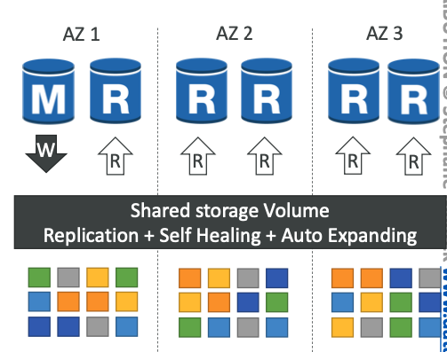
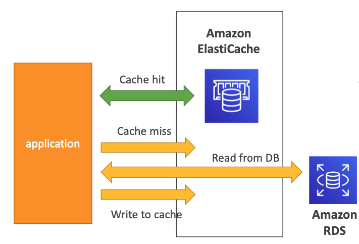
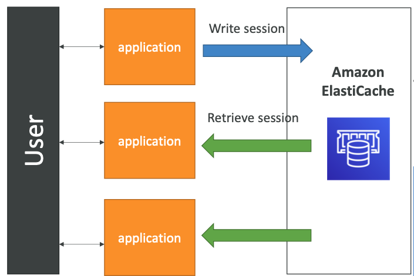

# 8: RDS, Aurora and ElastiCache

# RDS - Relational Database Service

A managed database service for SQL-based languages

### Database systems available (6)

- Postgres
- MySQL
- MariaDB
- Oracle
- Microsoft SQL Server
- Aurora

### Advantages of using RDS over deploying a database on an EC2

- Automated provisioning
- Conitinuous backups:
	- Daily full backup of the database
	- Transaction logs are backed up by RDS every 5 minutes
	- Ability to restore to any point in time
	- 7 day retention which can be increased up to 35 days
	- User can manually trigger DB snapshots, which can be kept as long as wanted
- Monitoring dashboards
- Read replicas for improved read performance
- Multi AZ setup for disaster recovery
- Maintenance windows for upgrades
- Scaling capability
- Storage backed by EBS

### Disadvantage
- You can't SSH into your instances

### Storage auto-scaling

- Helps you increase storage dynamically, scaling automatically when running out if storage
- Set a Maximum Storage Threshold
- E.g. set threshold to free storage less than 10%, lasts for more than 5 minutes, 6 hours have passed since last modification


## Read replicas vs Multi AZs

You can have up to 5 read replicas - within AZ, cross AZ or cross region

Replication is asynchronous which means reads are eventually consistent

Replicas can be promoted to be their own DB

Applications must update the connection string to leverage read replicas


Use case - reporting application to run analytics, you can run on a read replica so it doesn't affect the production database at all


### Network cost

In general, there is a network cost when data goes from one AZ to another, however there is no fee in RDS when you create a read replica in the same AZ or the same region

There is a fee when creating read replicas across regions


### RDS Multi AZ (Disaster recovery)

Synchronous replication - all databases get updated at the same time

One DNS name - automatic app failover to standby which increases availability

No manual intervention

It is not used for scaling, it is only there for standby

Read replicas can be set up as Multi AZ for Disaster recovery


### Changing from Single AZ to Multi AZ

No downtime

Just click modify for the database

Internally, a snapshot is taken, a  DB is restored from the snapshot in a new AZ, synchronisation is established between the two databases


## RDS Encryption and Security

At rest encryption:
- You can encrypt master and read replicas, must be defined at launch time
- Master must be encrypted for read replicas to be encrypted

In flight encryption:
- SSL certificates to encrypt data to RDS in flight (code on web server that provides security for online communications)
- To enforce SSL in Postgres, add rds.force_ssl=1 to the Parameter groups in the RDS console
- For MySQL, within the DB run command, GRANT USAGE ON *.* TO 'mysqluser'@'%' REQUIRE SSL


### Encrypting RDS backups

- Snapshots of encrypted databases are encrypted and unencrypted are unencrypted
- You can copy a unencrypted snapshot into an encrypted one

To encrypt an unencrypted RDS database:
- Take a snapshot
- Copy into encrypted snapshot
- Restore database from encrypted snapshot
- Migrate applications to new database


### Network and IAM

- RDS databases are usually deployed within a private subnet
- Works by leveraging security groups (same as EC2) to control which IPs/groups can communicate with RDS
- IAM policies control who can manage RDS, username and password used to login to the database


### IAM authentication

- For MySQL and Postgres
- You use an authentication token (lasts for 15 mins) obtained through IAM and RDS API calls
- Benefits - in/out encrypted using SSL, IAM to manage users, can leverage IAM roles and EC2 instance profiles


# Amazon Aurora

- Proprietary database technology from AWS which is compatible with MySQL and Postgres
- Aurora is cloud optimized and claims 5x performance improvement over MySQL on RDS, 3x Postgres on RDS
- Storage automatically grows in increments of 10GB up to 128TB
- Can have 15 read replicas, replication process faster
- Failover is instantaneous, very high availability
- Costs 20% more than RDS but is more efficient

### High availability and read scaling

6 copies across 3 AZs
- 4 used for writes
- 3 used for reads
- Self healing

One instance takes writes (master), support for cross region replication



### How Aurora works - DB cluster

Reader endpoint - connection load balancing which handles keeping track of and connecting to the read replicas

Instances do have their own endpoints but it is a bad idea to use these as if they autoscale, they can change

You can set min and max read replicas

You can have a single master or multiple master instances, but these instances connect to the same storage volume as it is a DB cluster (different setup to SQL but queried using same languages)  

Security is very similar to RDS


# ElastiCache

- ElastiCache is for managed Redis or Memcached
- In memory databases with really high performance which reduce load on databases
- AWS manages OS, patching, setup, config etc.
- Involves changes to application code because you need to query the cache before DB calls

### DB cache architecture

- Cache is checked before making calls to the database, if it's not there, then it does database call and writes to cache
- The cache needs an invalidation strategy to only keep the most current data



### User session store architecture

- Writing the user session data into ElastiCache
- Makes the application stateless as it doesn't matter which instance the user is directed to 




### Difference between Redis and Memcached

Redis:
- Multi AZ with auto-failover
- read replicas scale and high availability
- Backup and restore features
- Can have cluster mode where there is more than one node

Memcached:
- No high availability
- Not persistent
- No backup and restore

Memcached is more for if it is not important if you lose the data


## ElastiCache strategies

[Caching best practices](https://aws.amazon.com/caching/best-practices/)

When should you use caching?
- Pattern: data changing slowly, few keys frequently needed
- Anti-pattern: data changing regularly, all large key space needed frequently
- Is data structured well for caching?

## Caching patterns

### Lazy loading / Cache-aside / Lazy population

- Checking cache and if not get from DB and write to cache
- Pros 
	- only requested data cached
	- node failures not fatal
- Cons
	- cache miss means three round trips for read
	- potential for stale data in cache

```
def get_user(user_id):
	record = cache.get(user_id)
    
    if record is None:
    	record = db.query("SELECT * FROM users WHERE id = ?", user_id)
        cache.set(user_id, record)
        return record
    else:
    	return record
```

### Write through

- Add to or update the cache when database is updated
- Pros: 
	- data is never stale
	- reads are quick
	- write penalty instead of read (each write requires 2 calls)
- Cons:
	- missing data until added/updated
	- mitigation is to implement lazy loading as well
	- cache churn - a lot of data is never read

```
def save_user(user_id, values):
    record = db.query("UPDATE users ... WHERE id = ?", user_id, values)
    cache.set(user_id, record)
    return record
```

### Cache evictions and time-to-live

- You can delete items explicitly in the cache
- Items evicted because memory is full and not recently used
- Set time to live


### ElastiCache replication for Redis

Cluster mode disabled:
- One primary node, up to five replicas
- Async replication, primary read/write, others read only
- One shard, all nodes have data
- Guards against data loss if node failure
- Multi AZ enabled by default for failover

Cluster mode enabled:
- Data partitioned across shards (helpful to scale writes)
- Each shard has a primary and up to five replicas
- Multi AZ
- Up to 500 nodes per cluster (e.g. 500 shards with single master, 250 shards with 1 master, 1 replica)