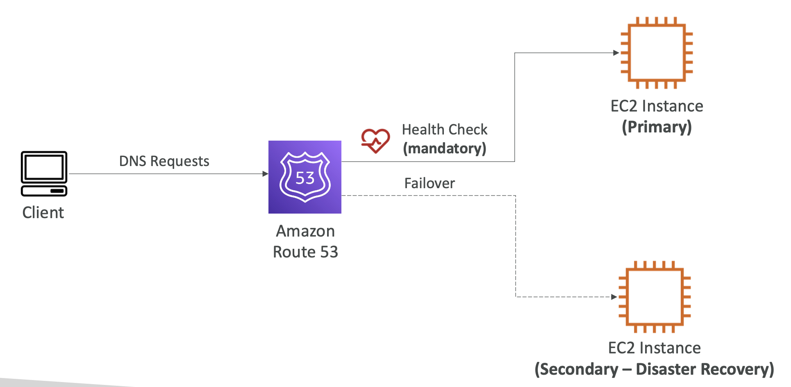

# 9: Route 53

## DNS - Domain Name System

Translates human-friendly hostnames into machine IP addresses, e.g. ```www.google.com => 172.217.18.36```

It uses a hierarchical naming structure:

- Domain Registrar - Amazon Route 53, GoDaddy
- DNS Records
- Zone File - contains DNS records
- Name Server - resolves DNS queries
- Top level domain: .com, .us, .gov
- Second level domain - amazon.com
 


### How DNS works


## Route 53

A highly available, scalable, fully managed and Authoritative DNS (The customer can update the DNS records)

Also a Domain Registrar, can check health, only service which provides 100% availability

Reason for name - 53 is traditional DNS port


### Records

How you want to route traffic for a domain

Each record contains:
- domain/sub-domain name
- Record type
- Value
- Routing policy
- Time To Live - amount of time to cache at DNS resolvers

### Record types

Route 53 supports:
- A / AAAA / CNAME / NS (must know)
- CAA / DS / MX / NAPTR / PTR / SOA / TXT / SPF / SRV (advanced)


- A - maps a hostname to IPv4 e.g. 1.2.3.4
- AAAA - maps a hostname to IPv6
- CNAME - map hostname to another hostname
- NS (Name Servers for Hosted Zones) - DNS names / IP addresses of servers that can respond to DNS queries

### Hosted Zones

A container for records that define how to route traffic to a domain and its sub-domains

Public Hosted Zones - specify how to route traffic on the internet (public domains)

Private Hosted Zones - specify how to route traffic within one or more VPCs (private domain names)

**Pricing** - $0.50 per month per hosted zone


### Buying a Domain

You can buy a domain name by searching to check if it's available, there's a price per year. After you've bought one, a Hosted Zone will be created with a NS record, showing the IPs to route traffic to.

### Creating records

You can create records, e.g. an A record where you set the IP address to direct to

You can then view the DNS setup by using the ```dig``` command in your terminal. This includes IP address, TTL etc.

```dig google.com``` shows that it has an A record which directs to an IP address


### Time To Live

#### Record Time To Live

The server tells the client to cache the result for the duration of the TTL - reduces number of queries on the DNS

**High TTL** - less traffic, but possibly outdated records

**Low TTL** - more traffic (more expensive), but easy to change records

TTL mandatory except for with Alias records


### CNAME vs Alias

AWS resources (Load Balancer, CloudFront) expose an AWS hostname

### CNAME 
- Points a hostname to any other hostname but only non-root domains. **Example:** 
	
    ```app.mydomain.com => blabla.anything.com```

### Alias records 
- Points a hostname to an AWS Resource, for root and non-root domains (and is free). **Example:**
	
    ```app.mydomain.com => mydomain.com```
    **This doesn't work with CNAME!**
- An extension of DNS functionality, automatically recognises changes in resource's IP address
- Always of type A or AAAA
- Targets can be Elastic Load Balancers, CloudFront distributions, API Gateway, Elastic Beanstalk environments, S3 websites
- You cannot set an ALIAS record for an EC2 DNS name


## Routing Policy

Defining how Route 53 responds to DNS queries. This is not the same as Load Balancer routing. The routing is from a DNS perspective, it doesn't route traffic but just responds to DNS queries.

You can select the routing policy when you create a record

Types of routing policy:
- Simple
- Weighted
- Failover
- Latency-based
- Geo-location
- Multi Value Answer
- Geo-proximity (using Route 53 Traffic Flow feature)


### Routing Policy - Simple

- Typically route traffic to a single resource
- Can specify multiple values, a random one is chosen by the client
- When Alias is enabled, you can only specify one AWS resource
- Can't use Health Checks 


### Routing Policy - Weighted

- Control the percentage of requests that go to each resource
- Weights are just relative, doesn't have to add up to 100
- DNS records must have the same name and type
- Can be associated with Health Checks
- Assign weight of 0 to stop traffic to a resource
- If all records have weight 0, all records returned equally


### Routing Policy - Latency

- Redirect to resource that has the least latency (is the nearest to the client)
- Based on traffic between users and AWS Regions
- Can be associated with Health Checks
- Because you can pass any IP address into a record, you have to specify yourself which region it is being hosted in


### Route 53 Health Checks

- Only for public resources
- Health checks are integrated with CloudWatch metrics

#### 3 ways of having automated DNS Failover:
1. Health checks that monitor an endpoint (app, server, AWS resource)
	- 15 global health checkers check endpoint health
	- Can set healthy threshold, interval for checks, supports HTTP, HTTPS, TCP
	- Only pass when endpoint responds with 2xx or 3xx response
	- Can be set to pass/fail based on text in start of response
	- Must configure your firewall to allow requests from health checkers
2. Health checks that monitor other health checks (Calculated Health Checks)
	- Combine results of multiple health checks into one
	- Can use AND, OR and NOT
	- Can have up to 256 child health checks
	- Use case: perform maintenance without causing all health checks to fail
3. Health checks that monitor CloudWatch alarms (gives more control, e.g. throttles of DynamoDB, alarms on RDS, custom metrics)
	- You can't run health checks on private hosted zones directly as Health checkers are outside the VPC
	- Instead you can create a CloudWatch metric and alarm, then create a Health Check that checks the alarm

You can create health checks in the Route 53 dashboard and select EC2 instances to monitor


### Routing Policy - Failover (Active-Passive)

You need a primary and secondary record (with the same names) which are both associated with a health check. When the health check fails, DNS queries are routed to the secondary record.




### Routing Policy - Geo-location

- Routing based on user location
- Different from latency as it's based on Continent, Country or by US state
- You have a default record for when there's no match on location
- ••Use cases:•• website localisation (e.g. go to country's language version of website), restrict content distribution, load balancing
- Can be associated with health check

### Routing Policy - Geo-proximity

- Shift traffic to resources based on a bias value
- You can expand the bias value (1 to 99) - more traffic to the resource
- You can shrink (-1 to -99) - less traffic
- Can be AWS or non-AWS resources
- You must use Traffic Flow for this feature


### Traffic Flow

Visual editor to simplify the process of creating and maintaining records in large and complex configurations

Configurations can be saved as Traffic Flow Policy - can be applied to different Route 53 Hosted Zones and it supports versioning

With Geo-proximity, you can view how the biases will affect how traffic is directed on a map in Traffic Flow


### Routing Policy - Multi-value

- Routing traffic to multiple resources
- Can be associated with Health Checks, only values for healthy resources are returned
- Up to 8 healthy records are returned for each multi-value query
- Is not a substitute for having a load balancer
- Similar to simple routing with multiple values but with the bonus of only healthy records getting returned


### 3rd party domains and Route 53

- You can buy or register a domain name with a Domain Registrar
- The Domain Registrar usually provides you with a DNS service to manage your DNS records
- You can use another DNS service to manage your DNS records, e.g. you can purchase the domain from GoDaddy but then use Route 53 to manage it

1. Create a public Hosted Zone in Route 53
2. Update the Name Server records on the 3rd party website to use the Route 53 Name Servers

A domain registrar (where you purchase your domain name) usually comes with some DNS features, but it doesn't necessarily have a DNS service for managing records
